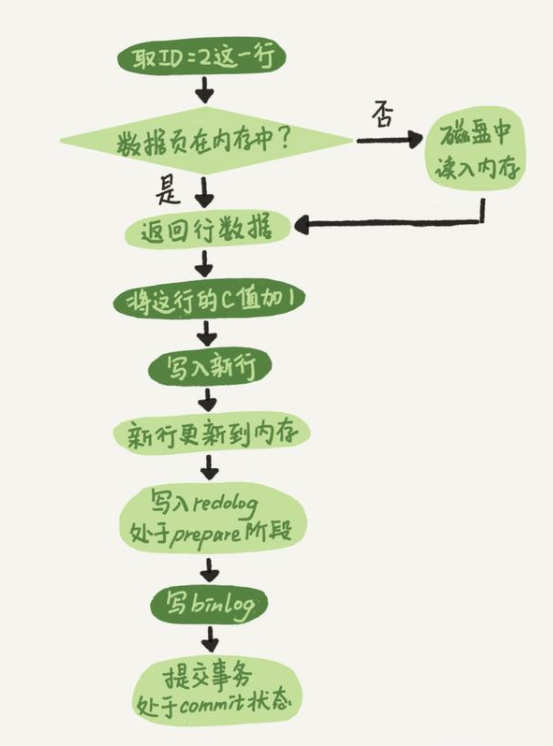

## MySQL 中的数据编辑过程中涉及的两阶段提交

MySQL 数据库中的两阶段提交，不知道您知道不？这篇文章就简单的聊一聊 MySQL 数据库中的两阶段提交，两阶段提交发生在数据变更期间（更新、删除、新增等），两阶段提交过程中涉及到了 MySQL 数据库中的两个日志系统：redo 日志和 binlog 文件。

redo 日志前面已经介绍过了，就不再介绍了，简单的聊一聊 binlog 文件，binlog 是 MySQL server 层提供的二进制文件，因此所有的存储引擎都可以使用 binlog 功能，binlog 是追加写的逻辑日志，记录了执行语句的原始逻辑，文件写到指定大小后会切换到下一个文件继续写，并不会覆盖以前写过的日志文件。

binlog 日志文件主要用于数据恢复和集群环境下各服务器之间的数据同步，在工作中，我们误删了数据或者表之类，如果需要恢复的话都是利用 binlog 日志来恢复的，所以 binlog 日志是 MySQL 数据库中比较重要的模块。

知道这两个日志之后，我们把重点回到 MySQL 数据库两阶段提交，前面我们说了两阶段提交发生在数据变更期间，为了更好的理解两阶段提交，我们用一条更新命令来加以说明，更新语句如下：

>mysql> update T set c=c+1 where id =2;

假设未更新前 id=2 的这行数据 c 的值为 0，这条更新语句在 MySQL 数据库内部是如何执行的呢？在下面这张执行流程图：

从流程图中可以看出，在 InnoDB 存储引擎下，一条 update 语句在 MySQL 内部执行大概会经历下面五个步骤：

- 1、执行器先找引擎取 id=2 这一行数据，如果 ID=2 这一行所在的数据页本来就在内存中，就直接返回给执行器；否则，需要先从磁盘读入内存，然后再返回。
- 2、执行器拿到引擎给的行数据，把这个值加上 1，比如原来是 N，现在就是 N+1，得到新的一行数据，再调用引擎接口写入这行新数据。
- 3、引擎将这行新数据更新到内存中，同时将这个更新操作记录到 redo log 里面，此时 redo log 处于 prepare 状态。然后告知执行器执行完成了，随时可以提交事务。
- 4、执行器生成这个操作的 binlog，并把 binlog 写入磁盘。
- 5、执行器调用引擎的提交事务接口，引擎把刚刚写入的 redo log 改成提交（commit）状态，更新完成。

在这五步中，注意用红颜色标出来的部分，redo 日志被分割成 prepare 和 commit 两个阶段提交，这个过程称为两阶段提交，不将 redo 日志拆分成两步提交行不行？

我们可以用反推法来证明，假设不使用两阶段提交，那么就有两种情况，一种是先提交 redo 日志再提交 binlog 日志，另一种是先提交 binlog 日志再提交 redo 日志，一起来看看这两种提交方式有什么问题？

先写 redo log 后写 binlog。假设在 redo log 写完，binlog 还没有写完的时候，MySQL 进程异常重启。在这个过程中更新发生了异常，redo 日志是可以在数据库发生异常是保证数据的持久性，启动后经过 redo 日志数据恢复后 c 的值是 1，但是 binlog 并没有写完，所以在 binlog 日志文件中并没有记录这条更新语句，如果用这个 binlog 日志文件来恢复临时库的话，恢复出来 id =2 的这行数据的 c 的值为 0，与原库的值就不一致了。

先写 binlog 后写 redo log。如果在 binlog 写完， redo 日志还没写，系统崩溃，系统重启后，id=2 的这行数据的 c 的值还是为 0，但是在 binlog 日志文件中却记录了这次更新，如果需要用 binlog 日志文件来恢复临时库的话，那么 id=2 的这行数据 c 的值就为 1，这样与原库的值就不一致了。

从这两个假设中，我们可以看出无论先提交那个日志文件都有可能出现数据不一致的现象，日志文件两阶段提交技术就解决了redo 日志和 binlog 日志文件记录数据不一致的问题，从而保证了在数据恢复时数据的一致性。

### innodb如何实现事务的
Innodb通过Buffer Pool，LogBuffer，Redo Log，Undo Log来实现事务，以⼀个update语句为例：
1. Innodb在收到⼀个update语句后，会先根据条件找到数据所在的⻚，并将该⻚缓存在Buffer Pool
   中
2. 执⾏update语句，修改Buffer Pool中的数据，也就是内存中的数据
3. 针对update语句⽣成⼀个RedoLog对象，并存⼊LogBuffer中
4. 针对update语句⽣成undolog⽇志，⽤于事务回滚
5. 如果事务提交，那么则把RedoLog对象进⾏持久化，后续还有其他机制将Buffer Pool中所修改的
   数据⻚持久化到磁盘中
6. 如果事务回滚，则利⽤undolog⽇志进⾏回滚