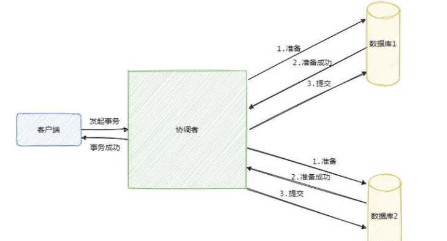
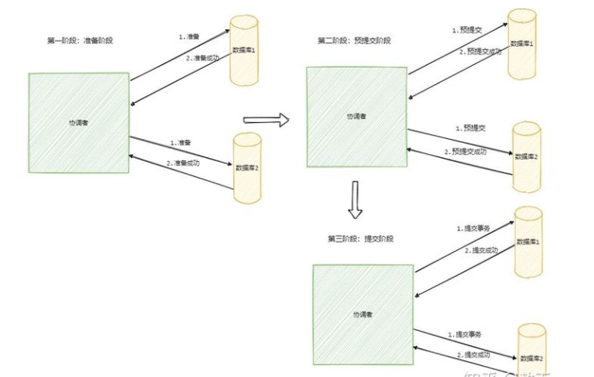

##两阶段提交协议（2PC）
在事务处理、数据库和计算机网络中，两阶段提交协议(2PC)是一种原子提交协议(ACP)。它是一种分布式算法，它协调参与分布式原子事务的所有进程，决定是提交事务还是中止(回滚)事务(它是一种特殊类型的共识协议)。该协议即使在许多临时系统故障(包括进程、网络节点、通信等故障)的情况下也能实现其目标，因此得到了广泛的应用。

该协议包括两个阶段:
- **提交-请求阶段(或投票阶段)**
  在此阶段，协调进程尝试准备所有事务的参与进程(指定的参与者、队列或工作者)采取提交或中止事务的必要步骤，并进行投票，要么是“Yes”:提交(如果事务参与者的本地部分执行已经正确结束)，或者“No”:abort(如果本地部分检测到问题)
- **提交阶段**
  在此阶段中，协调器根据参与者的投票决定是提交(仅当所有参与者投票为“Yes”时)还是中止事务(否则)，并将结果通知所有参与者。然后，参与者使用其本地事务资源(也称为可恢复资源)执行所需的操作(提交或中止);例如，数据库数据)和它们在事务的其他输出中的各自部分(如果适用)。
  两阶段提交(2PC)协议不应该与两阶段锁定(2PL)协议混淆，后者是一种并发控制协议。

###提交请求(或投票)阶段
1. 协调器向所有参与者发送提交消息的查询，并等待，直到收到来自所有参与者的回复。
2. 参与者执行事务直到被要求提交为止。它们分别在undo log（撤销日志）和redo log（重做）中写一个条目。
3. 如果参与者的操作成功，每个参与者都会回复一条协议消息(参与者投票是提交)，如果参与者经历了无法提交的失败，则会回复一条终止消息(参与者投票否，不提交)。

###提交(或完成)阶段
####成功
如果协调器在提交-请求阶段收到了来自所有参与者的协议消息:

1. 协调器向所有参与者发送提交消息。
2. 每个参与者完成操作，并释放事务期间持有的所有锁和资源。
3. 每个参与者向协调器发送一个确认。
4. 协调器在收到所有确认后完成事务。
####失败
如果任何参与者在提交-请求阶段(或协调器的超时到期)投票为No:

1. 协调器向所有参与者发送回滚消息。
2. 每个参与者使用undo log撤销事务，并释放事务期间持有的资源和锁。
3. 每个参与者向协调器发送一个确认。
4. 协调器在收到所有确认后撤销事务。

###流程图

### 缺点
两阶段提交协议的最大缺点是它是一个阻塞协议。如果协调器永久失败，一些参与者将永远不会解决它们的事务:
在一个参与者向协调器发送了一条协议消息之后，它将阻塞，直到收到提交或回滚。

### 总结
2PC 是一种尽量保证强一致性的分布式事务，因此它是同步阻塞的，而同步阻塞就导致长久的资源锁定问题，总体而言效率低，并且存在单点故障问题，在极端条件下存在数据不一致的风险。

##三阶段提交协议（3PC）
3PC 的出现是为了解决 2PC 的一些问题，相比于 2PC 它在参与者中也引入了超时机制，并且新增了一个阶段使得参与者可以利用这一个阶段统一各自的状态。

3PC 包含了三个阶段，分别是准备阶段、预提交阶段和提交阶段，对应的英文就是：CanCommit、PreCommit 和 DoCommit。

### 流程图

1. 准备阶段的变更成不会直接执行事务，而是会先去询问此时的参与者是否有条件接这个事务，因此不会一来就干活直接锁资源。

3pc引入了超时机制，参与者就不会傻等了，如果是等待提交命令超时，那么参与者就会提交事务了，因为都到了这一阶段了大概率是提交的，
如果是等待预提交命令超时，那该干啥就干啥了，反正本来啥也没干。

然而超时机制也会带来数据不一致的问题，比如在等待提交命令时候超时了，参与者默认执行的是提交事务操作，但是有可能执行的是回滚操作，这样一来数据就不一致了。

但是多引入一个阶段也多一个交互，因此性能会差一些，而且绝大部分的情况下资源应该都是可用的，这样等于每次明知可用执行还得询问一次。

## TCC （Try - Confirm - Cancel）
2PC 和 3PC 都是数据库层面的，而 TCC 是业务层面的分布式事务，就像我前面说的分布式事务不仅仅包括数据库的操作，还包括发送短信等，这时候 TCC 就派上用场了！

- Try 指的是预留，即资源的预留和锁定，注意是预留。
- Confirm 指的是确认操作，这一步其实就是真正的执行了。
- Cancel 指的是撤销操作，可以理解为把预留阶段的动作撤销了。

其实从思想上看和 2PC 差不多，都是先试探性的执行，如果都可以那就真正的执行，如果不行就回滚。

比如说一个事务要执行A、B、C三个操作，那么先对三个操作执行预留动作。如果都预留成功了那么就执行确认操作，如果有一个预留失败那就都执行撤销动作。

### 流程
TCC模型还有个事务管理者的角色，用来记录TCC全局事务状态并提交或者回滚事务。

### 优点
- 解决了跨应用业务操作的原子性问题，在诸如组合支付、账务拆分场景非常实用。
- TCC实际上把数据库层的二阶段提交上提到了应用层来实现，对于数据库来说是一阶段提交
- 规避了数据库层的2PC性能低下问题。
- 实时业务，执行时间较短的业务
- 强一致性的业务

### 缺点
TCC的Try、Confirm和Cancel操作功能需业务提供，开发成本高。

## 幂等性？
幂等性是指同一个操作无论请求多少次，其结果都相同。
幂等操作实现方式有：
1. 操作之前在业务方法进行判断如果执行过了就不再执行。
2. 缓存所有请求和处理的结果，已经处理的请求则直接返回结果。
3. 在数据库表中加一个状态字段（未处理，已处理），数据操作时判断未处理时再处理。
