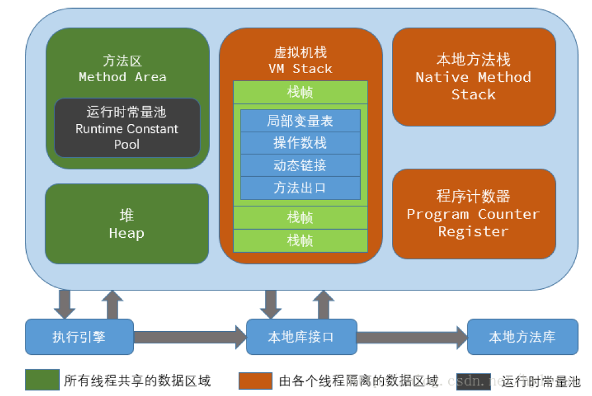
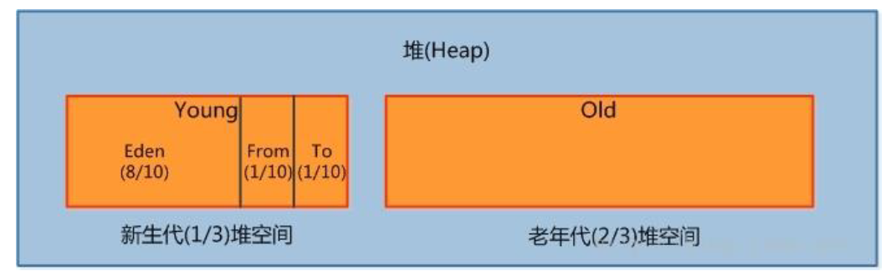
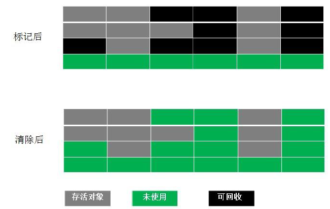
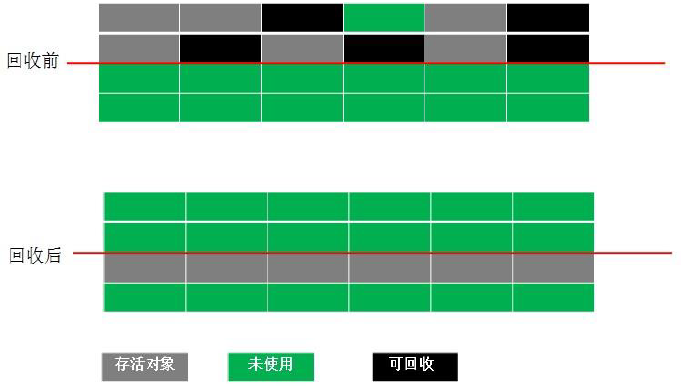
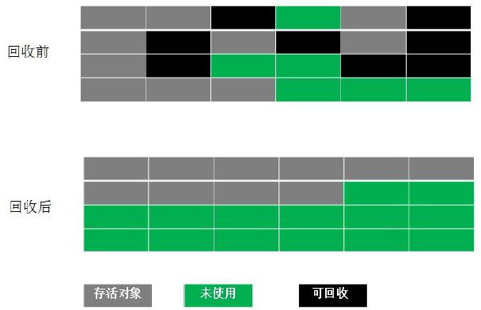
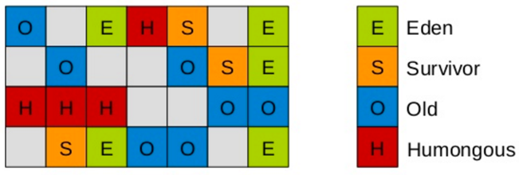
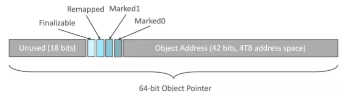
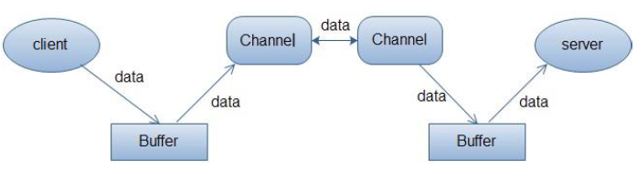
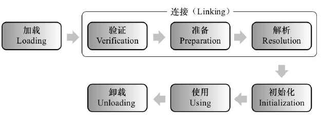
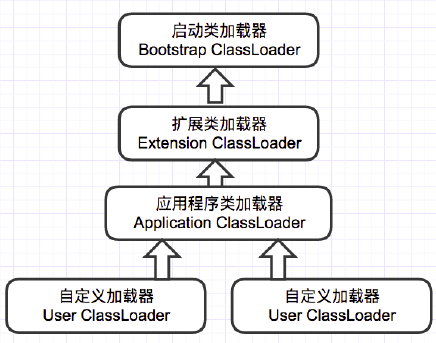

# JVM

## 1 线程

这里所说的线程指程序执行过程中的一个线程实体。JVM 允许一个应用并发执行多个线程。  
Hotspot JVM 中的 Java 线程与原生操作系统线程有直接的映射关系。当线程本地存储、缓冲区分配、同步对象、栈、程序计数器等准备好以后，就会创建一个操作系统原生线程。Java 线程结束，原生线程随之被回收。操作系统负责调度所有线程，并把它们分配到任何可用的 CPU 上。当原生线程初始化完毕，就会调用 Java 线程的 run() 方法。当线程结束时，会释放原生线程和 Java 线程的所有资源。

Hotspot JVM 后台运行的系统线程主要有下面几个：  
| | |
| -- | -- |
|  虚拟机线程（VM thread） | 这个线程等待 JVM 到达安全点操作出现。这些操作必须要在独立的线程里执行，因为当堆修改无法进行时，线程都需要 JVM 位于安全点。这些操作的类型有：stop-theworld垃圾回收、线程栈 dump、线程暂停、线程偏向锁（biased locking）解除。 |
| 周期性任务线程 | 这线程负责定时器事件（也就是中断），用来调度周期性操作的执行。 |
| GC 线程 | 这些线程支持 JVM 中不同的垃圾回收活动。 |
| 编译器线程 | 这些线程在运行时将字节码动态编译成本地平台相关的机器码。 |
| 信号分发线程 | 这个线程接收发送到 JVM 的信号并调用适当的 JVM 方法处理。 |

## 2 JVM内存划分



JVM 内存区域主要分为:

* 线程私有区域【程序计数器、虚拟机栈、本地方法区】
* 线程共享区域【JAVA 堆、方法区】
* 直接内存。

线程私有数据区域生命周期与线程相同, 依赖用户线程的启动/结束而创建/销毁(在HotspotVM 内, 每个线程都与操作系统的本地线程直接映射, 因此这部分内存区域的存/否跟随本地线程的生/死对应)。  
线程共享区域随虚拟机的启动/关闭而创建/销毁。  
直接内存并不是JVM运行时数据区的一部分, 但也会被频繁的使用: 在JDK 1.4引入的NIO提供了基于`Channel`与`Buffer`的IO方式, 它可以使用Native函数库直接分配堆外内存, 然后使用`DirectByteBuffer`对象作为这块内存的引用进行操作(详见: Java I/O 扩展), 这样就避免了在Java堆和Native堆中来回复制数据, 因此在一些场景中可以显著提高性能。

### 2.1 程序计数器(线程私有)

一块较小的内存空间, 是当前线程所执行的字节码的行号指示器，每条线程都要有一个独立的程序计数器，这类内存也称为“线程私有”的内存。  
正在执行java方法的话，计数器记录的是虚拟机字节码指令的地址（当前指令的地址）。如果还是Native方法，则为空。  
这个内存区域是唯一一个在虚拟机中没有规定任何`OutOfMemoryError`情况的区域。

### 2.2 虚拟机栈(线程私有)

是描述java方法执行的内存模型，每个方法在执行的同时都会创建一个栈帧（Stack Frame）用于存储局部变量表、操作数栈、动态链接、方法出口等信息。每一个方法从调用直至执行完成的过程，就对应着一个栈帧在虚拟机栈中入栈到出栈的过程。
栈帧（Frame）是用来存储数据和部分过程结果的数据结构，同时也被用来处理动态链接(Dynamic Linking)、 方法返回值和异常分派（Dispatch Exception）。栈帧随着方法调用而创建，随着方法结束而销毁——无论方法是正常完成还是异常完成（抛出了在方法内未被捕获的异常）都算作方法结束。

### 2.3 本地方法栈

本地方法栈和虚拟机栈作用类似, 区别是虚拟机栈为执行Java方法服务, 而本地方法栈则为Native方法服务, 如果一个VM实现使用C-linkage模型来支持Native调用, 那么该栈将会是一个C栈，但HotSpot VM直接就把本地方法栈和虚拟机栈合二为一。

### 2.4 堆（Heap，线程共享) -- 运行时数据区

是被线程共享的一块内存区域，创建的对象和数组都保存在Java堆内存中，也是垃圾收集器进行垃圾收集的最重要的内存区域。由于现代VM采用分代收集算法, 因此Java堆从GC的角度还可以细分为: *新生代*(Eden区、From Survivor区和To Survivor区)和*老年代*。

### 2.5 方法区/永久代（线程共享）

即我们常说的永久代(Permanent Generation), 用于存储被JVM 加载的类信息、常量、静态变量、即时编译器编译后的代码等数据。HotSpot VM把GC分代收集扩展至方法区, 即使用Java堆的永久代来实现方法区, 这样HotSpot 的垃圾收集器就可以像管理Java 堆一样管理这部分内存，而不必为方法区开发专门的内存管理器(永久带的内存回收的主要目标是针对常量池的回收和类型的卸载, 因此收益一般很小)。  
运行时常量池（Runtime Constant Pool）是方法区的一部分。Class 文件中除了有类的版本、字段、方法、接口等描述等信息外，还有一项信息是常量池（Constant Pool Table），用于存放编译期生成的各种字面量和符号引用，这部分内容将在类加载后存放到方法区的运行时常量池中。 Java 虚拟机对Class 文件的每一部分（自然也包括常量池）的格式都有严格的规定，每一个字节用于存储哪种数据都必须符合规范上的要求，这样才会被虚拟机认可、装载和执行。

## 3 JVM运行时内存

Java 堆从GC 的角度还可以细分为: 新生代(Eden 区、From Survivor 区和To Survivor 区)和老年代。



### 3.1 新生代

是用来存放新生的对象。一般占据堆的1/3 空间。由于频繁创建对象，所以新生代会频繁触发MinorGC 进行垃圾回收。新生代又分为 Eden 区、ServivorFrom、ServivorTo 三个区。

#### Eden 区

Java 新对象的出生地（如果新创建的对象占用内存很大，则直接分配到老年代）。当Eden 区内存不够的时候就会触发MinorGC，对新生代区进行一次垃圾回收。

#### ServivorFrom

上一次GC 的幸存者，作为这一次GC 的被扫描者。

#### ServivorTo

保留了一次MinorGC 过程中的幸存者。

#### MinorGC 的过程（复制->清空->互换）

MinorGC 采用复制算法。

1. eden、servicorFrom 复制到 ServicorTo，年龄+1  
首先，把Eden 和ServivorFrom区域中存活的对象复制到ServicorTo 区域（如果有对象的年龄以及达到了老年的标准，则赋值到老年代区），同时把这些对象的年龄+1（如果ServicorTo 不够位置了就放到老年区）
2. 清空eden、servicorFrom
3. ServicorTo和ServicorFrom互换  
最后，ServicorTo 和ServicorFrom 互换，原ServicorTo 成为下一次GC 时的ServicorFrom区。

### 3.2 老生代

主要存放应用程序中生命周期长的内存对象。
老年代的对象比较稳定，所以MajorGC 不会频繁执行。在进行MajorGC 前一般都先进行了一次MinorGC，使得有新生代的对象晋身入老年代，导致空间不够用时才触发。当无法找到足够大的连续空间分配给新创建的较大对象时也会提前触发一次MajorGC 进行垃圾回收腾出空间。  
MajorGC 采用标记清除算法：首先扫描一次所有老年代，标记出存活的对象，然后回收没有标记的对象。MajorGC 的耗时比较长，因为要扫描再回收。MajorGC 会产生内存碎片，为了减少内存损耗，我们一般需要进行合并或者标记出来方便下次直接分配。当老年代也满了装不下的时候，就会抛出OOM（Out of Memory）异常。

### 3.3 永久代

指内存的永久保存区域，主要存放Class 和Meta（元数据）的信息,Class 在被加载的时候被放入永久区域，它和和存放实例的区域不同，GC 不会在主程序运行期对永久区域进行清理。所以这也导致了永久代的区域会随着加载的Class 的增多而胀满，最终抛出OOM异常。

#### JAVA8 与元数据

在Java8 中，永久代已经被移除，被一个称为“元数据区”（元空间）的区域所取代。元空间的本质和永久代类似，元空间与永久代之间最大的区别在于：元空间并不在虚拟机中，而是使用**本地内存**。因此，默认情况下，元空间的大小仅受本地内存限制。类的元数据放入 native memory, 字符串池和类的静态变量放入java 堆中，这样可以加载多少类的元数据就不再由MaxPermSize 控制, 而由系统的实际可用空间来控制。

## 4 垃圾回收与算法

### 4.1 如何确定垃圾

#### 引用计数法

在Java 中，引用和对象是有关联的。如果要操作对象则必须用引用进行。因此，很显然一个简单的办法是通过引用计数来判断一个对象是否可以回收。简单说，即一个对象如果没有任何与之关联的引用，即他们的引用计数都不为0，则说明对象不太可能再被用到，那么这个对象就是可回收对象。  
循环引用问题，例：

```java
public class MyObject {
    public Object ref = null;
    public static void main(String[] args) {
        MyObject myObject1 = new MyObject();
        MyObject myObject2 = new MyObject();
        myObject1.ref = myObject2;
        myObject2.ref = myObject1;
        myObject1 = null;
        myObject2 = null;
    }
}
```

#### 可达性分析

为了解决引用计数法的循环引用问题，Java 使用了可达性分析的方法。通过一系列的“GC roots”对象作为起点搜索。如果在“GC roots”和一个对象之间没有可达路径，则称该对象是不可达的。  
要注意的是，不可达对象不等价于可回收对象，不可达对象变为可回收对象至少要经过两次标记过程。两次标记后仍然是可回收对象，则将面临回收。  
Java中，GC roots一般包含以下几种：

* 在虚拟机栈（栈帧中的本地变量表）中引用的对象
* 方法区中的类静态属性引用的对象
* 方法区中常量引用的对象
* 本机方法堆栈中JNI(即一般说的Native方法)引用的对象

### 4.2 标记清除算法（Mark-Sweep)

最基础的垃圾回收算法，分为两个阶段，标注和清除。标记阶段标记出所有需要回收的对象，清除阶段回收被标记的对象所占用的空间。如图



从图中我们就可以发现，该算法最大的问题是内存碎片化严重，后续可能发生大对象不能找到可利用空间的问题。

### 4.3 复制算法（coping）

为了解决Mark-Sweep 算法内存碎片化的缺陷而被提出的算法。按内存容量将内存划分为等大小的两块。每次只使用其中一块，当这一块内存满后将尚存活的对象复制到另一块上去，把已使用的内存清掉，如图：



这种算法虽然实现简单，内存效率高，不易产生碎片，但是最大的问题是可用内存被压缩到了原本的一半。且存活对象增多的话，Copying 算法的效率会大大降低。

### 4.4 标记整理（Mark-Compact）

结合了以上两个算法，为了避免缺陷而提出。标记阶段和Mark-Sweep 算法相同，标记后不是清理对象，而是将存活对象移向内存的一端。然后清除端边界外的对象。如图：


### 4.5 分代收集算法

分代收集法是目前大部分JVM 所采用的方法，其核心思想是根据对象存活的不同生命周期将内存划分为不同的域，一般情况下将GC 堆划分为老生代(Tenured/Old Generation)和新生代(Young Generation)。老生代的特点是每次垃圾回收时只有少量对象需要被回收，新生代的特点是每次垃圾回收时都有大量垃圾需要被回收，因此可以根据不同区域选择不同的算法。

#### 新生代与复制算法

目前大部分JVM的GC 对于新生代都采取 复制算法（coping），因为新生代中每次垃圾回收都要回收大部分对象，即要复制的操作比较少，但通常并不是按照1：1 来划分新生代。一般将新生代划分为一块较大的Eden 空间和两个较小的Survivor 空间(From Space, To Space)，每次使用Eden 空间和其中的一块Survivor 空间，当进行回收时，将该两块空间中还存活的对象复制到另一块Survivor 空间中。

#### 老年代与标记清理/标记整理算法

而老年代因为每次只回收少量对象，因而采用标记清理或标记整理算法。

1. JAVA 虚拟机提到过的处于方法区的永生代(Permanet Generation)，它用来存储class 类，常量，方法描述等。对永生代的回收主要包括废弃常量和无用的类。
2. 对象的内存分配主要在新生代的Eden Space 和Survivor Space 的From Space(Survivor 目前存放对象的那一块)，少数情况会直接分配到老生代。
3. 当新生代的Eden Space 和From Space 空间不足时就会发生一次GC，进行GC 后，Eden Space 和From Space 区的存活对象会被挪到To Space，然后将Eden Space 和From Space 进行清理。
4. 如果To Space 无法足够存储某个对象，则将这个对象存储到老生代。
5. 在进行GC 后，使用的便是Eden Space 和To Space 了，如此反复循环。
6. 当对象在Survivor 区躲过一次GC 后，其年龄就会+1。默认情况下年龄到达15 的对象会被移到老生代中。

## 5 JAVA四种引用类型

### 5.1 强引用

在Java 中最常见的就是强引用，把一个对象赋给一个引用变量，这个引用变量就是一个强引用。当一个对象被强引用变量引用时，它处于可达状态，它是不可能被垃圾回收机制回收的，即使该对象以后永远都不会被用到JVM也不会回收。因此强引用是造成Java 内存泄漏的主要原因之
一。

### 5.2 软引用

软引用需要用`SoftReference` 类来实现，对于只有软引用的对象来说，当系统内存足够时它不会被回收，当系统内存空间不足时它会被回收。软引用通常用在对内存敏感的程序中。

### 5.3 弱引用

弱引用需要用`WeakReference` 类来实现，它比软引用的生存期更短，对于只有弱引用的对象来说，只要垃圾回收机制一运行，不管JVM 的内存空间是否足够，总会回收该对象占用的内存。  
WeakReference使用实例：ThreadLocalMap类

```java
public class ThreadLocal<T> {
    // ...
    static class ThreadLocalMap {
        // ...
        static class Entry extends WeakReference<ThreadLocal<?>> {
            Object value;

            Entry(ThreadLocal<?> k, Object v) {
                super(k);
                value = v;
            }
        }
    }
}
```

### 5.4 虚引用

虚引用需要`PhantomReference` 类来实现，它不能单独使用，必须和引用队列联合使用。虚引用的主要作用是跟踪对象被垃圾回收的状态。一个对象是都有虚引用的存在都不会对生存时间都构成影响，也无法通过虚引用来获取对一个对象的真实引用。唯一的用处：能在对象被GC时收到系统通知，JAVA中用PhantomReference来实现虚引用。

| 引用类型 | CG回收时间 | 用途 | 生存时间 |
| -- | -- | -- | -- |
| 强引用 | never | 对象的一般状态 | JVM停止运行时 |
| 软引用 | 内存不足时 | 对象缓存 | 内存不足时终止 |
| 弱引用 | GC时 | 对象缓存 | GC后终止 |
| 需引用 | unknow | unknow | unknow |

## 6 GC分代收集算法vs分区收集算法

### 6.1 分代收集算法

当前主流VM 垃圾收集都采用”分代收集”(Generational Collection)算法, 这种算法会根据对象存活周期的不同将内存划分为几块, 如JVM中的 新生代、老年代、永久代，这样就可以根据各年代特点分别采用最适当的GC 算法。

#### 在新生代-复制算法

每次垃圾收集都能发现大批对象已死, 只有少量存活. 因此选用复制算法, 只需要付出少量存活对象的复制成本就可以完成收集。

#### 在老年代-标记清理或标记整理算法

因为对象存活率高、没有额外空间对它进行分配担保, 就必须采用“标记—清理”或“标记—整理”算法来进行回收, 不必进行内存复制, 且直接腾出空闲内存.

### 6.2 分区收集算法

分区算法则将整个堆空间划分为连续的不同小区间, 每个小区间独立使用, 独立回收. 这样做的好处是可以控制一次回收多少个小区间 , 根据目标停顿时间, 每次合理地回收若干个小区间(而不是整个堆), 从而减少一次GC 所产生的停顿。

## 7 GC垃圾收集器

")

### 7.1 Serial垃圾收集器（单线程、复制算法）

Serial是最基本垃圾收集器，使用复制算法，曾经是JDK1.3.1 之前新生代唯一的垃圾收集器。Serial 是一个单线程的收集器，它不但只会使用一个CPU 或一条线程去完成垃圾收集工作，并且在进行垃圾收集的同时，必须暂停其他所有的工作线程，直到垃圾收集结束。  
Serial 垃圾收集器虽然在收集垃圾过程中需要暂停所有其他的工作线程，但是它简单高效，对于限定单个CPU 环境来说，没有线程交互的开销，可以获得最高的单线程垃圾收集效率，因此**Serial垃圾收集器依然是java 虚拟机运行在Client 模式下默认的新生代垃圾收集器**。

### 7.2. ParNew垃圾收集器（多线程的Serial）

ParNew 垃圾收集器其实是Serial 收集器的多线程版本，也使用复制算法，除了使用多线程进行垃圾收集之外，其余的行为和Serial 收集器完全一样，ParNew 垃圾收集器在垃圾收集过程中同样也要暂停所有其他的工作线程。  
ParNew虽然是除了多线程外和Serial 收集器几乎完全一样，但是ParNew垃圾收集器是很多java虚拟机运行在Server 模式下新生代的默认垃圾收集器。

### 7.3. Parallel Scavenge收集器（多线程、复制算法、高效）

Parallel Scavenge 收集器也是一个新生代垃圾收集器，同样使用复制算法，也是一个多线程的垃圾收集器，它重点关注的是程序达到一个可控制的**吞吐量**（Thoughput，CPU 用于运行用户代码的时间/CPU 总消耗时间，即吞吐量=运行用户代码时间/(运行用户代码时间+垃圾收集时间)），高吞吐量可以最高效率地利用CPU 时间，尽快地完成程序的运算任务，主要适用于在后台运算而不需要太多交互的任务。*自适应调节策略*也是ParallelScavenge 收集器与ParNew 收集器的一个重要区别。

### 7.4. Serial Old收集器（单线程、标记整理算法）

Serial Old 是Serial 垃圾收集器老年代版本，它同样是个单线程的收集器，使用标记-整理算法，这个收集器也主要是运行在Client 默认的java 虚拟机默认的年老代垃圾收集器。  
在Server 模式下，主要有两个用途：

1. 在JDK1.5 之前版本中与新生代的Parallel Scavenge 收集器搭配使用。
2. 作为年老代中使用CMS 收集器的后备垃圾收集方案。

### 7.5 Parallel Old收集器（多线程、标记整理算法）

Parallel Old 收集器是Parallel Scavenge 的年老代版本，使用多线程的标记-整理算法，在JDK1.6才开始提供。  
在JDK1.6 之前，新生代使用ParallelScavenge 收集器只能搭配年老代的Serial Old 收集器，只能保证新生代的吞吐量优先，无法保证整体的吞吐量，Parallel Old 正是为了在年老代同样提供吞吐量优先的垃圾收集器，如果系统对吞吐量要求比较高，可以优先考虑新生代Parallel Scavenge和年老代Parallel Old 收集器的搭配策略。

### 7.6 CMS收集器（多线程、标记清除算法）

Concurrent mark sweep(CMS)收集器是一种年老代垃圾收集器，其最主要目标是获取最短垃圾回收停顿时间，和其他年老代使用标记-整理算法不同，它使用多线程的标记-清除算法。  
最短的垃圾收集停顿时间可以为交互比较高的程序提高用户体验。  
CMS 工作机制相比其他的垃圾收集器来说更复杂，整个过程分为以下4 个阶段：

#### 1. 初始标记

只是标记一下GC Roots 能直接关联的对象，速度很快，仍然需要暂停所有的工作线程。

#### 2. 并发标记

进行GC Roots 跟踪的过程，和用户线程一起工作，不需要暂停工作线程。

#### 3. 重新标记

为了修正在并发标记期间，因用户程序继续运行而导致标记产生变动的那一部分对象的标记记录，仍然需要暂停所有的工作线程。

#### 4. 并发清除

清除GC Roots 不可达对象，和用户线程一起工作，不需要暂停工作线程。  
由于耗时最长的并发标记和并发清除过程中，垃圾收集线程可以和用户线程一起并发工作，所以总体上来看CMS 收集器的内存回收和用户线程是一起并发地执行。

### 7.7 G1收集器

G1（Garbage - First）名称的由来是G1跟踪各个Region里面的垃圾堆的价值大小（回收所获得的空间大小以及回收所需时间的经验值），在后台维护一个优先列表，每次根据允许的收集时间，优先回收价值最大的Region。G1（Garbage-First）是JDK7-u4才推出商用的收集器。

注意：G1与前面的垃圾收集器有很大不同，它把新生代、老年代的划分取消了！
取而代之的是，G1算法将堆划分为若干个区域（Region），它仍然属于分代收集器。不过，这些区域的一部分包含新生代，新生代的垃圾收集依然采用暂停所有应用线程的方式，将存活对象拷贝到老年代或者Survivor空间。老年代也分成很多区域，G1收集器通过将对象从一个区域复制到另外一个区域，完成了清理工作。这就意味着，在正常的处理过程中，G1完成了堆的压缩（至少是部分堆的压缩），这样也就不会有CMS内存碎片问题的存在了。



在G1中，还有一种特殊的区域，叫Humongous区域。 如果一个对象占用的空间超过了分区容量50%以上，G1收集器就认为这是一个巨型对象。这些巨型对象，默认直接会被分配在年老代，但是如果它是一个短期存在的巨型对象，就会对垃圾收集器造成负面影响。为了解决这个问题，G1划分了一个Humongous区，它用来专门存放巨型对象。如果一个H区装不下一个巨型对象，那么G1会寻找连续的H分区来存储。为了能找到连续的H区，有时候不得不启动Full GC。

#### 特点

G1除了降低停顿外，还能建立可预测的停顿时间模型

##### Region概念

横跨整个堆内存，在G1之前的其他收集器进行收集的范围都是整个新生代或者老生代，而G1不再是这样。
G1在使用时，Java堆的内存布局与其他收集器有很大区别，它将整个Java堆划分为多个大小相等的独立区域（Region），虽然还保留新生代和老年代的概念，但新生代和老年代不再是物理隔离的了，而都是一部分Region（可以不连续）的集合。

##### 可并行，可并发

G1 能充分利用多CPU、多核环境下的硬件优势，使用多个CPU来缩短“Stop The World”停顿时间（并行），也可以并发让垃圾收集与用户程序同时进行（并发）

##### 分代收集，收集范围包括新生代和老年代

能独立管理整个GC堆（新生代和老年代），而不需要与其他收集器搭配；能够采用不同方式处理不同时期的对象

##### 空间整合，不产生碎片

从整体看，是基于标记-整理算法；从局部（两个Region间）看，是基于复制算法；都不会产生内存碎片，有利于长时间运行；这种特性有利于程序长时间运行，分配大对象时不会因为无法找到连续内存空间而提前触发下一次GC。

##### 可预测的停顿：低停顿的同时实现高吞吐量

G1收集器之所以能建立可预测的停顿时间模型，是因为它可以有计划地避免在整个Java堆中进行全区域的垃圾收集。  
G1跟踪各个Region里面的垃圾堆积的价值大小（回收所获得的空间大小以及回收所需时间的经验值），在后台维护一个优先列表，每次根据允许的收集时间，优先回收价值最大的Region，这样就保证了在有限的时间内尽可能提高效率。（这也就是Garbage-First名称的来由）。  
这种使用Region划分内存空间以及有优先级的区域回收方式，保证了G1收集器在有限的时间内可以获取尽可能高的收集效率。

不计算维护Remembered Set的操作，可以分为4个步骤（与CMS较为相似）。

#### 1. 初始标记（Initial Marking）

初始标记仅仅只是标记一下GC Roots能直接关联到的对象，速度很快，需要“Stop The World”。

#### 2. 并发标记（Concurrent Marking）

进行GC Roots Tracing的过程，从刚才产生的集合中标记出存活对象；（也就是从GC Roots 开始对堆进行可达性分析，找出存活对象。）耗时较长，但应用程序也在运行；并不能保证可以标记出所有的存活对象；

#### 3. 最终标记（Final Marking）

最终标记和CMS的重新标记阶段一样，也是为了修正并发标记期间因用户程序继续运作而导致标记产生变动的那一部分对象的标记记录，
这个阶段的停顿时间一般会比初始标记阶段稍长一些，但远比并发标记的时间短，也需要“Stop The World”。（修正Remebered Set）

#### 4. 筛选回收（Live Data Counting and Evacuation）

首先排序各个Region的回收价值和成本；然后根据用户期望的GC停顿时间来制定回收计划；最后按计划回收一些价值高的Region中垃圾对象；回收时采用"复制"算法，从一个或多个Region复制存活对象到堆上的另一个空的Region，并且在此过程中压缩和释放内存；可以并发进行，降低停顿时间，并增加吞吐量

### 7.8 收集器总结

| 收集器 | 串行、并行 or 并发 | 新生代 or 老年代 | 算法 | 目标 | 适用场景 |
| -- | -- | -- | -- | -- | -- |
| Serial | 串行 | 新生代 | 复制 | 响应速度优先 | 单CPU环境下的client模式 |
| Serial Old| 串行 | 老年代 | 标记整理 | 响应速度优先 | 单CPU环境下的client模式，CMS的后备预案 |
| ParNew | 并行 | 新生代 | 复制 | 响应速度优先 | 多CPU环境时在Server模式下与CMS配合使用 |
| Parallel Scavenge | 并行 | 新生代 | 复制 | 吞吐量优先 | 在后台运算而不需要太多交互的任务 |
| Parallel Old | 并行 | 老年代 | 标记整理 | 吞吐量优先 | 在后台运算而不需要太多交互的任务 |
| CMS | 并发 | 老年代 | 标记清除 | 响应速度优先 | 集中在互联网网站或B/S系统服务端上的Java应用 |
| G1 | 并发 | both | 标记整理 + 复制 | 响应速度优先 | 面向服务端应用、替换CMS |

### 7.9 ZGC

在JDK 11当中，加入了实验性质的ZGC。它的回收耗时平均不到2毫秒。它是一款低停顿高并发的收集器。  
ZGC几乎在所有地方并发执行的，除了初始标记的是STW的。所以停顿时间几乎就耗费在初始标记上，这部分的实际是非常少的。那么其他阶段是怎么做到可以并发执行的呢？  
ZGC主要新增了两项技术，一个是着色指针Colored Pointer，另一个是读屏障Load Barrier。  
ZGC 是一个并发、基于区域（region）、增量式压缩的收集器。Stop-The-World 阶段只会在根对象扫描（root scanning）阶段发生，这样的话 GC 暂停时间并不会随着堆和存活对象的数量而增加。  

#### ZGC 的设计目标

* 停顿时间不超过10ms；
* 停顿时间不会随着堆的大小，或者活跃对象的大小而增加；
* 支持8MB~4TB级别的堆（未来支持16TB）。

#### 全并发的ZGC

与CMS中的ParNew和G1类似，ZGC也采用标记-复制算法，不过ZGC对该算法做了重大改进：ZGC在标记、转移和重定位阶段几乎都是并发的，这是ZGC实现停顿时间小于10ms目标的最关键原因。

#### Region-based

ZGC中没有新生代和老年代的概念，只有一块一块的内存区域page，以page单位进行对象的分配和回收。

#### Compacting

每次进行GC时，都会对page进行压缩操作，所以完全避免了CMS算法中的碎片化问题。

#### 着色指针Colored Pointer



ZGC利用指针的64位中的几位表示Finalizable、Remapped、Marked1、Marked0（ZGC仅支持64位平台），以标记该指向内存的存储状态。相当于在对象的指针上标注了对象的信息。（注意，这里的指针相当于Java术语当中的引用。）  
在这个被指向的内存发生变化的时候（内存在Compact被移动时），颜色就会发生变化。  

#### 读屏障Load Barrier

由于着色指针的存在，在程序运行时访问对象的时候，可以轻易知道对象在内存的存储状态（通过指针访问对象），若请求读的内存被着色了，那么则会触发读屏障。读屏障会更新指针再返回结果，此过程有一定的耗费，从而达到与用户线程并发的效果。  
把这两项技术联合下理解，引用R大（RednaxelaFX）的话：  
与标记对象的传统算法相比，ZGC在指针上做标记，在访问指针时加入Load Barrier（读屏障），比如当对象正被GC移动，指针上的颜色就会不对，这个屏障就会先把指针更新为有效地址再返回，也就是，永远只有单个对象读取时有概率被减速，而不存在为了保持应用与GC一致而粗暴整体的Stop The World。

## 8. JAVA IO/NIO

## 8.1 阻塞IO模型

最传统的一种IO 模型，即在读写数据过程中会发生阻塞现象。当用户线程发出IO 请求之后，内核会去查看数据是否就绪，如果没有就绪就会等待数据就绪，而用户线程就会处于阻塞状态，用户线程交出CPU。当数据就绪之后，内核会将数据拷贝到用户线程，并返回结果给用户线程，用户线程才解除block 状态。典型的阻塞IO 模型的例子为：

```java
data = socket.read();
```

如果数据没有就绪，就会一直阻塞在read 方法。

## 8.2 非阻塞IO模型

当用户线程发起一个read 操作后，并不需要等待，而是马上就得到了一个结果。如果结果是一个error 时，它就知道数据还没有准备好，于是它可以再次发送read 操作。一旦内核中的数据准备好了，并且又再次收到了用户线程的请求，那么它马上就将数据拷贝到了用户线程，然后返回。
所以事实上，在非阻塞IO 模型中，用户线程需要不断地询问内核数据是否就绪，也就说非阻塞IO不会交出CPU，而会一直占用CPU。典型的非阻塞IO 模型一般如下：

```java
while(true) {
    data = socket.read();
    if(data != error) {
        // 处理数据
        break;
    }
}
```

但是对于非阻塞IO 就有一个非常严重的问题，在while 循环中需要不断地去询问内核数据是否就绪，这样会导致CPU 占用率非常高，因此一般情况下很少使用while 循环这种方式来读取数据。

## 8.3 多路复用IO

多路复用IO 模型是目前使用得比较多的模型。Java NIO 实际上就是多路复用IO。在多路复用IO模型中，会有一个线程不断去轮询多个socket 的状态，只有当socket 真正有读写事件时，才真正调用实际的IO 读写操作。因为在多路复用IO 模型中，只需要使用一个线程就可以管理多个
socket，系统不需要建立新的进程或者线程，也不必维护这些线程和进程，并且只有在真正有socket 读写事件进行时，才会使用IO 资源，所以它大大减少了资源占用。在Java NIO 中，是通过`selector.select()`去查询每个通道是否有到达事件，如果没有事件，则一直阻塞在那里，因此这种方式会导致用户线程的阻塞。多路复用IO 模式，通过一个线程就可以管理多个socket，只有当socket 真正有读写事件发生才会占用资源来进行实际的读写操作。因此，多路复用IO 比较适合连接数比较多的情况。  
另外多路复用IO 为何比非阻塞IO 模型的效率高是因为在非阻塞IO 中，不断地询问socket 状态时通过用户线程去进行的，而在多路复用IO 中，轮询每个socket 状态是内核在进行的，这个效率要比用户线程要高的多。  
不过要注意的是，多路复用IO 模型是通过轮询的方式来检测是否有事件到达，并且对到达的事件逐一进行响应。因此对于多路复用IO 模型来说，一旦事件响应体很大，那么就会导致后续的事件迟迟得不到处理，并且会影响新的事件轮询。

## 8.4 信号驱动IO模型

在信号驱动IO 模型中，当用户线程发起一个IO 请求操作，会给对应的socket 注册一个信号函数，然后用户线程会继续执行，当内核数据就绪时会发送一个信号给用户线程，用户线程接收到信号之后，便在信号函数中调用IO 读写操作来进行实际的IO 请求操作。

## 8.5 异步IO模型

异步IO 模型才是最理想的IO 模型，在异步IO 模型中，当用户线程发起read 操作之后，立刻就可以开始去做其它的事。而另一方面，从内核的角度，当它受到一个asynchronous read 之后，它会立刻返回，说明read 请求已经成功发起了，因此不会对用户线程产生任何block。然后，内核会等待数据准备完成，然后将数据拷贝到用户线程，当这一切都完成之后，内核会给用户线程发送一个信号，告诉它read 操作完成了。也就说用户线程完全不需要实际的整个IO 操作是如何进行的，只需要先发起一个请求，当接收内核返回的成功信号时表示IO 操作已经完成，可以直接去使用数据了。  
也就说在异步IO 模型中，IO 操作的两个阶段都不会阻塞用户线程，这两个阶段都是由内核自动完成，然后发送一个信号告知用户线程操作已完成。用户线程中不需要再次调用IO 函数进行具体的读写。这点是和信号驱动模型有所不同的，在信号驱动模型中，当用户线程接收到信号表示数据已经就绪，然后需要用户线程调用IO 函数进行实际的读写操作；而在异步IO 模型中，收到信号表示IO 操作已经完成，不需要再在用户线程中调用IO 函数进行实际的读写操作。

## 8.6 JAVA IO 包

## 8.7 JAVA NIO

NIO 主要有三大核心部分：Channel(通道)，Buffer(缓冲区), Selector。传统IO 基于字节流和字符流进行操作，而NIO 基于Channel 和Buffer(缓冲区)进行操作，数据总是从通道读取到缓冲区中，或者从缓冲区写入到通道中。Selector于监听多个通道的事件（比如：连接打开，数据到达）。因此，单个线程可以监听多个数据通道。

NIO与传统IO之间第一个最大的区别是，**IO 是面向流的，NIO 是面向缓冲区的**。

### NIO 的缓冲区

Java IO 面向流意味着每次从流中读一个或多个字节，直至读取所有字节，它们没有被缓存在任何地方。此外，它不能前后移动流中的数据。如果需要前后移动从流中读取的数据，需要先将它缓存到一个缓冲区。NIO 的缓冲导向方法不同。数据读取到一个它稍后处理的缓冲区，需要时可在缓冲区中前后移动。这就增加了处理过程中的灵活性。但是，还需要检查是否该缓冲区中包含所有您需要处理的数据。而且，需确保当更多的数据读入缓冲区时，不要覆盖缓冲区里尚未处理的数据。

### NIO 的非阻塞

IO 的各种流是阻塞的。这意味着，当一个线程调用read() 或 write()时，该线程被阻塞，直到有一些数据被读取，或数据完全写入。该线程在此期间不能再干任何事情了。 NIO 的非阻塞模式，使一个线程从某通道发送请求读取数据，但是它仅能得到目前可用的数据，如果目前没有数据可用时，就什么都不会获取。而不是保持线程阻塞，所以直至数据变的可以读取之前，该线程可以继续做其他的事情。 非阻塞写也是如此。一个线程请求写入一些数据到某通道，但不需要等待它完全写入，这个线程同时可以去做别的事情。 线程通常将非阻塞IO 的空闲时间用于在其它通道上执行IO 操作，所以一个单独的线程现在可以管理多个输入和输出通道（channel）。

### Channel

Java NIO的通道类似流，但又有些不同：

* 既可以从通道中读取数据，又可以写数据到通道。但流的读写通常是单向的。
* 通道可以异步地读写。
* 通道中的数据总是要先读到一个Buffer，或者总是要从一个Buffer中写入。

Java NIO中最重要的通道的实现：

* FileChannel - 从文件中读写数据
* DatagramChannel - 能通过UDP读写网络中的数据
* SocketChannel - 能通过TCP读写网络中的数据
* ServerSocketChannel - 可以监听新进来的TCP连接，像Web服务器那样。对每一个新进来的连接都会创建一个SocketChannel

### Buffer

Buffer，故名思意，缓冲区，实际上是一个容器，是一个连续数组。Channel 提供从文件、网络读取数据的渠道，但是读取或写入的数据都必须经由Buffer。



上面的图描述了从一个客户端向服务端发送数据，然后服务端接收数据的过程。客户端发送数据时，必须先将数据存入Buffer 中，然后将Buffer 中的内容写入通道。服务端这边接收数据必须通过Channel 将数据读入到Buffer 中，然后再从Buffer 中取出数据来处理。  
在NIO 中，Buffer 是一个顶层父类，它是一个抽象类，常用的Buffer 的子类有：`ByteBuffer`、`IntBuffer`、 `CharBuffer`、`LongBuffer`、 `DoubleBuffer`、`FloatBuffer`、`ShortBuffer`。

### Selector

Selector 类是NIO 的核心类，Selector 能够检测多个注册的通道上是否有事件发生，如果有事件发生，便获取事件然后针对每个事件进行相应的响应处理。这样一来，只是用一个单线程就可以管理多个通道，也就是管理多个连接。这样使得只有在连接真正有读写事件发生时，才会调用函数来进行读写，就大大地减少了系统开销，并且不必为每个连接都创建一个线程，不用去维护多个线程，并且避免了多线程之间的上下文切换导致的开销。  
与Selector一起使用时，Channel必须处于非阻塞模式下。这意味着不能将FileChannel与Selector一起使用，因为FileChannel不能切换到非阻塞模式。而套接字通道都可以。

## 9 类加载机制



### 9.1 加载

加载是类加载过程中的一个阶段，在这个阶段，虚拟机完成：

* 通过一个类的全限定名来获取定义此类的二进制字节流
* 将这个字节流所代表的静态存储结构转化为方法区的运行时数据结构
* 在在内存中生成一个代表这个类的`java.lang.Class` 对象，作为方法区这个类的各种数据的入口。

注意这里不一定非得要从一个Class 文件获取，这里既可以从ZIP 包中读取（比如从jar 包和war 包中读取），也可以在运行时计算生成（动态代理），也可以由其它文件生成（比如将JSP 文件转换成对应的Class 类）。

### 9.2 验证

这一阶段的主要目的是为了确保Class 文件的字节流中包含的信息是否符合当前虚拟机的要求，并且不会危害虚拟机自身的安全。

### 9.3 准备（分配方法区内存）

准备阶段是正式为类变量分配内存并设置类变量的初始值阶段，即在方法区中分配这些变量所使用的内存空间。  
准备阶段*类变量为零值，常量直接设值*。如：一个类变量定义为：

```java
public static int v = 8080;
```

实际上变量v 在准备阶段过后的初始值为0 而不是8080，将v 赋值为8080 的put static 指令是程序被编译后，存放于类构造器`<clinit>()`方法之中。 但是注意如果声明为：

```java
public static final int v = 8080;
```

在编译阶段会为v 生成ConstantValue 属性，在准备阶段虚拟机会根据ConstantValue 属性将v赋值为8080。

### 9.4 解析

解析阶段是指虚拟机将常量池中的符号引用替换为直接引用的过程。符号引用在Class文件中以CONSTANT_Class_info、CONSTANT_Fieldref_info、CONSTANT_Methodref_info等类型的常量出现。

#### 符号引用

符号引用以一组符号来描述所引用的目标，符号可以是任何形式的字面量，只要使用时能无歧义地定位到目标即可。符号引用与虚拟机实现的布局无关，引用的目标并不一定要已经加载到内存中。各种虚拟机实现的内存布局可以各不相同，但是它们能接受的符号引用必须是一致的，因为符号引用的字面量形式明确定义在Java 虚拟机规范的Class 文件格式中。

#### 直接引用

直接引用可以是指向目标的指针，相对偏移量或是一个能间接定位到目标的句柄。如果有了直接引用，那引用的目标必定已经在内存中存在。

### 9.5 初始化

初始化阶段是类加载最后一个阶段，前面的类加载阶段之后，除了在加载阶段可以自定义类加载器以外，其它操作都由JVM 主导。到了初始阶段，才开始真正执行类中定义的Java 程序代码。  
初始化阶段是执行类构造器`<clinit>()`方法的过程。

#### 类构造器`<clinit>()`

`<clinit>()`方法是由编译器自动收集类中的所有类变量的赋值动作和静态语句块（`static{}`块）中的语句合并而成的。  
`<clinit>()`方法与类的构造函数（`<init>()`方法）不同，不需要显示调用父类构造器，虚拟机会保证在子类`<clinit>()`方法执行之前，父类的`<clinit>()`方法已经执行完毕。因此虚拟机中第一个被执行的`<clinit>()`方法的类肯定是`java.lang.Object`。  
`<clinit>()`方法对于类或接口来说不是必需的，如果一个类中没有对静态变量赋值也没有静态语句块，那么编译器可以不为这个类生成`<clinit>()`方法。  
接口中不能有静态域菊花，但是可以有变量赋值操作，所以接口会生成`<clinit>()`方法。与类不同的是，执行接口的`<clinit>()`方法不需要先执行父接口的`<clinit>()`方法，除非使用了父接口中定义的变量。另外，接口的实现类在初始化的时候也不会执行接口的`<clinit>()`方法。  
虚拟机会保证一个类的`<clinit>()`方法在多线程环境中被正确地加锁、同步，如果多个线程同时去初始化一个类，那么只有一个线程会执行`<clinit>()`方法，其他线程阻塞等待。  
注意以下几种情况不会执行类初始化：

1. 通过子类引用父类的静态字段，只会触发父类的初始化，而不会触发子类的初始化。
2. 定义对象数组，不会触发该类的初始化。
3. 常量在编译期间会存入调用类的常量池中，本质上并没有直接引用定义常量的类，不会触发定义常量所在的类。
4. 通过类名获取Class 对象，不会触发类的初始化。
5. 通过Class.forName 加载指定类时，如果指定参数initialize 为false 时，也不会触发类初始化，其实这个参数是告诉虚拟机，是否要对类进行初始化。
6. 通过ClassLoader 默认的loadClass 方法，也不会触发初始化动作。

### 9.6 类加载器

虚拟机设计团队把加载动作放到JVM外部实现，以便让应用程序决定如何获取所需的类，JVM 提供了3 种类加载器：

#### 启动类加载器（Bootstrap ClassLoader）

负责加载JAVA_HOME\lib目录中，或通过-Xbootclasspath参数指定的路径中的，且被虚拟机识别（通过文件名识别，如：rt.jar）的类。

#### 扩展类加载器(Extension ClassLoader)

负责加载 JAVA_HOME\lib\ext 目录中的，或通过java.ext.dirs系统变量指定路径中的类库。

#### 应用程序类加载器（Application ClassLoader）

负责加载用户路径（classpath）上的类库。

#### 双亲委派模型



当一个类收到了类加载请求，他首先不会尝试自己去加载这个类，而是把这个请求委派给父类去完成，每一个层次类加载器都是如此，因此所有的加载请求都应该传送到启动类加载其中，只有当父类加载器反馈自己无法完成这个请求的时候（在它的加载路径下没有找到所需加载的Class），子类加载器才会尝试自己去加载。  
采用双亲委派的一个好处是比如加载位于rt.jar 包中的类java.lang.Object，不管是哪个加载器加载这个类，最终都是委托给顶层的启动类加载器进行加载，这样就保证了使用不同的类加载器最终得到的都是同样一个Object 对象。

### 9.7 OSGI动态模型系统

OSGi(Open Service Gateway Initiative)，是面向Java 的动态模型系统，是Java 动态化模块化系统的一系列规范。

#### 动态改变构造

OSGi 服务平台提供在多种网络设备上无需重启的动态改变构造的功能。为了最小化耦合度和促使这些耦合度可管理，OSGi 技术提供一种面向服务的架构，它能使这些组件动态地发现对方。

#### 模块化编程与热插拔

OSGi 旨在为实现Java 程序的模块化编程提供基础条件，基于OSGi 的程序很可能可以实现模块级的热插拔功能，当程序升级更新时，可以只停用、重新安装然后启动程序的其中一部分，这对企业级程序开发来说是非常具有诱惑力的特性。  
OSGi 描绘了一个很美好的模块化开发目标，而且定义了实现这个目标的所需要服务与架构，同时也有成熟的框架进行实现支持。但并非所有的应用都适合采用OSGi 作为基础架构，它在提供强大功能同时，也引入了额外的复杂度，因为它不遵守了类加载的双亲委托模型。
