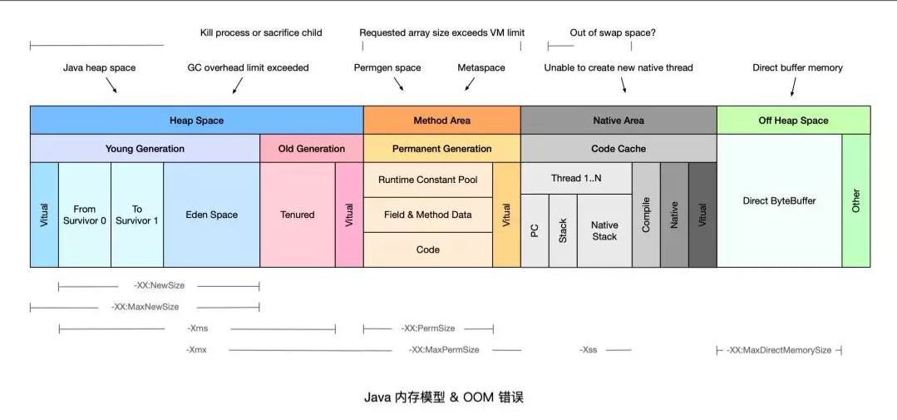

## OOM
当 JVM 内存严重不足时，就会抛出 java.lang.OutOfMemoryError 错误。本文总结了常见的 OOM 原因及其解决方法，如下图所示。

## 1、Java heap space
当堆内存（Heap Space）没有足够空间存放新创建的对象时，就会抛出 java.lang.OutOfMemoryError:Javaheap space 错误
（根据实际生产经验，可以对程序日志中的 OutOfMemoryError 配置关键字告警，一经发现，立即处理）。

### 原因分析
Javaheap space 错误产生的常见原因可以分为以下几类：

1、请求创建一个超大对象，通常是一个大数组。

2、超出预期的访问量/数据量，通常是上游系统请求流量飙升，常见于各类促销/秒杀活动，可以结合业务流量指标排查是否有尖状峰值。

3、过度使用终结器（Finalizer），该对象没有立即被 GC。

4、内存泄漏（Memory Leak），大量对象引用没有释放，JVM 无法对其自动回收，常见于使用了 File 等资源没有回收。

### 解决方案
针对大部分情况，通常只需要通过 -Xmx 参数调高 JVM 堆内存空间即可。如果仍然没有解决，可以参考以下情况做进一步处理：

1、如果是超大对象，可以检查其合理性，比如是否一次性查询了数据库全部结果，而没有做结果数限制。

2、如果是业务峰值压力，可以考虑添加机器资源，或者做限流降级。

3、如果是内存泄漏，需要找到持有的对象，修改代码设计，比如关闭没有释放的连接。

https://zhuanlan.zhihu.com/p/79355050