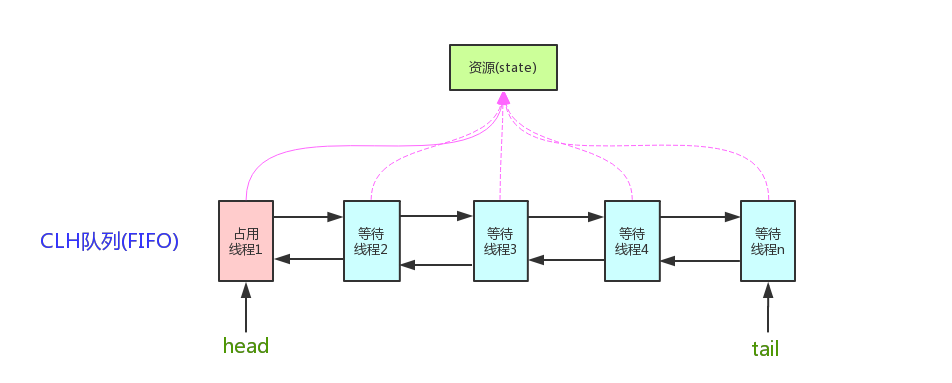

<!-- TOC -->
- [AQS 简单介绍](#AQS-简单介绍)
  - [AQS 原理概览](#AQS-原理概览)
  - [AQS 对资源的共享方式](#AQS-对资源的共享方式)
  - [AQS 底层使用了模板方法模式](#AQS-底层使用了模板方法模式)
- [Semaphore(信号量)-允许多个线程同时访问](#Semaphore-允许多个线程同时访问)
- [CountDownLatch （倒计时器）](#CountDownLatch-倒计时器)
    - [CountDownLatch 的两种典型用法](#CountDownLatch-的两种典型用法)
    - [CountDownLatch 的使用示例](#CountDownLatch-的使用示例)
    - [CountDownLatch 的不足](#CountDownLatch-的不足)
- [CyclicBarrier(循环栅栏)](#CyclicBarrier-循环栅栏)
    - [CyclicBarrier 的应用场景](#CyclicBarrier-的应用场景)
    - [CyclicBarrier 的使用示例](#CyclicBarrier-的使用示例)
    - [CyclicBarrier源码分析](#CyclicBarrier源码分析)
- [CyclicBarrier 和 CountDownLatch 的区别](#CyclicBarrier-和-CountDownLatch-的区别)
- [参考](#参考)

<!-- /TOC -->

## AQS 简单介绍
AQS 的全称为（AbstractQueuedSynchronizer），这个类在 java.util.concurrent.locks 包下面。

AQS 是一个用来构建锁和同步器的框架，使用 AQS 能简单且高效地构造出应用广泛的大量的同步器，比如我们提到的 ReentrantLock，Semaphore，其他的诸如 ReentrantReadWriteLock，SynchronousQueue，FutureTask(jdk1.7) 等等皆是基于 AQS 的。当然，我们自己也能利用 AQS 非常轻松容易地构造出符合我们自己需求的同步器。


### AQS 原理概览
**AQS 核心思想是，如果被请求的共享资源空闲，则将当前请求资源的线程设置为有效的工作线程，并且将共享资源设置为锁定状态。
如果被请求的共享资源被占用，那么就需要一套线程阻塞等待以及被唤醒时锁分配的机制，这个机制 AQS 是用 CLH 队列锁实现的，
即将暂时获取不到锁的线程加入到队列中。**

> CLH(Craig,Landin,and Hagersten)队列是一个虚拟的双向队列（虚拟的双向队列即不存在队列实例，仅存在结点之间的关联关系）。
AQS 是将每条请求共享资源的线程封装成一个 CLH 锁队列的一个结点（Node）来实现锁的分配。

看个 AQS(AbstractQueuedSynchronizer)原理图：


AQS 使用一个 int 成员变量来表示同步状态，通过内置的 FIFO 队列来完成获取资源线程的排队工作。
AQS 使用 CAS 对该同步状态进行原子操作实现对其值的修改。
```java
private volatile int state; //共享变量，使用volatile修饰保证线程可见性.
```

状态信息通过 protected 类型的getState，setState，compareAndSetState进行操作
```java
//返回同步状态的当前值
protected final int getState() {
        return state;
}
 // 设置同步状态的值
protected final void setState(int newState) {
        state = newState;
}
//原子地（CAS操作）将同步状态值设置为给定值update如果当前同步状态的值等于expect（期望值）
protected final boolean compareAndSetState(int expect, int update) {
        return unsafe.compareAndSwapInt(this, stateOffset, expect, update);
}
```

### AQS 对资源的共享方式

**AQS 定义两种资源共享方式**

**1. Exclusive（独占）**

只有一个线程能执行，如 ReentrantLock。又可分为公平锁和非公平锁,ReentrantLock 同时支持两种锁,下面以 ReentrantLock 对这两种锁的定义做介绍：

- 公平锁：按照线程在队列中的排队顺序，先到者先拿到锁
- 非公平锁：当线程要获取锁时，先通过两次 CAS 操作去抢锁，如果没抢到，当前线程再加入到队列中等待唤醒。

**下面来看 ReentrantLock 中相关的源代码：**

ReentrantLock 默认采用非公平锁，除非你在构造方法中传入参数 true 。
```java
public ReentrantLock() {
    // 默认非公平锁
    sync = new NonfairSync();
}
public ReentrantLock(boolean fair) {
    sync = fair ? new FairSync() : new NonfairSync();
}
```

**公平锁的 lock 方法：**
```java
static final class FairSync extends Sync {
    private static final long serialVersionUID = -3000897897090466540L;

    final void lock() {
        acquire(1);
    }

    /**
     * Fair version of tryAcquire.  Don't grant access unless
     * recursive call or no waiters or is first.
     */
    protected final boolean tryAcquire(int acquires) {
        final Thread current = Thread.currentThread();
        int c = getState();
        if (c == 0) {
            // 1. 和非公平锁相比，这里多了一个判断：是否有线程在等待
            if (!hasQueuedPredecessors() &&
                compareAndSetState(0, acquires)) {
                setExclusiveOwnerThread(current);
                return true;
            }
        }
        else if (current == getExclusiveOwnerThread()) {
            int nextc = c + acquires;
            if (nextc < 0)
                throw new Error("Maximum lock count exceeded");
            setState(nextc);
            return true;
        }
        return false;
    }
}
```
**非公平锁的 lock 方法：**
```java
static final class NonfairSync extends Sync {
    private static final long serialVersionUID = 7316153563782823691L;

    /**
     * Performs lock.  Try immediate barge, backing up to normal
     * acquire on failure.
     */
    final void lock() {
        // 2. 和公平锁相比，这里会直接先进行一次CAS，成功就返回了
        if (compareAndSetState(0, 1))
            setExclusiveOwnerThread(Thread.currentThread());
        else
            acquire(1);
    }

    protected final boolean tryAcquire(int acquires) {
        return nonfairTryAcquire(acquires);
    }
}
```
```java
final boolean nonfairTryAcquire(int acquires) {
    final Thread current = Thread.currentThread();
    int c = getState();
    if (c == 0) {
        // 这里没有对阻塞队列进行判断
        if (compareAndSetState(0, acquires)) {
            setExclusiveOwnerThread(current);
            return true;
        }
    }
    else if (current == getExclusiveOwnerThread()) {
        int nextc = c + acquires;
        if (nextc < 0) // overflow
            throw new Error("Maximum lock count exceeded");
        setState(nextc);
        return true;
    }
    return false;
}
```

**总结：公平锁和非公平锁只有两处不同：**

- 非公平锁在调用 lock 后，首先就会调用 CAS 进行一次抢锁，如果这个时候恰巧锁没有被占用，那么直接就获取到锁返回了。
- 非公平锁在 CAS 失败后，和公平锁一样都会进入到 tryAcquire 方法，在 tryAcquire 方法中，如果发现锁这个时候被释放了（state == 0），非公平锁会直接 CAS 抢锁，但是公平锁会判断等待队列是否有线程处于等待状态，如果有则不去抢锁，乖乖排到后面。

公平锁和非公平锁就这两点区别，如果这两次 CAS 都不成功，那么后面非公平锁和公平锁是一样的，都要进入到阻塞队列等待唤醒。

相对来说，非公平锁会有更好的性能，因为它的吞吐量比较大。当然，非公平锁让获取锁的时间变得更加不确定，可能会导致在阻塞队列中的线程长期处于饥饿状态。

**2. Share（共享）**

多个线程可同时执行，如 Semaphore/CountDownLatch。Semaphore、CountDownLatCh、 CyclicBarrier、ReadWriteLock 我们都会在后面讲到。

ReentrantReadWriteLock 可以看成是组合式，因为 ReentrantReadWriteLock 也就是读写锁允许多个线程同时对某一资源进行读。

不同的自定义同步器争用共享资源的方式也不同。自定义同步器在实现时只需要实现共享资源 state 的获取与释放方式即可，至于具体线程等待队列的维护（如获取资源失败入队/唤醒出队等），AQS 已经在上层已经帮我们实现好了。


### AQS 底层使用了模板方法模式

AQS 使用了模板方法模式，自定义同步器时需要重写下面几个 AQS 提供的模板方法：
```text
isHeldExclusively()//该线程是否正在独占资源。只有用到condition才需要去实现它。
tryAcquire(int)//独占方式。尝试获取资源，成功则返回true，失败则返回false。
tryRelease(int)//独占方式。尝试释放资源，成功则返回true，失败则返回false。
tryAcquireShared(int)//共享方式。尝试获取资源。负数表示失败；0表示成功，但没有剩余可用资源；正数表示成功，且有剩余资源。
tryReleaseShared(int)//共享方式。尝试释放资源，成功则返回true，失败则返回false。
```

- 以ReentrantLock 为例，state 初始化为 0，表示未锁定状态。A 线程 lock()时，会调用 tryAcquire()独占该锁并将 state+1。此后，其他线程再 tryAcquire()时就会失败，直到 A 线程 unlock()到 state=0（即释放锁）为止，其它线程才有机会获取该锁。当然，释放锁之前，A 线程自己是可以重复获取此锁的（state 会累加），这就是可重入的概念。但要注意，获取多少次就要释放多么次，这样才能保证 state 是能回到零态的。

- 以CountDownLatch 以例，任务分为 N 个子线程去执行，state 也初始化为 N（注意 N 要与线程个数一致）。这 N 个子线程是并行执行的，每个子线程执行完后 countDown()一次，state 会 CAS(Compare and Swap)减 1。等到所有子线程都执行完后(即 state=0)，会 unpark()主调用线程，然后主调用线程就会从 await()函数返回，继续后余动作。

一般来说，自定义同步器要么是独占方法，要么是共享方式，他们也只需实现tryAcquire-tryRelease、tryAcquireShared-tryReleaseShared中的一种即可。但 AQS 也支持自定义同步器同时实现独占和共享两种方式，如ReentrantReadWriteLock。


## Semaphore(信号量)-允许多个线程同时访问
synchronized 和 ReentrantLock 都是一次只允许一个线程访问某个资源，Semaphore(信号量)可以指定多个线程同时访问某个资源。

```java
import java.util.concurrent.ExecutorService;
import java.util.concurrent.Executors;
import java.util.concurrent.Semaphore;

public class SemaphoreExample {
    // 请求的数量
    private static final int threadCount = 30;

    public static void main(String[] args) throws InterruptedException {
        // 创建一个具有固定线程数量的线程池对象
        ExecutorService threadPool = Executors.newFixedThreadPool(threadCount);
        // 一次只能允许执行的线程数量。
        final Semaphore semaphore = new Semaphore(10);

        for (int i = 0; i < threadCount; i++) {
            final int threadnum = i;
            threadPool.execute(() -> {// Lambda 表达式的运用
                try {
                    semaphore.acquire();// 获取一个许可，所以可运行线程数量为10/1=10
                    test(threadnum);
                    semaphore.release();// 释放一个许可
                } catch (InterruptedException e) {
                    // TODO Auto-generated catch block
                    e.printStackTrace();
                }

            });
        }
        threadPool.shutdown();
        System.out.println("finish");
    }

    public static void test(int threadnum) throws InterruptedException {
        Thread.sleep(1000);// 模拟请求的耗时操作
        System.out.println(Thread.currentThread().getName() + " threadnum:" + threadnum);
        Thread.sleep(1000);// 模拟请求的耗时操作
    }
}
```

在代码中虽然有30个线程可执行，但是之允许10个并发执行。Semaphore的构造方法Semaphore(int permits)表示可用的许可证数量。
Semaphore(10)表示10个线程获取许可证，也就是最大并发数是10。
acquire()表示获取一个许可证；release()表示释放一个许可证。
除了 acquire方法之外，另一个比较常用的与之对应的方法是tryAcquire方法，该方法如果获取不到许可就立即返回 false。

```text
semaphore.acquire(5);// 获取5个许可，所以可运行线程数量为10/5=2
```

Semaphore 有两种模式，公平模式和非公平模式。

- 公平模式： 调用 acquire 的顺序就是获取许可证的顺序，遵循 FIFO；
- 非公平模式： 抢占式的。
Semaphore 对应的两个构造方法如下：
```java
public Semaphore(int permits) {
    // 默认非公平模式
    sync = new NonfairSync(permits);
}

public Semaphore(int permits, boolean fair) {
    sync = fair ? new FairSync(permits) : new NonfairSync(permits);
}
```
## CountDownLatch （倒计时器）
CountDownLatch 允许 count 个线程阻塞在一个地方，直至所有线程的任务都执行完毕。

CountDownLatch 是共享锁的一种实现,它默认构造 AQS 的 state 值为 count。当线程使用 countDown() 方法时,
其实使用了tryReleaseShared方法以 CAS 的操作来减少 state,直至 state 为 0 。当调用 await() 方法的时候，
如果 state 不为 0，那就证明任务还没有执行完毕，await() 方法就会一直阻塞，也就是说 await() 方法之后的语句不会被执行。
然后，CountDownLatch 会自旋 CAS 判断 state == 0，如果 state == 0 的话，就会释放所有等待的线程，await() 方法之后的语句得到执行。

### CountDownLatch 的两种典型用法
1. 某一线程在开始运行前等待 n 个线程执行完毕。将 CountDownLatch 的计数器初始化为 n ：new CountDownLatch(n)，每当一个任务线程执行完毕，
   就将计数器减 1 countdownlatch.countDown()，当计数器的值变为 0 时，在CountDownLatch上 await() 的线程就会被唤醒。
   一个典型应用场景就是启动一个服务时，主线程需要等待多个组件加载完毕，之后再继续执行。
   
2. 实现多个线程开始执行任务的最大并行性。**注意是并行性，不是并发**，强调的是多个线程在某一时刻同时开始执行。
   类似于赛跑，将多个线程放到起点，等待发令枪响，然后同时开跑。做法是初始化一个共享的 CountDownLatch 对象，
   将其计数器初始化为 1 ：new CountDownLatch(1)，多个线程在开始执行任务前首先 coundownlatch.await()，
   当主线程调用 countDown() 时，计数器变为 0，多个线程同时被唤醒。

### CountDownLatch 的使用示例
```java
import java.util.concurrent.CountDownLatch;
import java.util.concurrent.ExecutorService;
import java.util.concurrent.Executors;

public class CountDownLatchExample {
    // 请求的数量
    private static final int threadCount = 50;

    public static void main(String[] args) throws InterruptedException {
        // 创建一个具有固定线程数量的线程池对象
        ExecutorService threadPool = Executors.newFixedThreadPool(30);
        final CountDownLatch countDownLatch = new CountDownLatch(threadCount);
        for (int i = 0; i < threadCount; i++) {
            final int threadnum = i;
            threadPool.execute(() -> {// Lambda 表达式的运用
                try {
                    test(threadnum);
                } catch (InterruptedException e) {
                    // TODO Auto-generated catch block
                    e.printStackTrace();
                } finally {
                    countDownLatch.countDown();// 表示一个请求已经被完成
                }

            });
        }
        countDownLatch.await();
        threadPool.shutdown();
        System.out.println("finish");
    }

    public static void test(int threadnum) throws InterruptedException {
        Thread.sleep(1000);// 模拟请求的耗时操作
        System.out.println("threadnum:" + threadnum);
        Thread.sleep(1000);// 模拟请求的耗时操作
    }
}
```
CountDownLatch 的 await() 方法使用不当很容易产生死锁，比如我们上面代码中的 for 循环改为：
```java

for (int i = 0; i < threadCount-1; i++) {
.......
}
```

**这样就导致 count 的值没办法等于 0，然后就会导致一直等待。**

### CountDownLatch 的不足
CountDownLatch 是一次性的，计数器的值只能在构造方法中初始化一次，之后没有任何机制再次对其设置值，当 CountDownLatch 使用完毕后，它不能再次被使用。

## CyclicBarrier(循环栅栏)
CyclicBarrier 和 CountDownLatch 非常类似，它也可以实现线程间的技术等待，但是它的功能比 CountDownLatch 更加复杂和强大。
主要应用场景和 CountDownLatch 类似。
```text
CountDownLatch 的实现是基于 AQS 的，
而 CycliBarrier 是基于 ReentrantLock(ReentrantLock 也属于 AQS 同步器)和 Condition 的.
```

CyclicBarrier 的字面意思是可循环使用（Cyclic）的屏障（Barrier）。它要做的事情是，让一组线程到达一个屏障（也可以叫同步点）时被阻塞，
直到最后一个线程到达屏障时，屏障才会开门，所有被屏障拦截的线程才会继续干活。
CyclicBarrier 默认的构造方法是 CyclicBarrier(int parties)，其参数表示屏障拦截的线程数量，
每个线程调用await方法告诉 CyclicBarrier 我已经到达了屏障，然后当前线程被阻塞。

再来看一下它的构造函数：
```java
public CyclicBarrier(int parties) {
    this(parties, null);
}

public CyclicBarrier(int parties, Runnable barrierAction) {
    if (parties <= 0) throw new IllegalArgumentException();
    this.parties = parties;
    this.count = parties;
    this.barrierCommand = barrierAction;
}
```

其中，parties 就代表了有拦截的线程的数量，当拦截的线程数量达到这个值的时候就打开栅栏，让所有线程通过。

### CyclicBarrier 的应用场景
CyclicBarrier 可以用于多线程计算数据，最后合并计算结果的应用场景。比如我们用一个 Excel 保存了用户所有银行流水，
每个 Sheet 保存一个帐户近一年的每笔银行流水，现在需要统计用户的日均银行流水，先用多线程处理每个 sheet 里的银行流水，
都执行完之后，得到每个 sheet 的日均银行流水，最后，再用 barrierAction 用这些线程的计算结果，计算出整个 Excel 的日均银行流水。

### CyclicBarrier 的使用示例

```java
import java.util.concurrent.BrokenBarrierException;
import java.util.concurrent.CyclicBarrier;
import java.util.concurrent.ExecutorService;
import java.util.concurrent.Executors;

public class CyclicBarrierExample {
    // 请求的数量
    private static final int threadCount = 50;
    // 需要同步的线程数量
    private static final CyclicBarrier cyclicBarrier = new CyclicBarrier(5, () -> {
        System.out.println("------当线程数达到之后，优先执行------");
    });

    public static void main(String[] args) throws InterruptedException {
        // 创建线程池
        ExecutorService threadPool = Executors.newFixedThreadPool(10);

        for (int i = 0; i < threadCount; i++) {
            final int threadNum = i;
            Thread.sleep(1000);
            threadPool.execute(() -> {
                try {
                    test(threadNum);
                } catch (InterruptedException e) {
                    e.printStackTrace();
                } catch (BrokenBarrierException e) {
                    e.printStackTrace();
                }
            });
        }
        threadPool.shutdown();
    }

    public static void test(int threadnum) throws InterruptedException, BrokenBarrierException {
        System.out.println("threadnum:" + threadnum + "is ready");
        cyclicBarrier.await();
        System.out.println("threadnum:" + threadnum + "is finish");
    }
}
```
运行结果，如下：
```text
threadnum:0is ready
threadnum:1is ready
threadnum:2is ready
threadnum:3is ready
threadnum:4is ready
------当线程数达到之后，优先执行------
threadnum:1is finish
threadnum:3is finish
threadnum:0is finish
threadnum:2is finish
threadnum:4is finish
threadnum:5is ready
threadnum:6is ready
threadnum:7is ready
threadnum:8is ready
threadnum:9is ready
------当线程数达到之后，优先执行------
threadnum:9is finish
threadnum:5is finish
threadnum:8is finish
threadnum:7is finish
threadnum:6is finish
threadnum:10is ready
threadnum:11is ready
......
```

### CyclicBarrier源码分析
当调用 CyclicBarrier 对象调用 await() 方法时，实际上调用的是dowait(false, 0L)方法。 
await() 方法就像树立起一个栅栏的行为一样，将线程挡住了，当拦住的线程数量达到 parties 的值时，栅栏才会打开，线程才得以通过执行。

总结：CyclicBarrier 内部通过一个 count 变量作为计数器，cout 的初始值为 parties 属性的初始化值，
每当一个线程到了栅栏这里了，那么就将计数器减一。如果 count 值为 0 了，表示这是这一代最后一个线程到达栅栏， 就尝试执行我们构造方法中输入的任务。


## CyclicBarrier 和 CountDownLatch 的区别
下面这个是国外一个大佬的回答：

CountDownLatch 是计数器，只能使用一次，而 CyclicBarrier 的计数器提供 reset 功能，可以多次使用。但是我不那么认为它们之间的区别仅仅就是这么简单的一点。我们来从 jdk 作者设计的目的来看，javadoc 是这么描述它们的：
```text
CountDownLatch: A synchronization aid that allows one or more threads to wait until a set of operations being performed in other threads completes.
CountDownLatch: 一个或者多个线程，等待其他多个线程完成某件事情之后才能执行；

CyclicBarrier : A synchronization aid that allows a set of threads to all wait for each other to reach a common barrier point.
CyclicBarrier : 多个线程互相等待，直到到达同一个同步点，再继续一起执行。
```

对于 CountDownLatch 来说，重点是“一个线程（多个线程）等待”，而其他的 N 个线程在完成“某件事情”之后，可以终止，也可以等待。而对于 CyclicBarrier，重点是多个线程，在任意一个线程没有完成，所有的线程都必须等待。

CountDownLatch 是计数器，线程完成一个记录一个，只不过计数不是递增而是递减，而 CyclicBarrier 更像是一个阀门，需要所有线程都到达，阀门才能打开，然后继续执行。


## 参考

**搬运[Snailclimb的AQS同步组件总结.md](https://github.com/Snailclimb/JavaGuide/tree/master/docs/java/multi-thread)**
