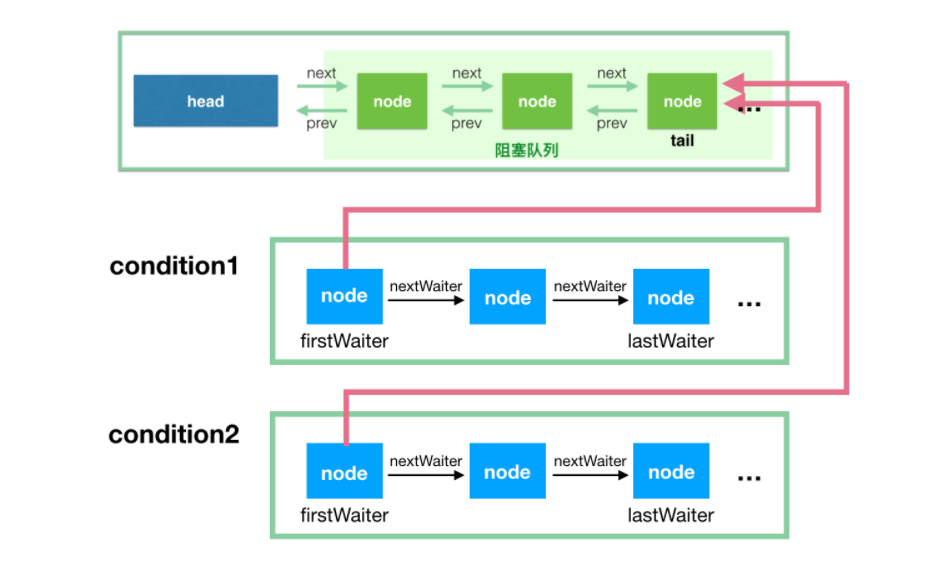

- 深入分析 AbstractQueuedSynchronizer 中的 ConditionObject
- 深入理解 Java 线程中断和 InterruptedException 异常

##Condition
我们先来看看 Condition 的使用场景，Condition 经常可以用在生产者-消费者的场景中，请看 Doug Lea 给出的这个例子
```java
import java.util.concurrent.locks.Condition;
import java.util.concurrent.locks.Lock;
import java.util.concurrent.locks.ReentrantLock;

class BoundedBuffer {
    final Lock lock = new ReentrantLock();
    // condition 依赖于 lock 来产生
    final Condition notFull = lock.newCondition();
    final Condition notEmpty = lock.newCondition();

    final Object[] items = new Object[100];
    int putptr, takeptr, count;

    // 生产
    public void put(Object x) throws InterruptedException {
        lock.lock();
        try {
            while (count == items.length)
                notFull.await();  // 队列已满，等待，直到 not full 才能继续生产
            items[putptr] = x;
            if (++putptr == items.length) putptr = 0;
            ++count;
            notEmpty.signal(); // 生产成功，队列已经 not empty 了，发个通知出去
        } finally {
            lock.unlock();
        }
    }

    // 消费
    public Object take() throws InterruptedException {
        lock.lock();
        try {
            while (count == 0)
                notEmpty.await(); // 队列为空，等待，直到队列 not empty，才能继续消费
            Object x = items[takeptr];
            if (++takeptr == items.length) takeptr = 0;
            --count;
            notFull.signal(); // 被我消费掉一个，队列 not full 了，发个通知出去
            return x;
        } finally {
            lock.unlock();
        }
    }
}
```

```text
1、我们可以看到，在使用 condition 时，必须先持有相应的锁。这个和 Object 类中的方法有相似的语义，
需要先持有某个对象的监视器锁才可以执行 wait(), notify() 或 notifyAll() 方法。

2、ArrayBlockingQueue 采用这种方式实现了生产者-消费者，所以请只把这个例子当做学习例子，
实际生产中可以直接使用 ArrayBlockingQueue
```

我们常用 obj.wait()，obj.notify() 或 obj.notifyAll() 来实现相似的功能，但是，它们是基于对象的监视器锁的。需要深入了解这几个方法的读者，可以参考我的另一篇文章《深入分析 java 8 编程语言规范：Threads and Locks》。而这里说的 Condition 是基于 ReentrantLock 实现的，而 ReentrantLock 是依赖于 AbstractQueuedSynchronizer 实现的。


在往下看之前，读者心里要有一个整体的概念。condition 是依赖于 ReentrantLock  的，不管是调用 await 进入等待还是 signal 唤醒，都必须获取到锁才能进行操作。

每个 ReentrantLock  实例可以通过调用多次 newCondition 产生多个 ConditionObject 的实例：
```java
final ConditionObject newCondition() {
    // 实例化一个 ConditionObject
    return new ConditionObject();
}
```

我们首先来看下我们关注的 Condition 的实现类 AbstractQueuedSynchronizer 类中的 ConditionObject。
```java
public class ConditionObject implements Condition, java.io.Serializable {
        private static final long serialVersionUID = 1173984872572414699L;
        // 条件队列的第一个节点
          // 不要管这里的关键字 transient，是不参与序列化的意思
        private transient Node firstWaiter;
        // 条件队列的最后一个节点
        private transient Node lastWaiter;
        ......
```

在上一篇介绍 AQS 的时候，我们有一个阻塞队列，用于保存等待获取锁的线程的队列。这里我们引入另一个概念，叫条件队列（condition queue），我画了一张简单的图用来说明这个。

这里的阻塞队列如果叫做同步队列（sync queue）其实比较贴切，不过为了和前篇呼应，我就继续使用阻塞队列了。记住这里的两个概念，阻塞队列和条件队列。



```text
这里，我们简单回顾下 Node 的属性：

volatile int waitStatus; // 可取值 0、CANCELLED(1)、SIGNAL(-1)、CONDITION(-2)、PROPAGATE(-3)
volatile Node prev;
volatile Node next;
volatile Thread thread;
Node nextWaiter;
prev 和 next 用于实现阻塞队列的双向链表，这里的 nextWaiter 用于实现条件队列的单向链表
```

基本上，把这张图看懂，你也就知道 condition 的处理流程了。所以，我先简单解释下这图，然后再具体地解释代码实现。

- 条件队列和阻塞队列的节点，都是 Node 的实例，因为条件队列的节点是需要转移到阻塞队列中去的；
- 我们知道一个 ReentrantLock 实例可以通过多次调用 newCondition() 来产生多个 Condition 实例，这里对应 condition1 和 condition2。注意，ConditionObject 只有两个属性 firstWaiter 和 lastWaiter；
- 每个 condition 有一个关联的条件队列，如线程 1 调用 condition1.await() 方法即可将当前线程 1 包装成 Node 后加入到条件队列中，然后阻塞在这里，不继续往下执行，条件队列是一个单向链表；
- 调用condition1.signal() 触发一次唤醒，此时唤醒的是队头，会将condition1 对应的条件队列的 firstWaiter（队头） 移到阻塞队列的队尾，等待获取锁，获取锁后 await 方法才能返回，继续往下执行。

上面的 2->3->4 描述了一个最简单的流程，没有考虑中断、signalAll、还有带有超时参数的 await 方法等，不过把这里弄懂是这节的主要目的。

同时，从图中也可以很直观地看出，哪些操作是线程安全的，哪些操作是线程不安全的。

这个图看懂后，下面的代码分析就简单了。

接下来，我们一步步按照流程来走代码分析，我们先来看看 wait 方法：

```java
// 首先，这个方法是可被中断的，不可被中断的是另一个方法 awaitUninterruptibly()
// 这个方法会阻塞，直到调用 signal 方法（指 signal() 和 signalAll()，下同），或被中断
public final void await() throws InterruptedException {
    // 老规矩，既然该方法要响应中断，那么在最开始就判断中断状态
    if (Thread.interrupted())
        throw new InterruptedException();

    // 添加到 condition 的条件队列中
    Node node = addConditionWaiter();

    // 释放锁，返回值是释放锁之前的 state 值
    // await() 之前，当前线程是必须持有锁的，这里肯定要释放掉
    int savedState = fullyRelease(node);

    int interruptMode = 0;
    // 这里退出循环有两种情况，之后再仔细分析
    // 1. isOnSyncQueue(node) 返回 true，即当前 node 已经转移到阻塞队列了
    // 2. checkInterruptWhileWaiting(node) != 0 会到 break，然后退出循环，代表的是线程中断
    while (!isOnSyncQueue(node)) {
        LockSupport.park(this);
        if ((interruptMode = checkInterruptWhileWaiting(node)) != 0)
            break;
    }
    // 被唤醒后，将进入阻塞队列，等待获取锁
    if (acquireQueued(node, savedState) && interruptMode != THROW_IE)
        interruptMode = REINTERRUPT;
    if (node.nextWaiter != null) // clean up if cancelled
        unlinkCancelledWaiters();
    if (interruptMode != 0)
        reportInterruptAfterWait(interruptMode);
}
```

**1. 将节点加入到条件队列**

addConditionWaiter() 是将当前节点加入到条件队列，看图我们知道，这种条件队列内的操作是线程安全的。
   
```java
// 将当前线程对应的节点入队，插入队尾
private Node addConditionWaiter() {
    Node t = lastWaiter;
    // 如果条件队列的最后一个节点取消了，将其清除出去
    // 为什么这里把 waitStatus 不等于 Node.CONDITION，就判定为该节点发生了取消排队？
    if (t != null && t.waitStatus != Node.CONDITION) {
        // 这个方法会遍历整个条件队列，然后会将已取消的所有节点清除出队列
        unlinkCancelledWaiters();
        t = lastWaiter;
    }
    // node 在初始化的时候，指定 waitStatus 为 Node.CONDITION
    Node node = new Node(Thread.currentThread(), Node.CONDITION);

    // t 此时是 lastWaiter，队尾
    // 如果队列为空
    if (t == null)
        firstWaiter = node;
    else
        t.nextWaiter = node;
    lastWaiter = node;
    return node;
}
```

上面的这块代码很简单，就是将当前线程进入到条件队列的队尾。

在addWaiter 方法中，有一个 unlinkCancelledWaiters() 方法，这个方法会遍历整个条件队列，然后会将已取消的所有节点清除出队列。


**2. 完全释放独占锁**
回到 wait 方法，节点入队了以后，会调用 int savedState = fullyRelease(node); 方法释放锁，注意，这里是完全释放独占锁（fully release），因为 ReentrantLock 是可以重入的。

**3. 等待进入阻塞队列**
```java
int interruptMode = 0;
// 如果不在阻塞队列中，注意了，是阻塞队列
while (!isOnSyncQueue(node)) {
    // 线程挂起
    LockSupport.park(this);

    // 在 5. 唤醒后检查中断状态会讲
    if ((interruptMode = checkInterruptWhileWaiting(node)) != 0)
        break;
}
```

```text
isOnSyncQueue判断是否在阻塞队列中
  1. 移动过去的时候，node 的 waitStatus 会置为 0，这个之后在说 signal 方法的时候会说到
  2. 如果 waitStatus 还是 Node.CONDITION，也就是 -2，那肯定就是还在条件队列中
  3. 如果 node 的前驱 prev 指向还是 null，说明肯定没有在 阻塞队列(prev是阻塞队列链表中使用的)
  4. 如果 node 已经有后继节点 next 的时候，那肯定是在阻塞队列了
```

**4. signal 唤醒线程，转移到阻塞队列**


**5. 唤醒后检查中断状态**
```java
int interruptMode = 0;
while (!isOnSyncQueue(node)) {
    // 线程挂起
    LockSupport.park(this);

    if ((interruptMode = checkInterruptWhileWaiting(node)) != 0)
        break;
}
```

先解释下 interruptMode。interruptMode 可以取值为 REINTERRUPT（1），THROW_IE（-1），0

- REINTERRUPT： 代表 await 返回的时候，需要重新设置中断状态
- THROW_IE： 代表 await 返回的时候，需要抛出 InterruptedException 异常
- 0 ：说明在 await 期间，没有发生中断

线程唤醒后第一步是调用 checkInterruptWhileWaiting(node) 这个方法，此方法用于判断是否在线程挂起期间发生了中断，如果发生了中断，是 signal 调用之前中断的，还是 signal 之后发生的中断。

```java
// 1. 如果在 signal 之前已经中断，返回 THROW_IE
// 2. 如果是 signal 之后中断，返回 REINTERRUPT
// 3. 没有发生中断，返回 0
private int checkInterruptWhileWaiting(Node node) {
    return Thread.interrupted() ?
        (transferAfterCancelledWait(node) ? THROW_IE : REINTERRUPT) :
        0;
}
```

**这里再说一遍，即使发生了中断，节点依然会转移到阻塞队列。**


**6. 获取独占锁**
while 循环出来以后，下面是这段代码：
```java
由于 while 出来后，我们确定节点已经进入了阻塞队列，准备获取锁。
if (acquireQueued(node, savedState) && interruptMode != THROW_IE)
interruptMode = REINTERRUPT;
```

**7. 处理中断状态**
到这里，我们终于可以好好说下这个 interruptMode 干嘛用了。

- 0：什么都不做，没有被中断过；
- THROW_IE：await 方法抛出 InterruptedException 异常，因为它代表在 await() 期间发生了中断；
- REINTERRUPT：重新中断当前线程，因为它代表 await() 期间没有被中断，而是 signal() 以后发生的中断


##再说 java 线程中断和 InterruptedException 异常
如果线程处于以下三种情况，那么当线程被中断的时候，能自动感知到：

- 来自 Object 类的 wait()、wait(long)、wait(long, int)，
- 来自 Thread 类的 join()、join(long)、join(long, int)、sleep(long)、sleep(long, int)

```text
这几个方法的相同之处是，方法上都有: throws InterruptedException 

如果线程阻塞在这些方法上（我们知道，这些方法会让当前线程阻塞），这个时候如果其他线程对这个线程进行了中断，
那么这个线程会从这些方法中立即返回，抛出 InterruptedException 异常，同时重置中断状态为 false。
```


##参考
https://www.javadoop.com/post/AbstractQueuedSynchronizer-2