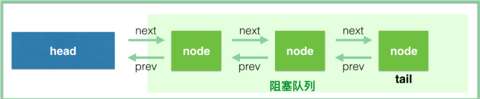
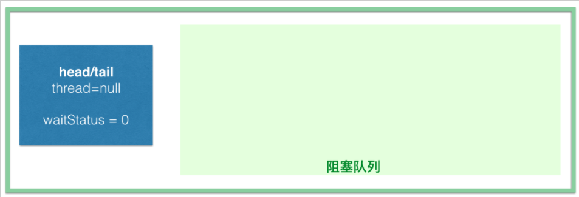
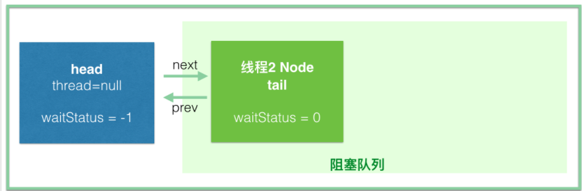
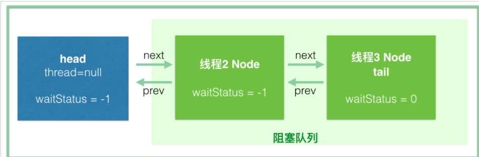

#AbstractQueuedSynchronizer源码分析

在分析 Java 并发包 java.util.concurrent 源码的时候，少不了需要了解 AbstractQueuedSynchronizer（以下简写AQS）这个抽象类，因为它是 Java 并发包的基础工具类，是实现 ReentrantLock、CountDownLatch、Semaphore、FutureTask 等类的基础。

本文将从 ReentrantLock 的公平锁源码出发，分析下 AbstractQueuedSynchronizer 这个类是怎么工作的。

##AQS 结构
**先来看看 AQS 有哪些属性**

```java
// //头结点，你直接把它当做 当前持有锁的线程
private transient volatile Node head;

//阻塞的尾节点，每个新的节点进来，都插入到最后，也就形成了一个链表
private transient volatile Node tail;

// 代表当前锁的状态，0代表没有被占用，大于 0 代表有线程持有当前锁
// 这个值可以大于 1，是因为锁可以重入，每次重入都加上 1
private volatile int state;

//继承自AbstractOwnableSynchronizer
//代表当前持有独占锁的线程，举个最重要的使用例子，因为锁可以重入
private transient Thread exclusiveOwnerThread; 
```

**AbstractQueuedSynchronizer 的等待队列示意如下所示，
注意了，之后分析过程中所说的 queue，也就是阻塞队列不包含 head，不包含 head，不包含 head。**



等待队列中每个线程被包装成一个 Node 实例，数据结构是链表，一起看看源码吧：
```java
static final class Node {
    // 标识节点当前在共享模式下
    static final Node SHARED = new Node();
    // 标识节点当前在独占模式下
    static final Node EXCLUSIVE = null;

    // ======== 下面的几个int常量是给waitStatus用的 ===========
    /** waitStatus value to indicate thread has cancelled */
    // 代码此线程取消了争抢这个锁
    static final int CANCELLED =  1;
    /** waitStatus value to indicate successor's thread needs unparking */
    // 官方的描述是，其表示当前node的后继节点对应的线程需要被唤醒
    static final int SIGNAL    = -1;
    /** waitStatus value to indicate thread is waiting on condition */
    // 本文不分析condition，所以略过吧，下一篇文章会介绍这个
    static final int CONDITION = -2;
    /**
     * waitStatus value to indicate the next acquireShared should
     * unconditionally propagate
     */
    // 同样的不分析，略过吧
    static final int PROPAGATE = -3;
    // =====================================================

    // 取值为上面的1、-1、-2、-3，或者0(以后会讲到)
    // 这么理解，暂时只需要知道如果这个值 大于0 代表此线程取消了等待，
    //    ps: 半天抢不到锁，不抢了，ReentrantLock是可以指定timeouot的。。。
    volatile int waitStatus;
    // 前驱节点的引用
    volatile Node prev;
    // 后继节点的引用
    volatile Node next;
    // 这个就是线程本尊
    volatile Thread thread;
}
```
Node 的数据结构其实也挺简单的，就是 thread + waitStatus + pre + next 四个属性而已.


## 首先，我们先看下 ReentrantLock 的使用方式。
ReentrantLock 在内部用了内部类 Sync 来管理锁，所以真正的获取锁和释放锁是由 Sync 的实现类来控制的。
```java
abstract static class Sync extends AbstractQueuedSynchronizer {
}
```
Sync 有两个实现，分别为 NonfairSync（非公平锁）和 FairSync（公平锁），我们看 FairSync 部分。
```java
public ReentrantLock(boolean fair) {
    sync = fair ? new FairSync() : new NonfairSync();
}
```

###FairSync争锁
**ReentrantLock的内部静态类公平锁**
```java
static final class FairSync extends Sync {
    private static final long serialVersionUID = -3000897897090466540L;

    // 争锁
    final void lock() {
        acquire(1);
    }

    /**
     * Fair version of tryAcquire.  Don't grant access unless
     * recursive call or no waiters or is first.
     */
    // 尝试直接获取锁，返回值是boolean，代表是否获取到锁
    // 返回true：1.没有线程在等待锁；2.重入锁，线程本来就持有锁，也就可以理所当然可以直接获取
    protected final boolean tryAcquire(int acquires) {
        final Thread current = Thread.currentThread();
        int c = getState();
        // state == 0 此时此刻没有线程持有锁
        if (c == 0) {
            // 虽然此时此刻锁是可以用的，但是这是公平锁，既然是公平，就得讲究先来后到，
            // 看看有没有别人在队列中等了半天了
            if (!hasQueuedPredecessors() &&
                // 如果没有线程在等待，那就用CAS尝试一下，成功了就获取到锁了，
                // 不成功的话，只能说明一个问题，就在刚刚几乎同一时刻有个线程抢先了
                compareAndSetState(0, acquires)) {
                // 到这里就是获取到锁了，标记一下，告诉大家，现在是我占用了锁
                setExclusiveOwnerThread(current);
                return true;
            }
        }
        // 会进入这个else if分支，说明是重入了，需要操作：state=state+1
        else if (current == getExclusiveOwnerThread()) {
            int nextc = c + acquires;
            if (nextc < 0)
                throw new Error("Maximum lock count exceeded");
            setState(nextc);
            return true;
        }
        // 如果到这里，说明前面的if和else if都没有返回true，说明没有获取到锁
        return false;
    }
}
```
**到AbstractQueuedSynchronizer看acquire方法**
```java
public final void acquire(int arg) {
    
    // 如果tryAcquire(arg) 返回true, 也就结束了。
    // 否则，acquireQueued方法会将线程压到队列中
    if (!tryAcquire(arg) &&
        // tryAcquire(arg)没有成功，这个时候需要把当前线程挂起，放到阻塞队列中。
        acquireQueued(addWaiter(Node.EXCLUSIVE), arg))
        selfInterrupt();
}


// 此方法的作用是把线程包装成node，同时进入到队列中
// 参数mode此时是Node.EXCLUSIVE，代表独占模式
private Node addWaiter(Node mode) {
    Node node = new Node(Thread.currentThread(), mode);
    // Try the fast path of enq; backup to full enq on failure
    Node pred = tail;
    // tail!=null => 队列不为空(tail==head的时候，其实队列是空的)
    if (pred != null) {
        // 将当前的队尾节点，设置为自己的前驱
        node.prev = pred;
        // 用CAS把自己设置为队尾
        if (compareAndSetTail(pred, node)) {
            // 实现了和之前的尾节点双向连接
            pred.next = node;
            return node;
        }
    }
    // 说明 pred==null(队列是空的) 或者 CAS失败(有线程在竞争入队)
    enq(node);
    return node;
}


// 采用自旋的方式入队
// 之前说过，到这个方法只有两种可能：等待队列为空，CAS失败(有线程在竞争入队)
private Node enq(final Node node) {
    for (;;) {
        Node t = tail;
        // 队列为空
        if (t == null) { // Must initialize
            // 初始化head节点
            if (compareAndSetHead(new Node()))
            // 给后面用：这个时候head节点的waitStatus==0
            // 这个时候有了head，但是tail还是null，设置一下，
            // 把tail指向head，放心，马上就有线程要来了，到时候tail就要被抢了
            // 注意：这里可没return哦，没有return，没有return,继续for循环，下次就到下面的else分支了
                tail = head;
        } else {
            node.prev = t;
            // 用CAS把自己设置为队尾
            if (compareAndSetTail(t, node)) {
                t.next = node;
                return t;
             }
        }
    }
}


//参数node，经过addWaiter(Node.EXCLUSIVE)，此时已经进入阻塞队列
// 这个方法非常重要，应该说真正的线程挂起，然后被唤醒后去获取锁，都在这个方法里了
final boolean acquireQueued(final Node node, int arg) {
    boolean failed = true;
    try {
        boolean interrupted = false;
        for (;;) {
            final Node p = node.predecessor();
            // p == head 说明当前节点虽然进到了阻塞队列，但是是阻塞队列的第一个
            // 注意，head一般指的是占有锁的线程，head后面的才称为阻塞队列
            // 所以当前节点可以去试抢一下锁
            // enq(node) 方法里面有提到，head是延时初始化的，而且new Node()的时候没有设置任何线程
            if (p == head && tryAcquire(arg)) {
                setHead(node);
                p.next = null; // help GC
                failed = false;
                return interrupted;
            }
            // 到这里，说明上面的if分支没有成功，要么当前node本来就不是队头，
            // 要么就是tryAcquire(arg)没有抢赢别人
            if (shouldParkAfterFailedAcquire(p, node) &&
                // 因为前面返回true，所以需要挂起线程, 等待被唤醒.
                parkAndCheckInterrupt())
                interrupted = true;
        }
    } finally {
        if (failed)
            cancelAcquire(node);
    }
}

// 刚刚说过，会到这里就是没有抢到锁呗
// 如果前驱节点waitStatus=-1, 返回true
private static boolean shouldParkAfterFailedAcquire(Node pred, Node node) {
    int ws = pred.waitStatus;
    // 前驱节点的 waitStatus == -1 ，说明前驱节点状态正常，当前线程需要挂起，直接可以返回true
    if (ws == Node.SIGNAL)
        /*
         * This node has already set status asking a release
         * to signal it, so it can safely park.
         */
        return true;
        
    // 前驱节点 waitStatus大于0，说明前驱节点取消了排队。
    // 将当前节点的prev指向waitStatus<=0的节点
    // 注意：进入阻塞队列排队的线程会被挂起，而唤醒的操作是由前驱节点完成的。
    if (ws > 0) {
        /*
         * Predecessor was cancelled. Skip over predecessors and
         * indicate retry.
         */
        do {
            node.prev = pred = pred.prev;
        } while (pred.waitStatus > 0);
        pred.next = node;
    } else {
        /*
         * waitStatus must be 0 or PROPAGATE.  Indicate that we
         * need a signal, but don't park yet.  Caller will need to
         * retry to make sure it cannot acquire before parking.
         */
        // 每个新的node入队时，waitStatu都是0
        // 用CAS将前驱节点的waitStatus设置为Node.SIGNAL(也就是-1)
        compareAndSetWaitStatus(pred, ws, Node.SIGNAL);
    }
    // 这个方法返回 false，那么会再走一次 for 循序，
    // 然后再次进来此方法，此时会从第一个分支返回 true
    return false;
}
```
**前驱节点的waitStatus=-1是依赖于后继节点设置的。**
**waitStatus=-1代表后继节点需要被唤醒**

**acquire(int arg)方法流程图**


##示例图解析
1. 第一个线程调用 reentrantLock.lock()，tryAcquire(1) 直接就返回 true 了，结束。
   只是设置了 state=1，连 head 都没有初始化，更谈不上什么阻塞队列了。

2. 如果线程 1 没有调用 unlock() 之前，线程 2 调用了 lock(), 想想会发生什么？
```java
//线程 2 会初始化 head(new Node())，同时线程 2 也会插入到阻塞队列并挂起
// (注意看这里是一个for循环，而且设置 head和tail的部分是不return，只有入队成功才会跳出循环)
    private Node enq(final Node node) {
        for (;;) {
            Node t = tail;
            if (t == null) { // Must initialize
                if (compareAndSetHead(new Node()))
                    tail = head;
            } else {
                node.prev = t;
                if (compareAndSetTail(t, node)) {
                    t.next = node;
                    return t;
                }
            }
        }
    }
```
首先，是线程 2 初始化 head 节点，此时 head==tail, waitStatus==0


然后线程 2 入队：

同时我们也要看此时节点的 waitStatus，我们知道 head 节点是线程 2 初始化的，此时的 waitStatus 没有设置， java 默认会设置为 0，
但是到 shouldParkAfterFailedAcquire 这个方法的时候，线程 2 会把前驱节点，也就是 head 的waitStatus设置为 -1。

那线程 2 节点此时的 waitStatus 是多少呢，由于没有设置，所以是 0；

如果线程 3 此时再进来，直接插到线程 2 的后面就可以了，此时线程 3 的 waitStatus 是 0，到 shouldParkAfterFailedAcquire 方法的时候把前驱节点线程 2 的 waitStatus 设置为 -1。

这里可以简单说下 waitStatus 中 SIGNAL(-1) 状态的意思，Doug Lea 注释的是：代表后继节点需要被唤醒。
也就是说这个 waitStatus 其实代表的不是自己的状态，而是后继节点的状态，我们知道，每个 node 在入队的时候，都会把前驱节点的状态改为 SIGNAL，然后阻塞，等待被前驱唤醒。


###FairSync解锁
```java
public void unlock() {
    sync.release(1);
}

protected final boolean tryRelease(int releases) {
    int c = getState() - releases;
    if (Thread.currentThread() != getExclusiveOwnerThread())
        throw new IllegalMonitorStateException();
    boolean free = false;
    // 其实就是重入的问题，如果c==0，也就是说没有嵌套锁了，可以释放了，否则还不能释放掉
    if (c == 0) {
        free = true;
        setExclusiveOwnerThread(null);
    }
    setState(c);
    return free;
}
```
**到AbstractQueuedSynchronizer 看release方法**
```java
public final boolean release(int arg) {
    if (tryRelease(arg)) {
        Node h = head;
        if (h != null && h.waitStatus != 0)
            unparkSuccessor(h);
        return true;
    }
    return false;
}

// 唤醒后继节点
// 从上面调用处知道，参数node是head头结点
private void unparkSuccessor(Node node) {
    /*
     * If status is negative (i.e., possibly needing signal) try
     * to clear in anticipation of signalling.  It is OK if this
     * fails or if status is changed by waiting thread.
     */
    int ws = node.waitStatus;
    // 如果head节点当前waitStatus<0, 将其修改为0
    if (ws < 0)
        compareAndSetWaitStatus(node, ws, 0);

    /*
     * Thread to unpark is held in successor, which is normally
     * just the next node.  But if cancelled or apparently null,
     * traverse backwards from tail to find the actual
     * non-cancelled successor.
     */
    Node s = node.next;
    // 下面的代码就是唤醒后继节点，但是有可能后继节点取消了等待（waitStatus==1）
    // 从队尾往前找，找到waitStatus<=0的所有节点中排在最前面的
    if (s == null || s.waitStatus > 0) {
        s = null;
        // 从后往前找
        for (Node t = tail; t != null && t != node; t = t.prev)
            if (t.waitStatus <= 0)
                s = t;
    }
    if (s != null)
        // 唤醒线程
        LockSupport.unpark(s.thread);
}
```

唤醒线程以后，被唤醒的线程将从以下代码中继续往前走：
```java
private final boolean parkAndCheckInterrupt() {
    LockSupport.park(this); // 刚刚线程被挂起在这里了
    return Thread.interrupted();
}
```
**又回到这个方法了：acquireQueued(final Node node, int arg)，这个时候，node的前驱是head了**

##总结
**在并发环境下，加锁和解锁需要以下三个部件的协调：**
- 锁状态。我们要知道锁是不是被别的线程占有了，这个就是 state 的作用，它为 0 的时候代表没有线程占有锁，可以去争抢这个锁，用 CAS 将 state 设为 1，
  如果 CAS 成功，说明抢到了锁，这样其他线程就抢不到了，如果锁重入的话，state进行 +1 就可以，解锁就是减 1，直到 state 又变为 0，代表释放锁，
  所以 lock() 和 unlock() 必须要配对。然后唤醒等待队列中的第一个线程，让其来占有锁。
- 线程的阻塞和解除阻塞。AQS 中采用了 LockSupport.park(thread) 来挂起线程，用 unpark 来唤醒线程。
- 阻塞队列。因为争抢锁的线程可能很多，但是只能有一个线程拿到锁，其他的线程都必须等待，这个时候就需要一个 queue 来管理这些线程，
  AQS 用的是一个 FIFO 的队列，就是一个链表，每个 node 都持有后继节点的引用。AQS 采用了 CLH 锁的变体来实现。
  

##参考
https://javadoop.com/post/AbstractQueuedSynchronizer