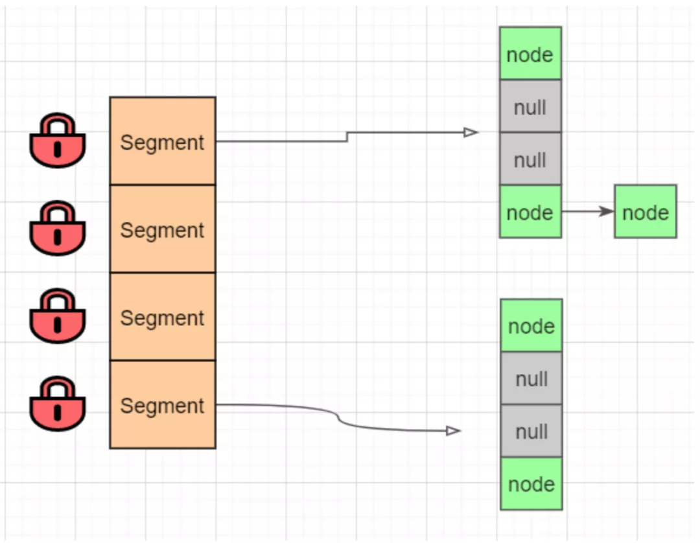
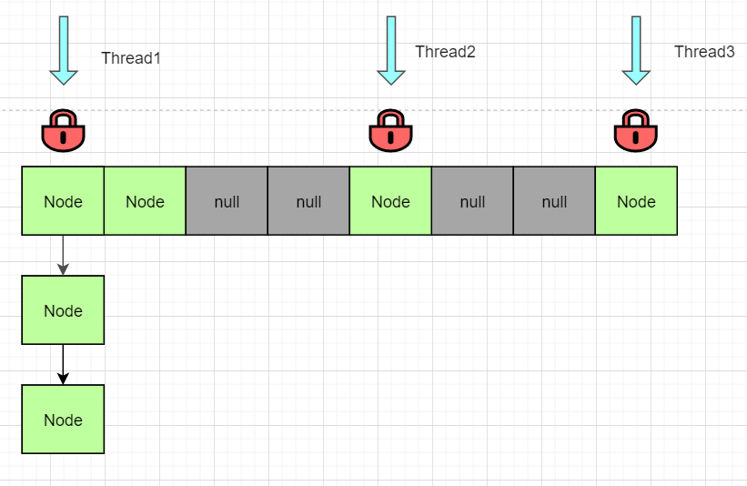
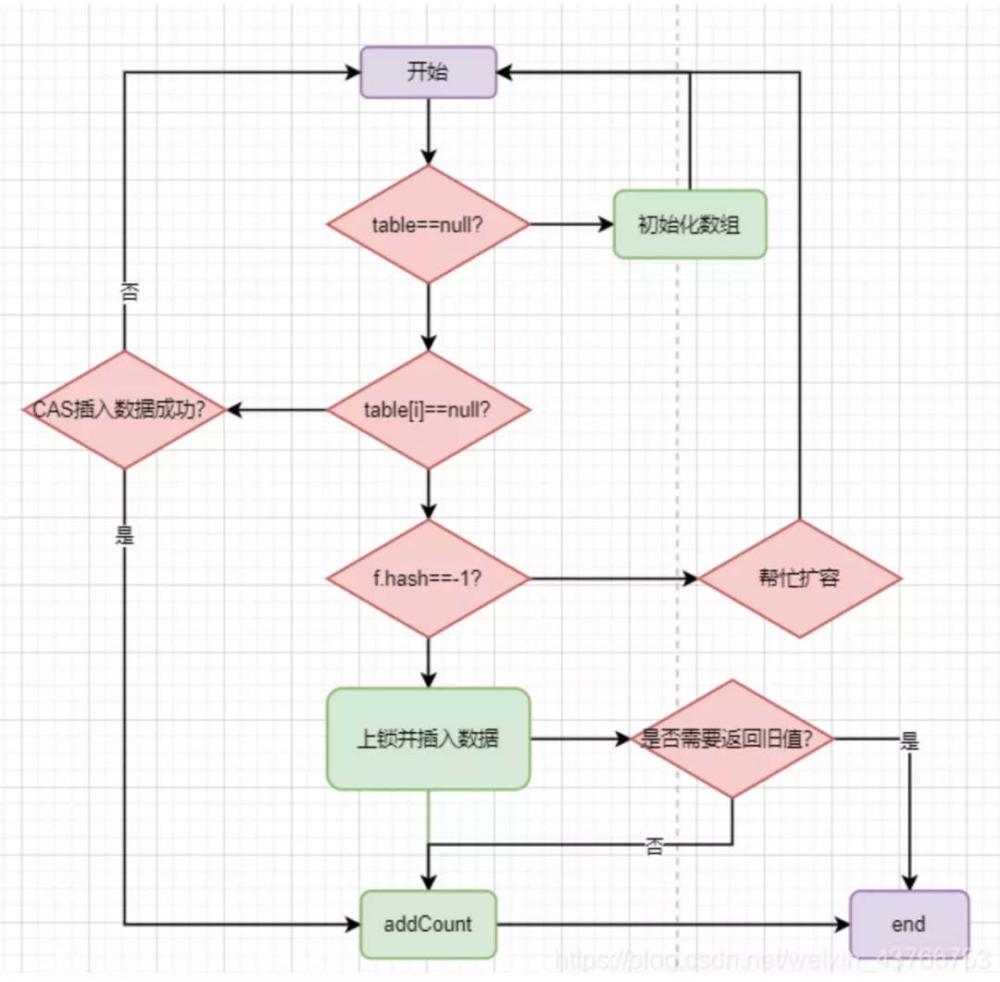
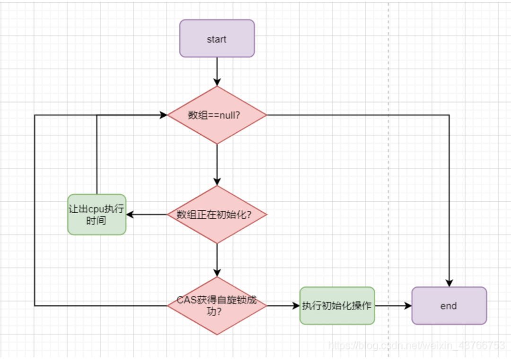

# ConcurrentHashMap 

## ConcurrentHashMap的并发策略概述
Hashtable与SynchronizeMap采取的并发策略是对整个数组对象加锁，导致性能及其低下。
jdk1.7之前，ConcurrentHashMap采用的是锁分段策略来优化性能，如下图：


相当于把整个数组，拆分成多个小数组。每次操作只需要锁住操作的小数组即可，不同的segment之间不互相影响，提高了性能。
jdk1.8之后，对整个策略进行了重构。锁的不是segment，而是节点，如下图：


锁的粒度进一步被降低，并发的效率也提高了。jdk1.8做得优化不只是细化锁粒度，还带来了CAS+synchronize的设计。
那么下面，我们针对ConcurrentHashMap的常见方法：添加、删除、扩容、初始化等进行详解他的设计思路。

## 添加数据：putVal()

ConcurrentHashMap添加数据时，采取了CAS+synchronize结合策略。首先会判断该节点是否为null，如果为null，尝试使用CAS添加节点；
如果添加失败，说明发生了并发冲突，再对节点进行上锁并插入数据。在并发较低的情景下无需加锁，可以显著提高性能。同时只会CAS尝试一次，
也不会造成线程长时间等待浪费cpu时间的情况。ConcurrentHashMap的put方法整体流程如下（并不是全部流程）：


1. 首先会判断数组是否已经初始化，如若未初始化，会先去初始化数组；
2. 如果当前要插入的节点为null，尝试使用CAS插入数据；
3. 如果不为null，则判断节点hash值是否为-1；-1表示数组正在扩容，会先去协助扩容，再回来继续插入数据。（协助扩容后面会讲）
4. 最后会执行上锁，并插入数据，最后判断是否需要返回旧值；如果不是覆盖旧值，需要更新map中的节点数，也就是图中的addCount方法。

ConcurrentHashMap是基于HashMap改造的，其中的插入数据、hash算法和HashMap都大同小异，这里不再赘述。
思路清晰之后，下面我们看源码分析：
```java
final V putVal(K key, V value, boolean onlyIfAbsent) {

    // 不允许插入空值或空键
    // 允许value空值会导致get方法返回null时有两种情况：
    // 1. 找不到对应的key2. 找到了但是value为null；
    // 当get方法返回null时无法判断是哪种情况，在并发环境下containsKey方法已不再可靠，
    // 需要返回null来表示查询不到数据。允许key空值需要额外的逻辑处理，占用了数组空间，且并没有多大的实用价值。
    // HashMap支持键和值为null，但基于以上原因，ConcurrentHashMap是不支持空键值。
    if (key == null || value == null) throw new NullPointerException();

    // 高低位异或扰动hashcode，和HashMap类似
    // 但有一点点不同，后面会讲,这里可以简单认为一样的就可以
    int hash = spread(key.hashCode());
    // bincount表示链表的节点数
    int binCount = 0;

    // 尝试多种方法循环处理，后续会有很多这种设计
    for (Node<K,V>[] tab = table;;) {
        Node<K,V> f; int n, i, fh; K fk; V fv;
        // 情况一：如果数组为空则进行初始化
        if (tab == null || (n = tab.length) == 0)
            tab = initTable();
        // 情况二：目标下标对象为null
        else if ((f = tabAt(tab, i = (n - 1) & hash)) == null) {
            // 重点：采用CAS进行插入
            if (casTabAt(tab, i, null, new Node<K,V>(hash, key, value)))
			    break;
        }
        // 情况三：数组正在扩容，帮忙迁移数据到新的数组
        // 同时会新数组，下次循环就是插入到新的数组
        // 关于扩容的内容后面再讲，这里理解为正在扩容即可
        else if ((fh = f.hash) == MOVED)
			tab = helpTransfer(tab, f);
        else if (onlyIfAbsent // check first node without acquiring lock
				 && fh == hash
				 && ((fk = f.key) == key || (fk != null && key.equals(fk)))
				 && (fv = f.val) != null)
            return fv;
        // 情况四：直接对节点进行加锁，插入数据
        // 下面代码很多，但逻辑和HashMap插入数据大同小异
        // 因为已经上锁，不涉及并发安全设计
        else {
            V oldVal = null;
			// 同步加锁
            synchronized (f) {
                // 重复检查一下刚刚获取的对象有没有发生变化
                if (tabAt(tab, i) == f) {
                    // 链表处理情况
                    if (fh >= 0) {
                        binCount = 1;
                        // 循环链表
                        for (Node<K,V> e = f;; ++binCount) {
                            K ek;
                            // 找到相同的则记录旧值
                            if (e.hash == hash &&
                                ((ek = e.key) == key ||
                                (ek != null && key.equals(ek)))) {
                                oldVal = e.val;
                                // 判断是否需要更新数值
                                if (!onlyIfAbsent)
                                    e.val = value;
                                break;
                            }
                            Node<K,V> pred = e;
                            // 若未找到则插在链表尾
                            if ((e = e.next) == null) {
                                pred.next = new Node<K,V>(hash, key, value);
                                break;
                            }
                        }
                    }
                    // 红黑树处理情况
                    else if (f instanceof TreeBin) {
                        Node<K,V> p;
                        binCount = 2;
                        if ((p = ((TreeBin<K,V>)f).putTreeVal(hash, key, value)) != null) {
                            oldVal = p.val;
                            if (!onlyIfAbsent)
                                p.val = value;
                        }
                    }
                    else if (f instanceof ReservationNode)
                        throw new IllegalStateException("Recursive update");
                }
            }
            // 判断是否需要转化为红黑树，和返回旧数值
            if (binCount != 0) {
                if (binCount >= TREEIFY_THRESHOLD)
                    treeifyBin(tab, i);
                if (oldVal != null)
                    return oldVal;
                break;
            }
        }
    }
    // 总数+1；这是一个非常硬核的设计
    // 这是ConcurrentHashMap设计中的一个重点，后面我们详细说
    addCount(1L, binCount);
    return null;
}
```

我们注意到源码中有两个关键方法：初始化数组的initTable()，修改map中节点总数的addCount。这两个方法是如何实现线程安全的呢，我们继续分析。

## 初始化数组：initTable()

初始化操作的重点是：保证多个线程并发调用此方法，只能有一个线程成功。ConcurrentHashMap采取了CAS+自旋的方法来解决并发问题，整体流程如下图：


1. 首先会判断数组是否为null，如果否说明另一个线程初始化结束了，直接返回该数组；
2. 第二步判断是否正在初始化，如果是会让出cpu执行时间，当前线程自旋等待
3. 如果数组为null，且没有另外的线程正在初始化，那么会尝试获取自旋锁，获取成功则进行初始化，获取失败则表示发生了并发冲突，继续循环判断。

ConcurrentHashMap并没有直接采用上锁的方式，而是采用CAS+自旋锁的方式，提高了性能。自旋锁保证了只有一个线程能真正初始化数组，
同时又无需承担synchronize的高昂代价，一举两得。在看源码分析之前，我们先来了解一下ConcurrentHashMap中一个关键的变量：sizeCtl 。

sizeCtl默认为0，在正常情况下，他表示ConcurrentHashMap的阈值，是一个正数。当数组正在扩容时，他的值为-1，表示当前正在初始化，
其他线程只需要判断sizeCtl==-1 ，就知道当前数组正在初始化。但当ConcurrentHashMap正在扩容时，
sizeCtl是一个表示当前有多少个线程正在协助扩容的负数 ，我们下面讲到扩容时再分析。我们直接来看initTable()的源码分析：

```java
private final Node<K,V>[] initTable() {
    Node<K,V>[] tab; int sc;
    // 这里的循环是采用自旋的方式而不是上锁来初始化
    // 首先会判断数组是否为null或长度为0
    // 没有在构造函数中进行初始化，主要是涉及到懒加载的问题
    while ((tab = table) == null || tab.length == 0) {
        // sizeCtl是一个非常关键的变量；
        // 默认为0，-1表示正在初始化，<-1表示有多少个线程正在帮助扩容，>0表示阈值
        if ((sc = sizeCtl) < 0)
            Thread.yield(); // 让出cpu执行时间

        // 通过CAS设置sc为-1，表示获得自选锁
        // 其他线程则无法进入初始化，进行自选等待
        else if (U.compareAndSwapInt(this, SIZECTL, sc, -1)) {
            try {
                // 重复检查是否为空
                if ((tab = table) == null || tab.length == 0) {
                    int n = (sc > 0) ? sc : DEFAULT_CAPACITY;
                    @SuppressWarnings("unchecked")
                    Node<K,V>[] nt = (Node<K,V>[])new Node<?,?>[n];
                    table = tab = nt;
                    // 设置sc为阈值，n>>>2表示1/4*n，也就相当于0.75n
                    sc = n - (n >>> 2);
                }
            } finally {
                // 把sc赋值给sizeCtl
                sizeCtl = sc;
            }
            break;
        }
    }
    // 最后返回tab数组
    return tab;
}
```

## 修改节点总数：addCount()
addCount方法的目标很简单，就是把ConcurrentHashMap的节点总数进行+1,也就是我在文章开头提出的问题。
ConcurrentHashMap的作者设计了一套非常严谨的架构来保证并发安全与高性能。

```java
private final void addCount(long x, int check) {
    ... // 总数+1逻辑

        // 这部分的逻辑主要是判断是否需要扩容
        // 同时保证只有一个线程能够创建新的数组
        // 其他的线程只能辅助迁移数据
    if (check >= 0) {
        Node<K,V>[] tab, nt; int n, sc;
           // 当长度达到阈值且长度并未达到最大值时进行下一步扩容
        while (s >= (long)(sc = sizeCtl) && (tab = table) != null &&
               (n = tab.length) < MAXIMUM_CAPACITY) {
            // 这个数配合后续的sizeCtr计算
            // 他的格式是第16位肯定为1,低15位表示n前面连续的0个数，我们前面介绍过
            int rs = resizeStamp(n);
            // 小于0表示正在扩容或者正在初始化,否则进入下一步抢占锁进行创建新数组
            if (sc < 0) {
                // 如果正在迁移右移16位后一定等于rs
                // ( sc == rs + 1 ||sc == rs + MAX_RESIZERS)这两个条件我认为不可能为true
                // 有兴趣可以点击下方网站查看
                // https://bugs.java.com/bugdatabase/view_bug.do?bug_id=JDK-8214427
                // nextTable==null说明下个数组还未创建
                // transferIndex<=0说明迁移已经够完成了
                // 符合以上情况的重新循环自旋
                if ((sc >>> RESIZE_STAMP_SHIFT) != rs || sc == rs + 1 ||
                    sc == rs + MAX_RESIZERS || (nt = nextTable) == null ||
                    transferIndex <= 0)
                    break;
                // 帮忙迁移,sc+1
                if (U.compareAndSwapInt(this, SIZECTL, sc, sc + 1))
                    transfer(tab, nt);
            }
            // 抢占锁进行扩容
            // 对rs检验码进行左移16位再+2，这部分我们在上面介绍过
            else if (U.compareAndSwapInt(this, SIZECTL, sc,
                                         (rs << RESIZE_STAMP_SHIFT) + 2))
                // 抢占自旋锁成功，进行扩容
                transfer(tab, null);

            // 更新节点总数，继续循环
            s = sumCount();
        }
    }
}
```


参考链接
https://mp.weixin.qq.com/s/88vdouvU--fUa4tfrQlxFg