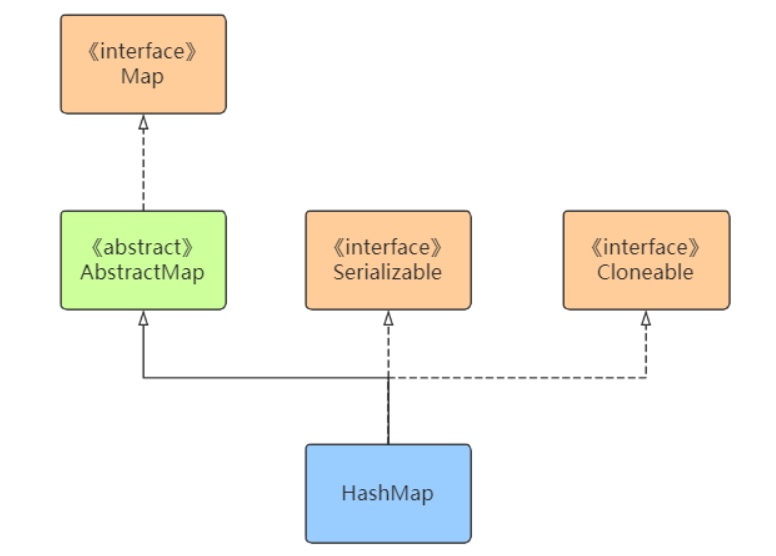
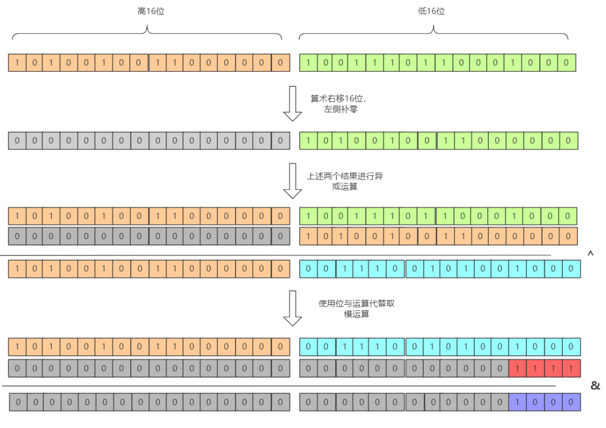
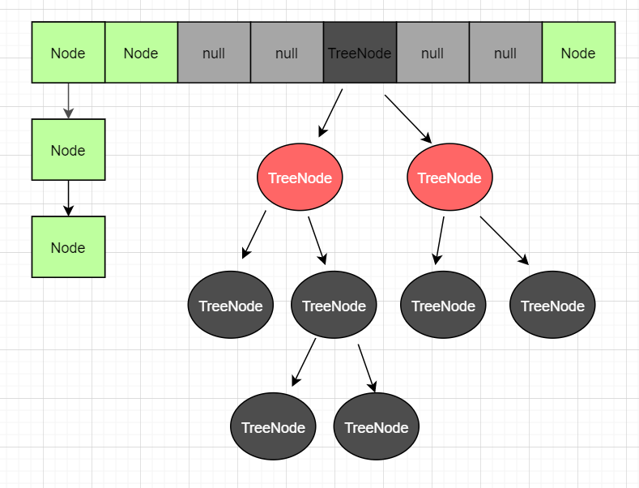
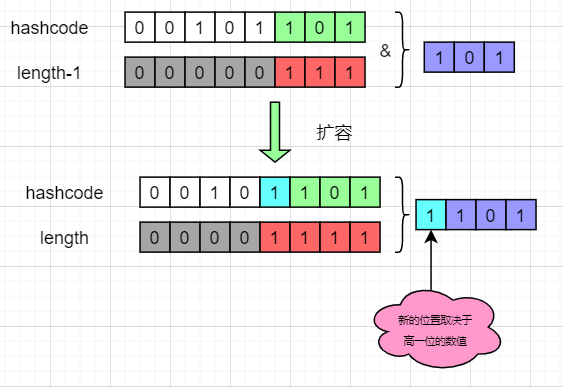
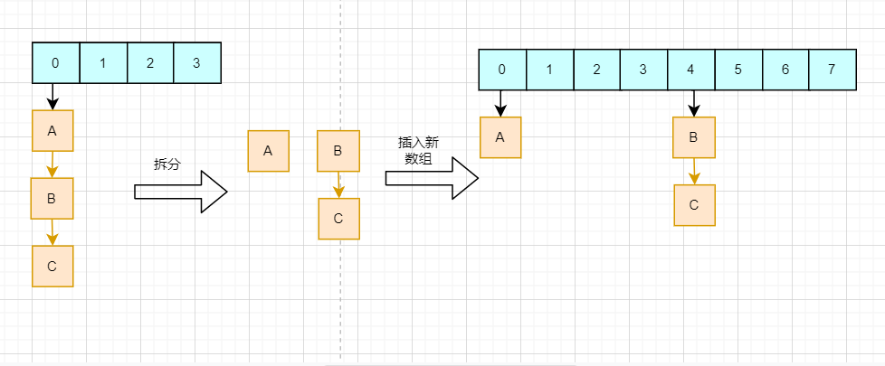
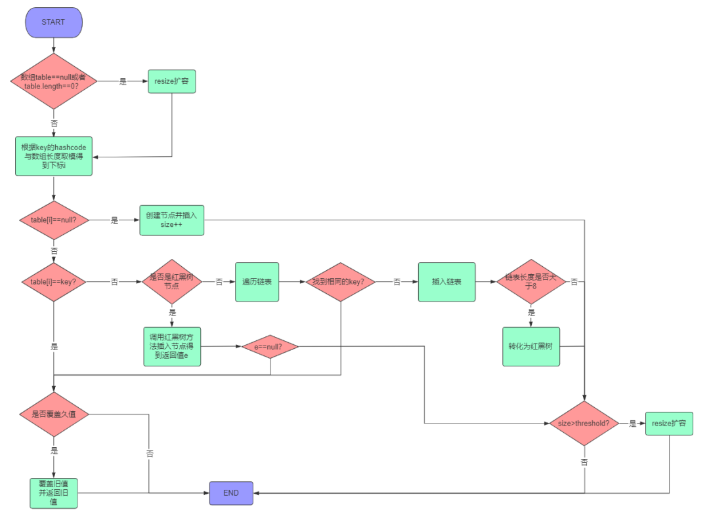

# HashMap
HashMap本质上是一个散列表，那么就离不开散列表的三大问题：散列函数、哈希冲突、扩容方案；同时作为一个数据结构，必须考虑多线程并发访问的问题，也就是线程安全。这四大重点则为学习HashMap的重点，也是HashMap设计的重点。

HashMap属于Map集合体系的一部分，同时继承了Serializable接口可以被序列化，继承了Cloneable接口可以被复制。他的的继承结构如下：


HashMap并不是全能的，对于一些特殊的情景下的需求官方拓展了一些其他的类来满足，如线程安全的ConcurrentHashMap、
记录插入顺序的LinkHashMap、给key排序的TreeMap等。

文章内容主要讲解四大重点：
散列函数、哈希冲突、扩容方案、线程安全，再补充关键的源码分析和相关的问题。

## 哈希函数
哈希函数的目标是计算key在数组中的下标。判断一个哈希函数的标准是：散列是否均匀、计算是否简单。

HashMap哈希函数的步骤：
1. 对key对象的hashcode进行扰动
2. 通过取模求得数组下标 
   
扰动是为了让hashcode的随机性更高，第二步取模就不会让所以的key都聚集在一起，提高散列均匀度。扰动可以看到hash()方法：
```java
    static final int hash(Object key) {
        int h;
        // 获取到key的hashcode，在高低位异或运算
        return (key == null) ? 0 : (h = key.hashCode()) ^ (h >>> 16);
    }
```
也就是低16位是和高16位进行异或，高16位保持不变。一般的数组长度都会比较短，取模运算中只有低位参与散列；高位与低位进行异或，
让高位也得以参与散列运算，使得散列更加均匀。

取模运算的源码看到putVal()方法，该方法在put()方法中被调用：
```java
    final V putVal(int hash, K key, V value, boolean onlyIfAbsent,
                   boolean evict) {
        ...
        if ((p = tab[i = (n - 1) & hash]) == null)
        ...
        }
```
完整的hash计算过程可以参考下图：


上面我们提到HashMap的数组长度为2的整数次幂，那么HashMap是如何控制数组的长度为2的整数次幂的？修改数组长度有两种情况：
- 初始化时指定的长度
- 扩容时的长度增量

1. 先看第一种情况。默认情况下，如未在HashMap构造器中指定长度，则初始长度为16。16是一个较为合适的经验值，他是2的整数次幂，
同时太小会频繁触发扩容、太大会浪费空间。如果指定一个非2的整数次幂，会自动转化成大于该指定数的最小2的整数次幂。如指定6则转化为8，
指定11则转化为16。结合源码来分析，当我们初始化指定一个非2的整数次幂长度时，HashMap会调用tableSizeFor()方法：
```java
public HashMap(int initialCapacity, float loadFactor) {
    ...
    this.loadFactor = loadFactor;
    this.threshold = tableSizeFor(initialCapacity);
}
```

2. 第二种改变数组长度的情况是扩容。HashMap每次扩容的大小都是原来的两倍，控制了数组大小一定是2的整数次幂，相关源码如下：
```java
final Node<K,V>[] resize() {
    ...
    else if ((newCap = oldCap << 1) < MAXIMUM_CAPACITY &&
    oldCap >= DEFAULT_INITIAL_CAPACITY)
    newThr = oldThr << 1; // double threshold
    }
```

## 小结
1. HashMap通过高16位与低16位进行异或运算来让高位参与散列，提高散列效果；
2. HashMap控制数组的长度为2的整数次幂来简化取模运算，提高性能；
3. HashMap通过控制初始化的数组长度为2的整数次幂、扩容为原来的2倍来控制数组长度一定为2的整数次幂。

## 哈希冲突解决方案

再优秀的hash算法永远无法避免出现hash冲突。hash冲突指的是两个不同的key经过hash计算之后得到的数组下标是相同的。
解决hash冲突的方式很多，如开放定址法、再哈希法、公共溢出表法、链地址法。HashMap采用的是链地址法，jdk1.8之后还增加了红黑树的优化。
如下图：


出现冲突后会在当前节点形成链表，而当链表过长之后，会自动转化成红黑树提高查找效率。红黑树是一个查找效率很高的数据结构，时间复杂度为O(logN)，
但红黑树只有在数据量较大时才能发挥它的优势。关于红黑树的转化，HashMap做了以下限制。

```java
static final int DEFAULT_INITIAL_CAPACITY = 1 << 4; // 16 这是数组默认的大小。
static final int MAXIMUM_CAPACITY = 1 << 30;   //桶最大值。
static final float DEFAULT_LOAD_FACTOR = 0.75f;   //默认的负载因子（0.75）
static final int TREEIFY_THRESHOLD = 8;  //用于判断是否需要将链表转换为红黑树的阈值。
static final int UNTREEIFY_THRESHOLD = 6; //用于判断是否需要将红黑树转换为链表的阈值。
static final int MIN_TREEIFY_CAPACITY = 64; //The smallest table capacity for which bins may be treeified
```

1. 当链表的长度>=8且数组长度>=64时，会把链表转化成红黑树。
2. 当链表长度>=8，但数组长度<64时，会优先进行扩容，而不是转化成红黑树。
3. 当红黑树节点数<=6，自动转化成链表。

**为什么需要数组长度到64才会转化红黑树？**
当数组长度较短时，如16，链表长度达到8已经是占用了最大限度的50%，意味着负载已经快要达到上限，此时如果转化成红黑树，
之后的扩容又会再一次把红黑树拆分平均到新的数组中，这样非但没有带来性能的好处，反而会降低性能。所以在数组长度低于64时，优先进行扩容。

**为什么要大于等于8转化为红黑树，而不是7或9？**
树节点的比普通节点更大，在链表较短时红黑树并未能明显体现性能优势，反而会浪费空间，在链表较短是采用链表而不是红黑树。
在理论数学计算中（装载因子=0.75），链表的长度到达8的概率是百万分之一；把7作为分水岭，大于7转化为红黑树，小于7转化为链表。
红黑树的出现是为了在某些极端的情况下，抗住大量的hash冲突，正常情况下使用链表是更加合适的。

## 小结
1. HashMap采用链地址法，当发生冲突时会转化为链表，当链表过长会转化为红黑树提高效率。
2. HashMap对红黑树进行了限制，让红黑树只有在极少数极端情况下进行抗压。

## 扩容方案
当HashMap中的数据越来越多，那么发生hash冲突的概率也就会越来越高，通过数组扩容可以利用空间换时间，保持查找效率在常数时间复杂度。
那什么时候进行扩容？由HashMap的一个关键参数控制：装载因子。

装载因子=HashMap中节点数/数组长度，他是一个比例值。当HashMap中节点数到达装载因子这个比例时，就会触发扩容；
也就是说，装载因子控制了当前数组能够承载的节点数的阈值。如数组长度是16，装载因子是0.75，那么可容纳的节点数是16*0.75=12。
装载因子的数值大小需要仔细权衡。装载因子越大，数组利用率越高，同时发生哈希冲突的概率也就越高；
装载因子越小，数组利用率降低，但发生哈希冲突的概率也降低了。所以装载因子的大小需要权衡空间与时间之间的关系。
在理论计算中，0.75是一个比较合适的数值，大于0.75哈希冲突的概率呈指数级别上升，而小于0.75冲突减少并不明显。
HashMap中的装载因子的默认大小是0.75，没有特殊要求的情况下，不建议修改他的值。

那么在到达阈值之后，HashMap是如何进行扩容的呢？HashMap会把数组长度扩展为原来的两倍，再把旧数组的数据迁移到新的数组，
而HashMap针对迁移做了优化：使用HashMap数组长度是2的整数次幂的特点，以一种更高效率的方式完成数据迁移。



从图中我们可以看到，在新数组中的hash结果，仅仅取决于高一位的数值。如果高一位是0，那么计算结果就是在原位置，而如果是1，则加上原数组的长度即可。
这样我们只需要判断一个节点的高一位是1 or 0就可以得到他在新数组的位置，而不需要重复hash计算。HashMap把每个链表拆分成两个链表，
对应原位置或原位置+原数组长度，再分别插入到新的数组中，保留原来的节点顺序，如下：


## 小结
1. 装载因子决定了HashMap扩容的阈值，需要权衡时间与空间，一般情况下保持0.75不作改动；
2. HashMap扩容机制结合了数组长度为2的整数次幂的特点，以一种更高的效率完成数据迁移，同时避免头插法造成链表环。

## 源码解析
```java
public V put(K key, V value) {
        // 获取hash值，再调用putVal方法插入数据
        return putVal(hash(key), key, value, false, true);
}

// onlyIfAbsent表示是否覆盖旧值，true表示不覆盖，false表示覆盖，默认为false
final V putVal(int hash, K key, V value, boolean onlyIfAbsent, boolean evict) {
    
    // tab是HashMap内部数组，n是数组的长度，i是要插入的下标，p是该下标对应的节点
    Node<K,V>[] tab; Node<K,V> p; int n, i;

    // 判断数组是否是null或者是否是空，若是，则调用resize()方法进行扩容
    if ((tab = table) == null || (n = tab.length) == 0)
        n = (tab = resize()).length;

    // 使用位与运算代替取模得到下标
    // 判断当前下标是否是null，若是则创建节点直接插入，若不是，进入下面else逻辑
    if ((p = tab[i = (n - 1) & hash]) == null)
        tab[i] = newNode(hash, key, value, null);
    else {
        // e表示和当前key相同的节点，若不存在该节点则为null
        // k是当前数组下标节点的key
        Node<K,V> e; K k;

        // 判断当前节点与要插入的key是否相同，是则表示找到了已经存在的key
        if (p.hash == hash &&
            ((k = p.key) == key || (key != null && key.equals(k))))
            e = p;
        // 判断该节点是否是树节点，如果是调用红黑树的方法进行插入
        else if (p instanceof TreeNode)
            e = ((TreeNode<K,V>)p).putTreeVal(this, tab, hash, key, value);
        // 最后一种情况是直接链表插入
        else {
            for (int binCount = 0; ; ++binCount) {
                if ((e = p.next) == null) {
                    p.next = newNode(hash, key, value, null);
                    // 长度大于等于8时转化为红黑树
                    // 注意，treeifyBin方法中会进行数组长度判断，
                    // 若小于64，则优先进行数组扩容而不是转化为树
                    if (binCount >= TREEIFY_THRESHOLD - 1) // -1 for 1st
                        treeifyBin(tab, hash);
                    break;
                }
                // 找到相同的直接跳出循环
                if (e.hash == hash &&
                    ((k = e.key) == key || (key != null && key.equals(k))))
                    break;
                p = e;
            }
        }
        // 如果找到相同的key节点，则判断onlyIfAbsent和旧值是否为null
        // 执行更新或者不操作，最后返回旧值
        if (e != null) { // existing mapping for key
            V oldValue = e.value;
            if (!onlyIfAbsent || oldValue == null)
                e.value = value;
            afterNodeAccess(e);
            return oldValue;
        }
    }
    ++modCount;
    if (++size > threshold)
        resize();
    afterNodeInsertion(evict);
    return null;
}
```

代码中关于每个步骤有了详细的解释，这里来总结一下：
1. 总体上分为两种情况：找到相同的key和找不到相同的key。找了需要判断是否更新并返回旧value，没找到需要插入新的Node、更新节点数并判断是否需要扩容。
2. 查找分为三种情况：数组、链表、红黑树。数组下标i位置不为空且不等于key，那么就需要判断是否树节点还是链表节点并进行查找。
3. 链表到达一定长度后需要扩展为红黑树，当且仅当链表长度>=8且数组长度>=64。

最后画一张图总体再加深一下整个流程的印象：


## 其他问题
1. 为什么jdk1.7以前控制数组的长度为素数，而jdk1.8之后却采用的是2的整数次幂？
答：素数长度可以有效减少哈希冲突；JDK1.8之后采用2的整数次幂是为了提高求余和扩容的效率，同时结合高低位异或的方法使得哈希散列更加均匀。

为何素数可以减少哈希冲突？若能保证key的hashcode在每个数字之间都是均匀分布，那么无论是素数还是合数都是相同的效果。
例如hashcode在1~20均匀分布，那么无论长度是合数4，还是素数5，分布都是均匀的。而如果hashcode之间的间隔都是2，
如1,3,5...,那么长度为4的数组，位置2和位置4两个下标无法放入数据，而长度为5的数组则没有这个问题。长度为合数的数组会使间隔为其因子的hashcode聚集出现，从而使得散列效果降低。

2. 为什么插入HashMap的数据需要实现hashcode和equals方法？对这两个方法有什么要求？
答：通过hashcode来确定插入下标，通过equals比较来寻找数据；两个相等的key的hashcode必须相等，但拥有相同的hashcode的对象不一定相等。

这里需要区分好他们之间的区别：hashcode就像一个人的名，相同的人名字肯定相等，但是相同的名字不一定是同个人；
equals比较内容是否相同，一般由对象覆盖重写，默认情况下比较的是引用地址；“==”引用队形比较的是引用地址是否相同，值对象比较的是值是否相同。

HashMap中需要使用hashcode来获取key的下标，如果两个相同的对象的hashcode不同，那么会造成HashMap中存在相同的key；
所以equals返回相同的key他们的hashcode一定要相同。
HashMap比较两个元素是否相同采用了三种比较方法结合：
p.hash == hash && ((k = p.key) == key || (key != null && key.equals(k))) 。

##线程安全

HashMap作为一个集合，主要功能则为CRUD，也就是增删查改数据，那么就肯定涉及到多线程并发访问数据的情况。并发产生的问题，需要我们特别关注。

HashMap并不是线程安全的，在多线程的情况下无法保证数据的一致性。举个例子：HashMap下标2的位置为null，线程A需要将节点X插入下标2的位置，
在判断是否为null之后，线程被挂起；此时线程B把新的节点Y插入到下标2的位置；恢复线程A，节点X会直接插入到下标2，覆盖节点Y，导致数据丢失。

**那如果结果数据一致性问题呢？解决这个问题有三个方案：**
1. 采用Hashtable
2. 调用Collections.synchronizeMap()方法来让HashMap具有多线程能力
3. 采用ConcurrentHashMap

Hashtable是老一代的集合框架，很多的设计均以及落后，
他在每一个方法中均加上了synchronize关键字保证线程安全。
```java
// Hashtable
public synchronized V get(Object key) {...}
public synchronized V put(K key, V value) {...}
public synchronized V remove(Object key) {...}
public synchronized V replace(K key, V value) {...}
```

**[ConcurrentHashMap 总结](ConcurrentHashMap.md)**

那么，使用了上述的解决方案是不是绝对线程安全？先观察下面的代码：
```java
ConcurrentHashMap<String, String> map = new ConcurrentHashMap<>();
map.put("abc","123");

Thread1:
if (map.containsKey("abc")){
    String s = map.get("abc");
}

Thread2:
map.remove("abc");
```
当Thread1调用containsKey之后释放锁，Thread2获得锁并把“abc”移除再释放锁，这个时候Thread1读取到的s就是一个null了，也就出现了问题了。
所以ConcurrentHashMap类或者Collections.synchronizeMap()方法或者Hashtable都只能在一定的限度上保证线程安全，而无法保证绝对线程安全。


关于线程安全，还有一个fast-fail问题，即快速失败。当使用HashMap的迭代器遍历HashMap时，如果此时HashMap发生了结构性改变，
如插入新数据、移除数据、扩容等，那么Iteractor会抛出fast-fail异常，防止出现并发异常，在一定限度上保证了线程安全。如下源码：
```java
final Node<K,V> nextNode() {
    ...
    if (modCount != expectedModCount)
        throw new ConcurrentModificationException();
}
```

创建Iteractor对象时会记录HashMap的modCount变量，每当HashMap发生结构性改变时，modCount会加1。
在迭代时判断HashMap的modCount和自己保存的expectedModCount是否一致即可判断是否发生了结构性改变。

fast-fail异常只能当做遍历时的一种安全保证，而不能当做多线程并发访问HashMap的手段。
若有并发需求，还是需要使用上述的三种方法。

## 小结
1. HashMap并不能保证线程安全，在多线程并发访问下会出现意想不到的问题，如数据丢失等
2. HashMap1.8采用尾插法进行扩容，防止出现链表环导致的死循环问题
3. 解决并发问题的的方案有Hashtable、Collections.synchronizeMap()、ConcurrentHashMap。其中最佳解决方案是ConcurrentHashMap
4. 上述解决方案并不能完全保证线程安全
5. 快速失败是HashMap迭代机制中的一种并发安全保证


- 16是数组的大小
- hash是高16位与低16位异或
- put获取数组下标：hash值与1111（16-1）进行位与运算
- 所以扩容时，扩原来的2倍变成与11111（32-1）进行位与运算，取决于高位。
- 如果高一位是0，那么计算结果就是在原位置，而如果是1，则加上原数组的长度即可。


参考链接
https://mp.weixin.qq.com/s/3JuPUqsUJwSfBInilY9zRg