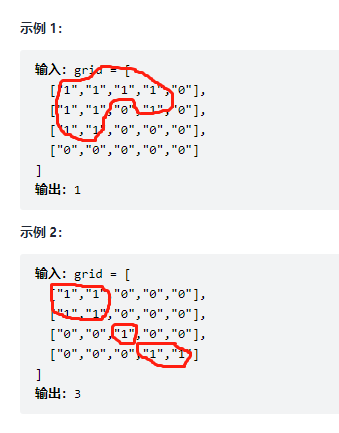
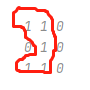
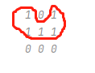

## 描述
>给一个01矩阵，1代表是陆地，0代表海洋， 如果两个1相邻，那么这两个1属于同一个岛。我们只考虑上下左右为相邻。
岛屿: 相邻陆地可以组成一个岛屿（相邻:上下左右） 判断岛屿个数。
> 



### why dfs(grid,r-1,c);


### why dfs(grid,r,c-1);;


### if(grid[i][j] == '1') is '1' not 1

```java
import java.util.*;

public class Solution {
    /**
     * 判断岛屿数量
     * @param grid char字符型二维数组 
     * @return int整型
     */
    public int solve (char[][] grid) {
        // write code here
        if(grid == null || grid.length == 0){
            return 0;
        }
        int row = grid.length;
        int col = grid[0].length;
        int num = 0;
        for(int i= 0; i < row; ++i){
            for(int j=0; j< col; ++j){
                if(grid[i][j] == '1') {
                    ++num;
                    dfs(grid,i,j);
                }
            }
        }
        return num;
    }
    public void dfs(char[][] grid, int r, int c) {
        int row = grid.length;
        int col = grid[0].length;
        if(r < 0 || c < 0 || r >= row || c >= col || grid[r][c] == '0'){
            return;
        }
        grid[r][c] = '0';
        dfs(grid,r-1,c);
        dfs(grid,r+1,c);
        dfs(grid,r,c-1);
        dfs(grid,r,c+1);
    }
}
```