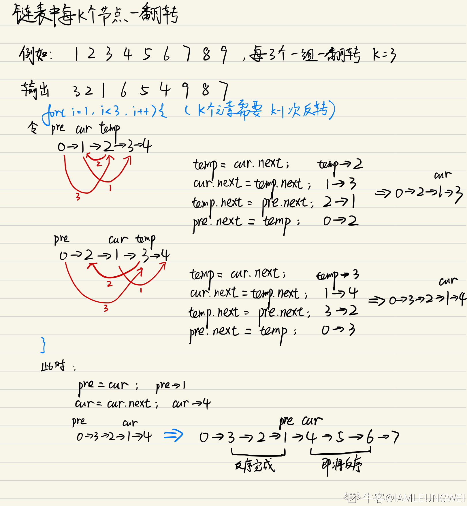

```java
import java.util.*;

/*
 * public class ListNode {
 *   int val;
 *   ListNode next = null;
 * }
 */

public class Solution {
    /**
     * 
     * @param head ListNode类 
     * @param k int整型 
     * @return ListNode类
     */
    public ListNode reverseKGroup (ListNode head, int k) {
        // write code here
        if(head==null || head.next==null || k==1) return head;
        ListNode res = new ListNode(0);
        res.next = head;
        int length = 0;
        ListNode pre = res,
                 cur = head,
                 temp = null;
        while(head!=null){
            length++;
            head = head.next;
        }
        //分段使用头插法将链表反序
        for(int i=0; i<length/k; i++){
            //pre作为每一小段链表的头节点，负责衔接
            for(int j=1; j<k; j++){
                temp = cur.next;
                cur.next = temp.next;
                //相当于头插法，注意：
                //temp.next = cur是错误的，temp需要连接的不是前一节点，而是子序列的头节点
                temp.next = pre.next;
                pre.next = temp;
            }
            //每个子序列反序完成后，pre，cur需要更新至下一子序列的头部
            pre = cur;
            cur = cur.next;
        }
        return res.next;
    }
}

```