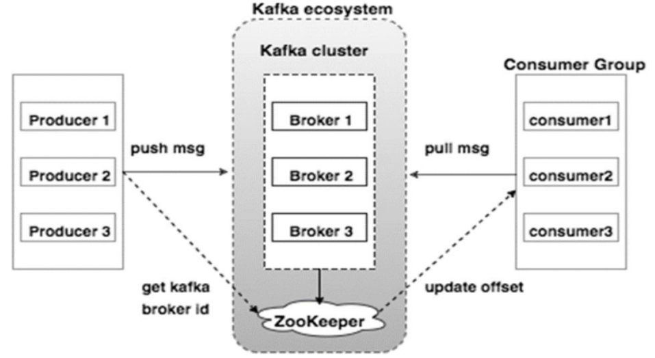

###1. 为什么要使用消息队列?
    解耦、异步、削峰
####(1)解耦
传统模式的缺点：
    系统间耦合性太强，如上图所示，系统A在代码中直接调用系统B和系统C的代码，如果将来D系统接入，系统A还需要修改代码，过于麻烦！
中间件模式的优点：
    将消息写入消息队列，需要消息的系统自己从消息队列中订阅，从而系统A不需要做任何修改。

####(2)异步
传统模式的缺点：
    一些非必要的业务逻辑以同步的方式运行，太耗费时间。
中间件模式的的优点：
    将消息写入消息队列，非必要的业务逻辑以异步的方式运行，加快响应速度
####(3)削峰
传统模式的缺点：
    并发量大的时候，所有的请求直接怼到数据库，造成数据库连接异常
中间件模式的的优点：
    系统A慢慢的按照数据库能处理的并发量，从消息队列中慢慢拉取消息。在生产中，这个短暂的高峰期积压是允许的。

###2. 使用了消息队列会有什么缺点?
系统可用性降低:
    本来其他系统只要运行好好的，那你的系统就是正常的。现在加个消息队列进去，那消息队列挂了，你的系统不是呵呵了。因此，系统可用性降低
系统复杂性增加:
    要多考虑很多方面的问题，比如一致性问题、如何保证消息不被重复消费，如何保证保证消息可靠传输。因此，需要考虑的东西更多，系统复杂性增大。

###3. 消息队列如何选型?
综合上面的材料得出以下两点:
(1)中小型软件公司，建议选RabbitMQ.一方面，erlang语言天生具备高并发的特性，而且他的管理界面用起来十分方便。正所谓，成也萧何，败也萧何！
他的弊端也在这里，虽然RabbitMQ是开源的，然而国内有几个能定制化开发erlang的程序员呢？所幸，RabbitMQ的社区十分活跃，可以解决开发过程中遇到的bug，这点对于中小型公司来说十分重要。
不考虑rocketmq和kafka的原因是，一方面中小型软件公司不如互联网公司，数据量没那么大，选消息中间件，应首选功能比较完备的，所以kafka排除。
不考虑rocketmq的原因是，rocketmq是阿里出品，如果阿里放弃维护rocketmq，中小型公司一般抽不出人来进行rocketmq的定制化开发，因此不推荐。

(2)大型软件公司，根据具体使用在rocketMq和kafka之间二选一。一方面，大型软件公司，具备足够的资金搭建分布式环境，也具备足够大的数据量。
针对rocketMQ,大型软件公司也可以抽出人手对rocketMQ进行定制化开发，毕竟国内有能力改JAVA源码的人，还是相当多的。
至于kafka，根据业务场景选择，如果有日志采集功能，肯定是首选kafka了。具体该选哪个，看使用场景。

###4. 如何保证消息队列是高可用的？
####kafka

如上图所示，一个典型的Kafka集群中包含若干Producer，若干broker（Kafka支持水平扩展，一般broker数量越多，集群吞吐率越高），
若干Consumer Group，以及一个Zookeeper集群。Kafka通过Zookeeper管理集群配置，选举leader，以及在Consumer Group发生变化时进行rebalance。
Producer使用push模式将消息发布到broker，Consumer使用pull模式从broker订阅并消费消息。 至于rabbitMQ,也有普通集群和镜像集群模.

###5. 如何保证消息不被重复消费？
无论是那种消息队列，造成重复消费原因其实都是类似的。正常情况下，消费者在消费消息时候，消费完毕后，会发送一个确认信息给消息队列，
消息队列就知道该消息被消费了，就会将该消息从消息队列中删除。只是不同的消息队列发送的确认信息形式不同,例如RabbitMQ是发送一个ACK确认消息，
RocketMQ是返回一个CONSUME_SUCCESS成功标志，kafka实际上有个offset的概念，每一个消息都有一个offset，kafka消费过消息后，需要提交offset，
让消息队列知道自己已经消费过了。那造成重复消费的原因?，就是因为网络传输等等故障，确认信息没有传送到消息队列，
导致消息队列不知道自己已经消费过该消息了，再次将该消息分发给其他的消费者。

####如何解决?这个问题针对业务场景来答分以下几点
- 比如，你拿到这个消息做数据库的insert操作。那就容易了，给这个消息做一个唯一主键，那么就算出现重复消费的情况，就会导致主键冲突，避免数据库出现脏数据。
- 再比如，你拿到这个消息做redis的set的操作，那就容易了，不用解决，因为你无论set几次结果都是一样的，set操作本来就算幂等操作。
- 如果上面两种情况还不行，上大招。准备一个第三方介质,来做消费记录。以redis为例，给消息分配一个全局id，只要消费过该消息，将<id,message>以K-V形式写入redis。那消费者开始消费前，先去redis中查询有没消费记录即可。

###6. 如何保证消费的可靠性传输?
