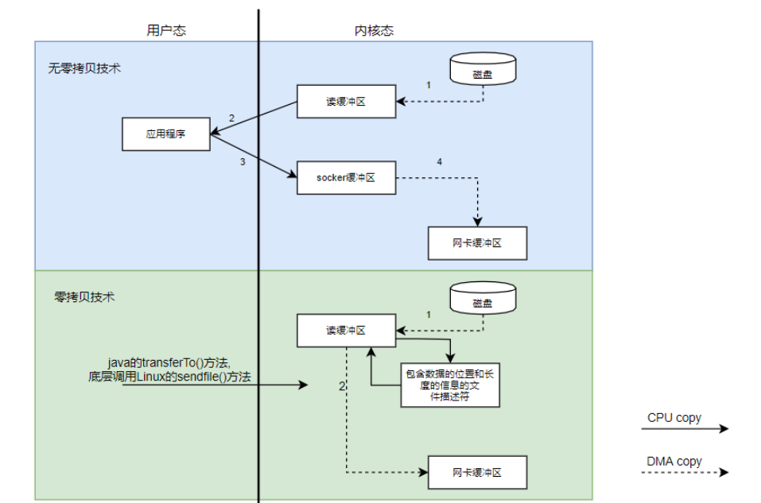

## Kafka为什么速度那么快？

    1、partition顺序读写，充分利用磁盘特性，这是基础；
    2、Producer生产的数据持久化到broker，采用mmap文件映射，实现顺序的快速写入；
    3、Customer从broker读取数据，采用sendfile，将磁盘文件读到OS内核缓冲区后，
    直接转到socket buffer进行网络发送。

Kafka速度的秘诀在于，它把所有的消息都变成一个批量的文件，并且进行合理的批量压缩，减少网络IO损耗，
通过mmap提高I/O速度，写入数据的时候由于单个Partion是末尾添加所以速度最优；
读取数据的时候配合sendfile直接暴力输出。

### mmap 和 sendfile总结

    1、都是Linux内核提供、实现零拷贝的API；
    2、sendfile 是将读到内核空间的数据，转到socket buffer，进行网络发送；
    3、mmap将磁盘文件映射到内存，支持读和写，对内存的操作会反映在磁盘文件上。
    RocketMQ 在消费消息时，使用了 mmap。kafka 使用了 sendFile。

### 顺序写入
硬盘是机械结构，每次读写都会寻址->写入，其中寻址是一个“机械动作”，它是最耗时的。
所以硬盘最讨厌随机I/O，最喜欢顺序I/O。为了提高读写硬盘的速度，Kafka就是使用顺序I/O。

### Kakfa提供了两种策略来删除数据：

    1、顺序写入一是基于时间。
    2、顺序写入二是基于partition文件大小。

### Memory Mapped Files

即便是顺序写入硬盘，硬盘的访问速度还是不可能追上内存。所以Kafka的数据并不是实时的写入硬盘 ，
它充分利用了现代操作系统分页存储来利用内存提高I/O效率。

Memory Mapped Files(后面简称mmap)也被翻译成 内存映射文件 ，在64位操作系统中一般可以表示20G的数据文件，
它的工作原理是直接利用操作系统的Page来实现文件到物理内存的直接映射。

完成映射之后你对物理内存的操作会被同步到硬盘上（操作系统在适当的时候）。

通过mmap，进程像读写硬盘一样读写内存（当然是虚拟机内存），也不必关心内存的大小有虚拟内存为我们兜底。

但也有一个很明显的缺陷——不可靠，写到mmap中的数据并没有被真正的写到硬盘，
操作系统会在程序主动调用flush的时候才把数据真正的写到硬盘。

Kafka提供了一个参数——producer.type来控制是不是主动flush，
如果Kafka写入到mmap之后就立即flush然后再返回Producer叫 同步 (sync)；
写入mmap之后立即返回Producer不调用flush叫异步 (async)。默认是sync，即同步发送模式。

### 基于sendfile实现Zero Copy

### 2、批量压缩

在很多情况下，系统的瓶颈不是CPU或磁盘，而是网络IO，对于需要在广域网上的数据中心之间发送消息的数据流水线尤其如此。进行数据压缩会消耗少量的CPU资源,不过对于kafka而言,网络IO更应该需要考虑。

1、如果每个消息都压缩，但是压缩率相对很低，所以Kafka使用了批量压缩，即将多个消息一起压缩而不是单个消息压缩

2、Kafka允许使用递归的消息集合，批量的消息可以通过压缩的形式传输并且在日志中也可以保持压缩格式，直到被消费者解压缩

3、Kafka支持多种压缩协议，包括Gzip和Snappy压缩协议

##参考
https://mp.weixin.qq.com/s/dXYQTofcP6lGR8SSctixBQ
https://zhuanlan.zhihu.com/p/68156672
