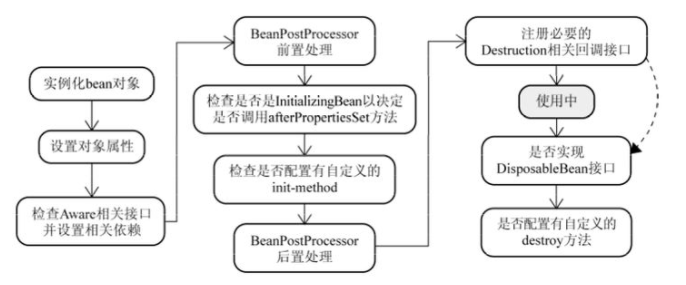

对于普通的Java对象，当new的时候创建对象，当它没有任何引用的时候被垃圾回收机制回收。
而由Spring IoC容器托管的对象，它们的生命周期完全由容器控制。Spring中每个Bean的生命周期如下：


### 1. 实例化Bean
对于BeanFactory容器，当客户向容器请求一个尚未初始化的bean时，或初始化bean的时候需要注入另一个尚未初始化的依赖时，容器就会调用createBean进行实例化。

对于ApplicationContext容器，当容器启动结束后，便实例化所有的bean。
容器通过获取BeanDefinition对象中的信息进行实例化。并且这一步仅仅是简单的实例化，并未进行依赖注入。

实例化对象被包装在BeanWrapper对象中，BeanWrapper提供了设置对象属性的接口，从而避免了使用反射机制设置属性。

### 2. 设置对象属性（依赖注入）
实例化后的对象被封装在BeanWrapper对象中，并且此时对象仍然是一个原生的状态，并没有进行依赖注入。

紧接着，Spring根据BeanDefinition中的信息进行依赖注入。

并且通过BeanWrapper提供的设置属性的接口完成依赖注入。

### 3. 注入Aware接口
紧接着，Spring会检测该对象是否实现了xxxAware接口，并将相关的xxxAware实例注入给bean。
BeanNameAware
BeanFactoryAware

### 4. BeanPostProcessor
当经过上述几个步骤后，bean对象已经被正确构造，但如果你想要对象被使用前再进行一些自定义的处理，就可以通过BeanPostProcessor接口实现。

该接口提供了两个函数：
- postProcessBeforeInitialzation( Object bean, String beanName )
  
  当前正在初始化的bean对象会被传递进来，我们就可以对这个bean作任何处理。
  这个函数会先于InitialzationBean执行，因此称为前置处理。
  所有Aware接口的注入就是在这一步完成的。
- postProcessAfterInitialzation( Object bean, String beanName )
  
  当前正在初始化的bean对象会被传递进来，我们就可以对这个bean作任何处理。
  这个函数会在InitialzationBean完成后执行，因此称为后置处理。
### 5. InitializingBean与init-method
当BeanPostProcessor的前置处理完成后就会进入本阶段。

InitializingBean接口只有一个函数：afterPropertiesSet()

这一阶段也可以在bean正式构造完成前增加我们自定义的逻辑，但它与前置处理不同，由于该函数并不会把当前bean对象传进来，因此在这一步没办法处理对象本身，只能增加一些额外的逻辑。 若要使用它，我们需要让bean实现该接口，并把要增加的逻辑写在该函数中。然后Spring会在前置处理完成后检测当前bean是否实现了该接口，并执行afterPropertiesSet函数。

当然，Spring为了降低对客户代码的侵入性，给bean的配置提供了init-method属性，该属性指定了在这一阶段需要执行的函数名。Spring便会在初始化阶段执行我们设置的函数。init-method本质上仍然使用了InitializingBean接口。

### 6. DisposableBean和destroy-method

和init-method一样，通过给destroy-method指定函数，就可以在bean销毁前执行指定的逻辑。

### 参考
https://www.zhihu.com/question/38597960
https://www.cnblogs.com/zrtqsk/p/3735273.html
https://www.jianshu.com/p/1dec08d290c1

### spring bean生命周期
- 实例化 Instantiation
- 属性赋值 Populate
- 初始化 Initialization
- 销毁 Destruction
  实例化 -> 属性赋值 -> 初始化 -> 销毁

主要逻辑都在doCreate()方法中，逻辑很清晰，就是顺序调用以下三个方法，这三个方法与三个生命周期阶段一一对应，非常重要，在后续扩展接口分析中也会涉及。
- createBeanInstance() -> 实例化
- populateBean() -> 属性赋值
- initializeBean() -> 初始化
```java
// 忽略了无关代码
protected Object doCreateBean(final String beanName, final RootBeanDefinition mbd, final @Nullable Object[] args)
      throws BeanCreationException {

   // Instantiate the bean.
   BeanWrapper instanceWrapper = null;
   if (instanceWrapper == null) {
       // 实例化阶段！
      instanceWrapper = createBeanInstance(beanName, mbd, args);
   }

   // Initialize the bean instance.
   Object exposedObject = bean;
   try {
       // 属性赋值阶段！
      populateBean(beanName, mbd, instanceWrapper);
       // 初始化阶段！
      exposedObject = initializeBean(beanName, exposedObject, mbd);
   }
}
```

```java
现在开始初始化容器
这是BeanFactoryPostProcessor实现类构造器！！
BeanFactoryPostProcessor调用postProcessBeanFactory方法
这是BeanPostProcessor实现类构造器！！
这是InstantiationAwareBeanPostProcessorAdapter实现类构造器！！

InstantiationAwareBeanPostProcessor调用postProcessBeforeInstantiation方法
【构造器】调用Person的构造器实例化
InstantiationAwareBeanPostProcessor调用postProcessPropertyValues方法
【注入属性】注入属性address
【注入属性】注入属性name
【注入属性】注入属性phone
【BeanNameAware接口】调用BeanNameAware.setBeanName()
【BeanFactoryAware接口】调用BeanFactoryAware.setBeanFactory()
BeanPostProcessor接口方法postProcessBeforeInitialization对属性进行更改！
【InitializingBean接口】调用InitializingBean.afterPropertiesSet()
【init-method】调用<bean>的init-method属性指定的初始化方法
BeanPostProcessor接口方法postProcessAfterInitialization对属性进行更改！
InstantiationAwareBeanPostProcessor调用postProcessAfterInitialization方法
容器初始化成功
Person [address=广州, name=张三, phone=110]
现在开始关闭容器！
【DiposibleBean接口】调用DiposibleBean.destory()
【destroy-method】调用<bean>的destroy-method属性指定的初始化方法
```