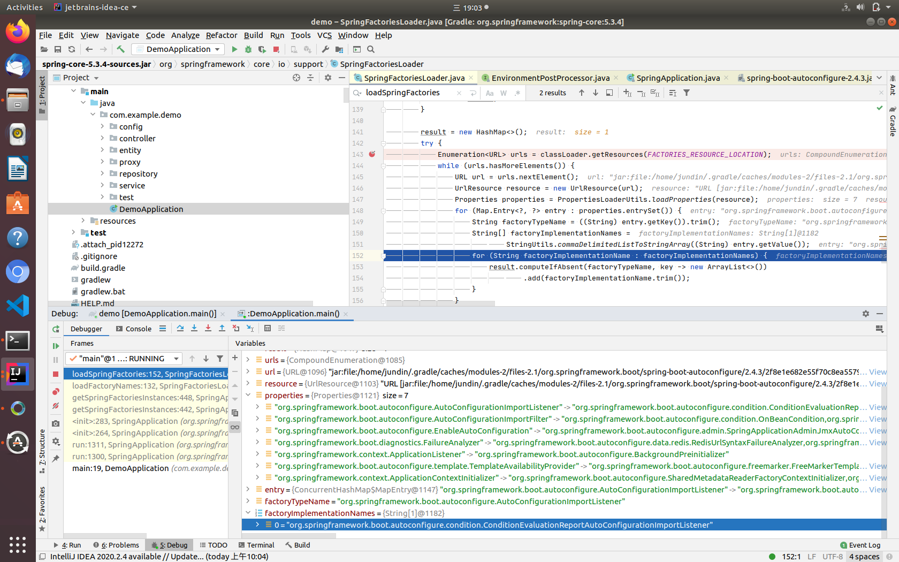

Spring Boot中有一种非常解耦的扩展机制：Spring Factories。这种扩展机制实际上是仿照Java中的SPI扩展机制来实现的。

##什么是 SPI机制
SPI的全名为Service Provider Interface.大多数开发人员可能不熟悉，因为这个是针对厂商或者插件的。在java.util.ServiceLoader的文档里有比较详细的介绍。
简单的总结下java SPI机制的思想。我们系统里抽象的各个模块，往往有很多不同的实现方案，比如日志模块的方案，xml解析模块、jdbc模块的方案等。
面向的对象的设计里，我们一般推荐模块之间基于接口编程，模块之间不对实现类进行硬编码。一旦代码里涉及具体的实现类，就违反了可拔插的原则，
如果需要替换一种实现，就需要修改代码。为了实现在模块装配的时候能不在程序里动态指明，这就需要一种服务发现机制。

java SPI就是提供这样的一个机制：为某个接口寻找服务实现的机制。有点类似IOC的思想，就是将装配的控制权移到程序之外，在模块化设计中这个机制尤其重要。

**Spring Boot中的SPI机制**

在Spring中也有一种类似与Java SPI的加载机制。它在META-INF/spring.factories文件中配置接口的实现类名称，然后在程序中读取这些配置文件并实例化。
这种自定义的SPI机制是Spring Boot Starter实现的基础。

## Spring Factories实现原理是什么?
spring-core包里定义了SpringFactoriesLoader类,这个类实现了检索META-INF/spring.factories文件，并获取指定接口的配置的功能。
在这个类中定义了两个对外的方法：
- loadFactories 根据接口类获取其实现类的实例，这个方法返回的是对象列表。
- loadFactoryNames 根据接口获取其接口类的名称，这个方法返回的是类名的列表。
上面的两个方法的关键都是从指定的ClassLoader中获取spring.factories文件，并解析得到类名列表，具体代码如下↓

**spring.factories**

```text
# Application Listeners
org.springframework.context.ApplicationListener=\
org.springframework.boot.autoconfigure.BackgroundPreinitializer

# Auto Configuration Import Listeners
org.springframework.boot.autoconfigure.AutoConfigurationImportListener=\
org.springframework.boot.autoconfigure.condition.ConditionEvaluationReportAutoConfigurationImportListener

# Auto Configuration Import Filters
org.springframework.boot.autoconfigure.AutoConfigurationImportFilter=\
org.springframework.boot.autoconfigure.condition.OnBeanCondition,\
org.springframework.boot.autoconfigure.condition.OnClassCondition,\
org.springframework.boot.autoconfigure.condition.OnWebApplicationCondition
```
**SpringFactoriesLoader.java**
```java
public static List<String> loadFactoryNames(Class<?> factoryType, @Nullable ClassLoader classLoader) {
    ClassLoader classLoaderToUse = classLoader;
    if (classLoaderToUse == null) {
        classLoaderToUse = SpringFactoriesLoader.class.getClassLoader();
    }
    String factoryTypeName = factoryType.getName();
    return loadSpringFactories(classLoaderToUse).getOrDefault(factoryTypeName, Collections.emptyList());
}

private static Map<String, List<String>> loadSpringFactories(ClassLoader classLoader) {
    ...
    //FACTORIES_RESOURCE_LOCATION = "META-INF/spring.factories"
    Enumeration<URL> urls = classLoader.getResources(FACTORIES_RESOURCE_LOCATION);
    while (urls.hasMoreElements()) {
        URL url = urls.nextElement();
        UrlResource resource = new UrlResource(url);
        Properties properties = PropertiesLoaderUtils.loadProperties(resource);
        for (Map.Entry<?, ?> entry : properties.entrySet()) {
            String factoryTypeName = ((String) entry.getKey()).trim();
            String[] factoryImplementationNames =
                StringUtils.commaDelimitedListToStringArray((String) entry.getValue());
            for (String factoryImplementationName : factoryImplementationNames) {
                result.computeIfAbsent(factoryTypeName, key -> new ArrayList<>())
                    .add(factoryImplementationName.trim());
            }
        }
    }
}
```
Debug截图

