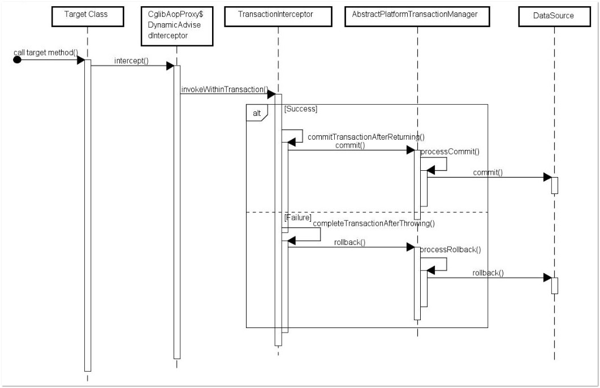
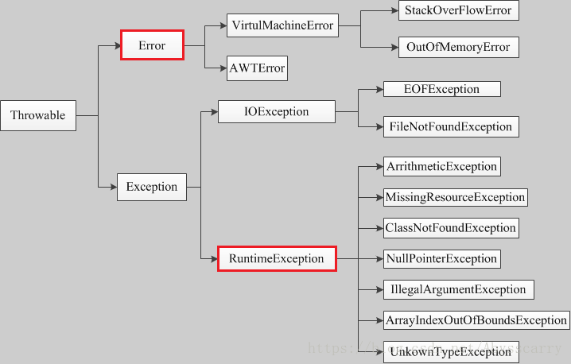

## @Transactional注解可以作用于哪些地方？
@Transactional 可以作用在接口、类、类方法。
- 作用于类：当把@Transactional 注解放在类上时，表示所有该类的public方法都配置相同的事务属性信息。
- 作用于方法：当类配置了@Transactional，方法也配置了@Transactional，方法的事务会覆盖类的事务配置信息。
- 作用于接口：不推荐这种使用方法，因为一旦标注在Interface上并且配置了Spring AOP 使用CGLib动态代理，将会导致@Transactional注解失效

## @Transactional失效场景

### 1. @Transactional 应用在非 public 修饰的方法上
如果Transactional注解应用在非public 修饰的方法上，Transactional将会失效。

之所以会失效是因为在Spring AOP 代理时，如上图所示 TransactionInterceptor （事务拦截器）在目标方法执行前后进行拦截，
DynamicAdvisedInterceptor（CglibAopProxy 的内部类）的 intercept 方法或 JdkDynamicAopProxy 的 invoke 方法
会间接调用 AbstractFallbackTransactionAttributeSource的 computeTransactionAttribute 方法，获取Transactional 注解的事务配置信息。
```java
protected TransactionAttribute computeTransactionAttribute(Method method, @Nullable Class<?> targetClass){
        // Don't allow no-public methods as required.
        if(allowPublicMethodsOnly()&&!Modifier.isPublic(method.getModifiers())){
        return null;
        }
```
此方法会检查目标方法的修饰符是否为 public，不是 public则不会获取@Transactional 的属性配置信息。

**注意：protected、private 修饰的方法上使用 @Transactional 注解，虽然事务无效，但不会有任何报错，这是我们很容犯错的一点。**

### 2. @Transactional 注解属性 propagation 设置错误
这种失效是由于配置错误，若是错误的配置以下三种 propagation，事务将不会发生回滚。

TransactionDefinition.PROPAGATION_SUPPORTS：如果当前存在事务，则加入该事务；如果当前没有事务，则以非事务的方式继续运行。

TransactionDefinition.PROPAGATION_NOT_SUPPORTED：以非事务方式运行，如果当前存在事务，则把当前事务挂起。

TransactionDefinition.PROPAGATION_NEVER：以非事务方式运行，如果当前存在事务，则抛出异常。

### 3. @Transactional  注解属性 rollbackFor 设置错误
rollbackFor 可以指定能够触发事务回滚的异常类型。Spring默认抛出了未检查unchecked异常（继承自 RuntimeException 的异常）或者 Error才回滚事务；
其他异常不会触发回滚事务。如果在事务中抛出其他类型的异常，但却期望 Spring 能够回滚事务，就需要指定 rollbackFor属性。


```java
// 希望自定义的异常可以进行回滚
@Transactional(propagation= Propagation.REQUIRED,rollbackFor= MyException.class
```
若在目标方法中抛出的异常是 rollbackFor 指定的异常的子类，事务同样会回滚。Spring 源码如下：
```java
private int getDepth(Class<?> exceptionClass, int depth) {
        if (exceptionClass.getName().contains(this.exceptionName)) {
            // Found it!
            return depth;
}
        // If we've gone as far as we can go and haven't found it...
        if (exceptionClass == Throwable.class) {
            return -1;
}
return getDepth(exceptionClass.getSuperclass(), depth + 1);
}
```

### 4. 同一个类中方法调用，导致@Transactional失效
开发中避免不了会对同一个类里面的方法调用，比如有一个类Test，它的一个方法A，A再调用本类的方法B（不论方法B是用public还是private修饰），
但方法A没有声明注解事务，而B方法有。则外部调用方法A之后，方法B的事务是不会起作用的。这也是经常犯错误的一个地方。

那为啥会出现这种情况？其实这还是由于使用Spring AOP代理造成的，因为只有当事务方法被当前类以外的代码调用时，才会由Spring生成的代理对象来管理。

### 5. 异常被你的 catch“吃了”导致@Transactional失效
这种情况是最常见的一种 @Transactional 注解失效场景，
```java
@Transactional
    private Integer A() throws Exception {
        int insert = 0;
        try {
            CityInfoDict cityInfoDict = new CityInfoDict();
            cityInfoDict.setCityName("2");
            cityInfoDict.setParentCityId(2);
            // A 插入字段为 2的数据
            insert = cityInfoDictMapper.insert(cityInfoDict);
            // B 插入字段为 3的数据
            b.insertB();
        } catch (Exception e) {
            e.printStackTrace();
        }
    }
```
如果B方法内部抛了异常，而A方法此时try catch了B方法的异常，那这个事务还能正常回滚吗？

答案：不能！

会抛出异常：
```text
org.springframework.transaction.UnexpectedRollbackException: Transaction rolled back because it has been marked as rollback-only
```

因为当ServiceB中抛出了一个异常以后，ServiceB标识当前事务需要rollback。但是ServiceA中由于你手动的捕获这个异常并进行处理，ServiceA认为当前事务应该正常commit。此时就出现了前后不一致，也就是因为这样，抛出了前面的UnexpectedRollbackException异常。

spring的事务是在调用业务方法之前开始的，业务方法执行完毕之后才执行commit or rollback，事务是否执行取决于是否抛出runtime异常。如果抛出runtime exception 并在你的业务方法中没有catch到的话，事务会回滚。

在业务方法中一般不需要catch异常，如果非要catch一定要抛出throw new RuntimeException()，或者注解中指定抛异常类型@Transactional(rollbackFor=Exception.class)，否则会导致事务失效，数据commit造成数据不一致，所以有些时候 try catch反倒会画蛇添足。

### 6. 数据库引擎不支持事务
这种情况出现的概率并不高，事务能否生效数据库引擎是否支持事务是关键。常用的MySQL数据库默认使用支持事务的innodb引擎。
一旦数据库引擎切换成不支持事务的myisam，那事务就从根本上失效了。