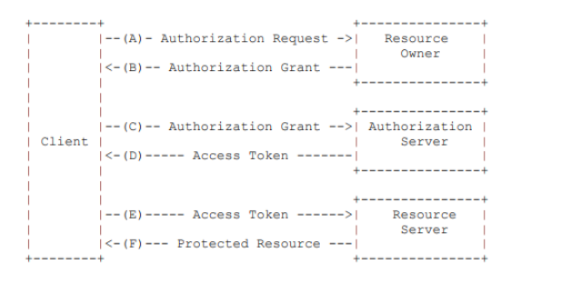
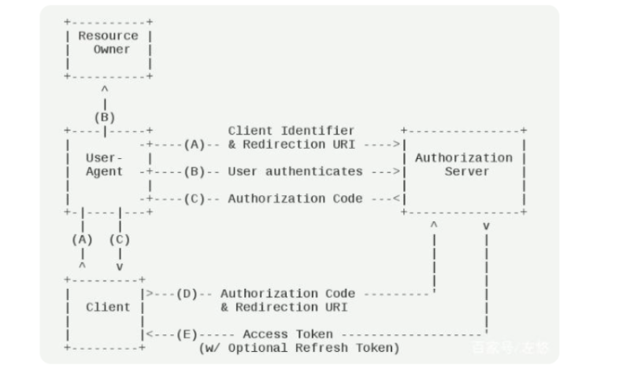

# OAuth2

## 简介

oAuth协议为用户资源的授权提供了一个安全的、开放而又简易的标准。与以往的授权方式不同之处是： oAuth 的授权不会使第三方触及到用户的帐号信息（如用户名与密码），即第三方无需使用用户的用户名与密码就可以申请获得该用户资源的授权，因此 oAuth 是安全的。OAuth2是OAuth1.0的后续版本，但是跟OAuth不兼容。RFC6749

## 角色

* Resource Owner：资源所有者，可以对保护的资源进行授权。如果资源所有者是一个人，他就是终端用户。
* Resource Server：资源服务器，持有受保护的资源，可以接收和回复对受保护资源带access tokens的请求。它与认证服务器，可以是同一台服务器，也可以是不同的服务器。
* Client：客户，一个代表资源所有者并且获得其授权的应用程序，它发出对资源的请求。
* Authorization Server：认证服务器，即服务提供商专门用来处理认证的服务器。它在成功验证了资源所有者并且获得授权后，给client签发access token。



## 授权模式

### 授权码

授权码模式用来取得access token和refresh token，它是功能最完整、流程最严密的授权模式。这种方式是最常用的流程，安全性也最高，它适用于那些有后端的 Web 应用。授权码通过前端传送，令牌则是储存在后端，而且所有与资源服务器的通信都在后端完成。这样的前后端分离，可以避免令牌泄漏。



1. 用户（资源所有者）访问客户端（client），客户端将用户（user agent）导向认证服务器，此时request里面携带客户端ID，重定向URI，request scope等信息。e.g, `https://authorization-server.com/oauth/authorize?response_type=code&client_id=CLIENT_ID&redirect_uri=CALLBACK_URL&scope=read`
2. 认证服务器要求用户登录，然后询问用户是否同意授权。
3. 假定用户给与授权，认证服务器将用户导回客户端事先指定的"重定向URI"（redirection URI），同时附上一个授权码。e.g, `https://client.com/callback?code=AUTHORIZATION_CODE`
4. 客户端收到授权码，就可以在后端附上早先的"重定向URI"，向认证服务器的token端点申请access令牌。客户端请求授权时，需要与授权服务器进行身份验证。客户端还要提供获取验证的授权码的重定向URI。e.g, `https://authorization-server.com/oauth/token?client_id=CLIENT_ID&client_secret=CLIENT_SECRET&grant_type=authorization_code&code=AUTHORIZATION_CODE&redirect_uri=CALLBACK_URL`
5. 授权服务器对客户端进行身份验证，验证授权码，并确保接收到的重定向URI与步骤3中用于重定向客户端的URI匹配。如果有效，授权服务器将颁发令牌。

### 隐藏式

有些 Web 应用是纯前端应用，没有后端。这时就不能用上面的方式了，必须将令牌储存在前端。隐藏式允许直接向前端颁发令牌。这种方式没有授权码这个中间步骤，所以称为（授权码）"隐藏式"（implicit）。


第一步，A 网站提供一个链接，要求用户跳转到 B 网站，授权用户数据给 A 网站使用。

```bash
https://b.com/oauth/authorize?
  response_type=token&
  client_id=CLIENT_ID&
  redirect_uri=CALLBACK_URL&
  scope=read
```

第二步，用
户跳转到 B 网站，登录后同意给予 A 网站授权。这时，B 网站就会跳回redirect_uri参数指定的跳转网址，并且把令牌作为 URL 参数，传给 A 网站。

```bash
https://a.com/callback#token=ACCESS_TOKEN
```

上面 URL 中，token参数就是令牌，A 网站因此直接在前端拿到令牌。
>注意，令牌的位置是 URL 锚点（fragment），而不是查询字符串（querystring），这是因为 OAuth 2.0 允许跳转网址是 HTTP 协议，因此存在"中间人攻击"的风险，而浏览器跳转时，锚点不会发到服务器，就减少了泄漏令牌的风险。

这种方式把令牌直接传给前端，是很不安全的。因此，只能用于一些安全要求不高的场景，并且令牌的有效期必须非常短，通常就是会话期间（session）有效，浏览器关掉，令牌就失效了。

### 密码式

如果你高度信任某个应用，RFC 6749 也允许用户把用户名和密码，直接告诉该应用。该应用就使用你的密码，申请令牌，这种方式称为"密码式"（password）

第一步，A 网站要求用户提供 B 网站的用户名和密码。拿到以后，A 就直接向 B 请求令牌。

```bash
https://oauth.b.com/token?
  grant_type=password&
  username=USERNAME&
  password=PASSWORD&
  client_id=CLIENT_ID
```

第二步，B 网站验证身份通过后，直接给出令牌。注意，这时不需要跳转，而是把令牌放在 JSON 数据里面，作为 HTTP 回应，A 因此拿到令牌。

这种方式需要用户给出自己的用户名/密码，显然风险很大，因此只适用于其他授权方式都无法采用的情况，而且必须是用户高度信任的应用。

### 凭证式

client credentials, 适用于没有前端的命令行应用，即在命令行下请求令牌。

第一步，A 应用在命令行向 B 发出请求。

```bash
https://oauth.b.com/token?
  grant_type=client_credentials&
  client_id=CLIENT_ID&
  client_secret=CLIENT_SECRET
```

上面 URL 中，grant_type参数等于client_credentials表示采用凭证式，client_id和client_secret用来让 B 确认 A 的身份。

第二步，B 网站验证通过以后，直接返回令牌。

这种方式给出的令牌，是针对第三方应用的，而不是针对用户的，即有可能多个用户共享同一个令牌。

## 更新令牌

具体方法是，B 网站颁发令牌的时候，一次性颁发两个令牌，一个用于获取数据，另一个用于获取新的令牌（refresh token 字段）。令牌到期前，用户使用 refresh token 发一个请求，去更新令牌。

```bash
https://b.com/oauth/token?
  grant_type=refresh_token&
  client_id=CLIENT_ID&
  client_secret=CLIENT_SECRET&
  refresh_token=REFRESH_TOKEN
```

上面 URL 中，grant_type参数为refresh_token表示要求更新令牌，client_id参数和client_secret参数用于确认身份，refresh_token参数就是用于更新令牌的令牌。

B 网站验证通过以后，就会颁发新的令牌。
