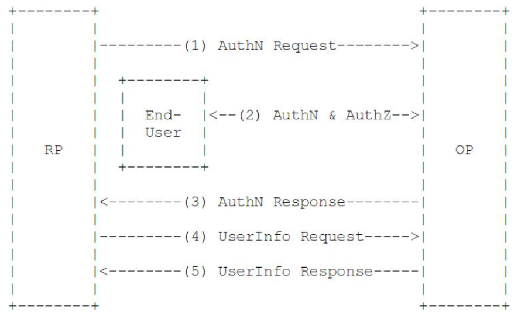

# OIDC

## Summary

OIDC=(Identity, Authentication) + OAuth 2.0  
OpenID Connect(OIDC)是在OAuth 2.0协议之上的一个简单的身份层，是一个基于OAuth2协议的身份认证标准协议。OAuth2是一个授权协议，它无法提供完善的身份认证功能，OIDC使用OAuth2的授权服务器来为第三方客户端提供用户的身份认证，并把对应的身份认证信息传递给客户端，且可以适用于各种类型的客户端（比如服务端应用，移动APP，JS应用），且完全兼容OAuth2，也就是说你搭建了一个OIDC的服务后，也可以当作一个OAuth2的服务来用。

## 核心概念

OAuth2提供了Access Token来解决授权第三方客户端访问受保护资源的问题；OIDC在这个基础上提供了ID Token来解决第三方客户端标识用户身份认证的问题。OIDC的核心在于在OAuth2的授权流程中，一并提供用户的身份认证信息（ID Token）给到第三方客户端，ID Token使用JWT格式来包装，得益于JWT（JSON Web Token）的自包含性，紧凑性以及防篡改机制，使得ID Token可以安全的传递给第三方客户端程序并且容易被验证。此外还提供了UserInfo的接口，用户获取用户的更完整的信息。

## 主要术语

* EU: End User, 一个人类用户
* RP：Relying Party，用来代指OAuth2中的受信任的客户端（Client），从OpenID提供者请求EU的身份和授权信息，身份认证和授权信息的消费方
* OP：OpenID Provider，有能力提供EU认证的服务并且为RP提供EU的身份认证信息的OAuth 2.0认证服务器（Authorization Server）
* ID Token：JWT格式的数据，包含EU身份认证的信息
* UserInfo Endpoint：用户信息接口（受OAuth2保护），当RP使用Access Token访问时，返回授权用户的信息，此接口必须使用HTTPS

## 声明（Claim）

ID 令牌的有效负载包括了一些被称作声明的域。基本的声明有：

* iss：令牌发布者
* sub：用户的唯一标识符
* email：用户的邮箱
* iat：用 Unix 时间表示的令牌发布时间
* exp：Unix 时间表示的令牌到期时间

然而，声明不仅限于上述这些域。由授权服务器对声明进行编码。客户端可以用这些信息来认证用户。  
如果客户端需要更多的用户信息，客户端可以指定标准的 OpenID Connect 范围，来告知授权服务端将所需信息包括在 ID 令牌的有效负载中。这些范围包括个人主页（profile）、邮箱（email）、地址（address）和电话（phone）。

## 工作流程

抽象的工作流程如图：

1. RP发送一个认证请求给OP
2. OP对EU进行身份认证，然后提供授权；
3. OP把ID Token和Access Token（需要的话）返回给RP；
4. RP使用Access Token发送一个请求UserInfo EndPoint；
5. UserInfo EndPoint返回EU的Claims

三种模式： 授权码模式、隐藏模式以及混合模式。

### 授权码模式流程

1. RP/Client准备一个包含需要请求参数的认证请求
2. RP/Client将请求发送到认证服务器
3. 认证服务器校验终端用户
4. 认证服务器得到终端用户的授权
5. 认证服务器把终端用户导向RP/Client，并附带一个授权码
6. RP/Client使用授权码从认证服务器的Token端请求token
7. RP/Client收到包含ID Token和Access Token的回复
8. RP/Client验证ID token的有效性，并且提取终端用户的信息

### 隐藏模式流程

1 ~ 4 同上
5. 认证服务器把终端用户导向RP/client，并附带一个ID token，还有Access Token，如果请求的话
6. 同上面的第8步

### 混合模式流程

1 ~ 4 同上
5. 认证服务器把终端用户导向RP/Client，并附带一个授权码，并且对于回复类型，附加一个或多个参数
   6 ~ 8 同授权码模式

> 第五步附加的参数

* `access_token` - OAuth 2.0 Access Token. 当回复类型值是：`code token`, 或者`code id_token token`(还需要附加`token_type`的值)。
* `id_token` - ID Token.  当回复类型值是：`code id_token`, 或者`code id_token token`。
* `code` - Authorization Code. 授权码，使用混合模式一定会返回。