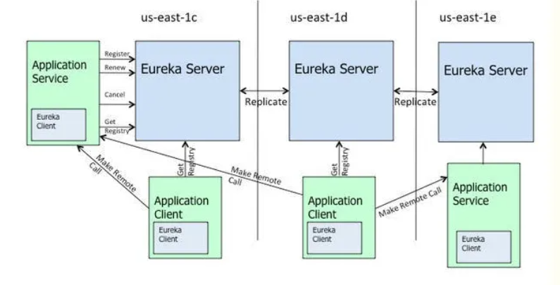

##CAP 分布式领域的CAP理论：
    C - Consistency 一致性
    A - Availability 可用性
    P - Partition tolerance 分区容忍性

### C Consistency，一致性的意思。
    一致性就是说，我们读写数据必须是一摸一样的。
    比如一条数据，分别存在两个服务器中，server1和server2。
    我们此时将数据a通过server1修改为数据b。此时如果我们访问server1访问的应该是b。
    当我们访问server2的时候，如果返回的还是未修改的a，那么则不符合一致性，如果返回的是b，则符合数据的一致性。

### A Availability，可用性的意思。
这个比较好理解，就是说，只要我对服务器，发送请求，服务器必须对我进行相应，保证服务器一直是可用的。

### P Partition tolerance 分区容忍性
表示分布式系统在一部分服务不可用时依然可以向外提供服务。这是分布式应用的基础，显然是不可或缺的。

**为什么CAP只能达到 CP 或者 AP？**

- 由以上我们得知，P是必然存在的。
- 如果我们保证了CP，即一致性与分布容错。当我们通过一个服务器修改数据后，该服务器会向另一个服务器发送请求，将数据进行同步，
  但此时，该数据应处于锁定状态，不可再次修改，这样，如果此时我们想服务器发送请求，则得不到相应，这样就不能A，高可用。
- 如果我们保证了AP，那么我们不能对服务器进行锁定，任何时候都要得到相应，那么数据的一致性就不好说了。

**eureka和zookeeper的cap理论 ：eureka是基于ap的。zookeeper是基于cp的。**

## Eureka的实现
eureka的官方架构图，这是基于集群配置的eureka：

### eureka的基本原理
- 处于不同节点的eureka通过Replicate进行数据同步
- Application Service为服务提供者
- Application Client为服务消费者
- Make Remote Call完成一次服务调用

服务启动后向Eureka注册，Eureka Server会将注册信息向其他Eureka Server进行同步，
当服务消费者要调用服务提供者，则向服务注册中心获取服务提供者地址，然后会将服务提供者地址缓存在本地，下次再调用时，则直接从本地缓存中取，完成一次调用。

当服务注册中心Eureka Server检测到服务提供者因为宕机、网络原因不可用时，则在服务注册中心将服务置为DOWN状态，并把当前服务提供者状态向订阅者发布，订阅过的服务消费者更新本地缓存。

服务提供者在启动后，周期性（默认30秒）向Eureka Server发送心跳，以证明当前服务是可用状态。Eureka Server在一定的时间（默认90秒）未收到客户端的心跳，则认为服务宕机，注销该实例。

### eureka的自我保护机制
在默认配置中，Eureka Server在默认90s没有得到客户端的心跳，则注销该实例，但是往往因为微服务跨进程调用， 网络通信往往会面临着各种问题，
比如微服务状态正常，但是因为网络分区故障时，Eureka Server注销服务实例则会让大部分微服务不可用，这很危险，因为服务明明没有问题。

为了解决这个问题，Eureka 有自我保护机制，通过在Eureka Server配置如下参数，可启动保护机制。
    
    eureka.server.enable-self-preservation=true
它的原理是，当Eureka Server节点在短时间内丢失过多的客户端时（可能发送了网络故障），
那么这个节点将进入自我保护模式，不再注销任何微服务，当网络故障回复后，该节点会自动退出自我保护模式。

### eureka保证ap
eureka优先保证可用性。在Eureka平台中，如果某台服务器宕机，Eureka不会有类似于ZooKeeper的选举leader的过程；
客户端请求会自动切换 到新的Eureka节点；当宕机的服务器重新恢复后，Eureka会再次将其纳入到服务器集群管理之中；
而对于它来说，所有要做的无非是同步一些新的服务 注册信息而已。所以，再也不用担心有“掉队”的服务器恢复以后，会从Eureka服务器集群中剔除出去的风险了。
Eureka甚至被设计用来应付范围更广 的网络分割故障，并实现“0”宕机维护需求。当网络分割故障发生时，
每个Eureka节点，会持续的对外提供服务（注：ZooKeeper不会）：接收新 的服务注册同时将它们提供给下游的服务发现请求。
这样一来，就可以实现在同一个子网中（same side of partition），新发布的服务仍然可以被发现与访问。
Eureka各个节点都是平等的，几个节点挂掉不会影响正常节点的工作，剩余的节点依然可以提供注册和查询服务。
而Eureka的客户端在向某个Eureka注册或时如果发现连接失败，则会自动切换至其它节点，
只要有一台Eureka还在，就能保证注册服务可用(保证可用性)，只不过查到的信息可能不是最新的(不保证强一致性)。
除此之外，Eureka还有一种自我保护机制，如果在15分钟内超过85%的节点都没有正常的心跳，
那么Eureka就认为客户端与注册中心出现了网络故障，此时会出现以下几种情况：

1. Eureka不再从注册列表中移除因为长时间没收到心跳而应该过期的服务
2. Eureka仍然能够接受新服务的注册和查询请求，但是不会被同步到其它节点上(即保证当前节点依然可用)
3. 当网络稳定时，当前实例新的注册信息会被同步到其它节点中
   Eureka还有客户端缓存功能（注：Eureka分为客户端程序与服务器端程序两个部分，客户端程序负责向外提供注册与发现服务接口）。
   所以即便Eureka集群中所有节点都失效，或者发生网络分割故障导致客户端不能访问任何一台Eureka服务器；
   Eureka服务的消费者仍然可以通过 Eureka客户端缓存来获取现有的服务注册信息。
   甚至最极端的环境下，所有正常的Eureka节点都不对请求产生相应，也没有更好的服务器解决方案来解 决这种问题时；
   得益于Eureka的客户端缓存技术，消费者服务仍然可以通过Eureka客户端查询与获取注册服务信息。
   
## zookeeper原理

Zookeeper的设计理念就是分布式协调服务，保证数据（配置数据，状态数据）在多个服务系统之间保证一致性，
这也不难看出Zookeeper是属于CP特性（Zookeeper的核心算法是Zab，保证分布式系统下，数据如何在多个服务之间保证数据同步）

zookeeper用于服务治理（zookeeper还有其他用途，例如：分布式事务锁等）
每启动一个微服务，就会去zk中注册一个临时子节点，
例如：5台订单服务，4台商品服务
（5台订单服务在zk中的订单目录下创建的5个临时节点）
（4台商品服务在zk中的商品目录下创建的4个临时接点）

每当有一个服务down机，由于是临时接点，此节点会立即被删除，并通知订阅该服务的微服务更新服务列表
（zk上有watch，每当有节点更新，都会通知订阅该服务的微服务更新服务列表）

每当有一个新的微服务注册进来，就会在对应的目录下创建临时子节点，并通知订阅该服务的微服务更新服务列表
（zk上有watch，每当有节点更新，都会通知订阅该服务的微服务更新服务列表）

每个微服务30s向zk获取新的服务列表

## eureka和zookeeper的区别总结

服务注册功能对可用性的要求要高于一致性。但是zk会出现这样一种情况，当master节点因为网络故障与其他节点失去联系时，剩余节点会重新进行leader选举。
问题在于，选举leader的时间太长，30 ~ 120s, 且选举期间整个zk集群都是不可用的，这就导致在选举期间注册服务瘫痪。
在云部署的环境下，因网络问题使得zk集群失去master节点是较大概率会发生的事，虽然服务能够最终恢复，但是漫长的选举时间导致的注册长期不可用是不能容忍的。

Eureka可以很好的应对因网络故障导致部分节点失去联系的情况，而不会像zookeeper那样使整个注册服务瘫痪。
Eureka作为单纯的服务注册中心来说要比zookeeper更加“专业”，因为注册服务更重要的是可用性，我们可以接受短期内达不到一致性的状况。

## Zab协议
Zab协议 的全称是 Zookeeper Atomic Broadcast （Zookeeper原子广播）。
Zookeeper 是通过 Zab 协议来保证分布式事务的最终一致性。 

eureka原理分析
https://zhuanlan.zhihu.com/p/88385121
